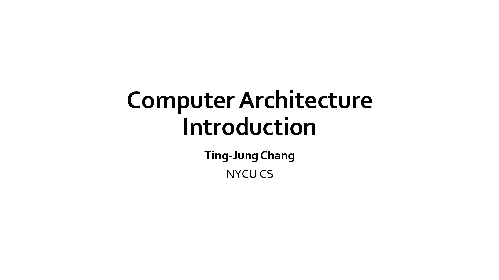
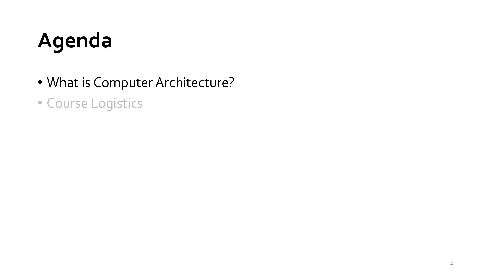
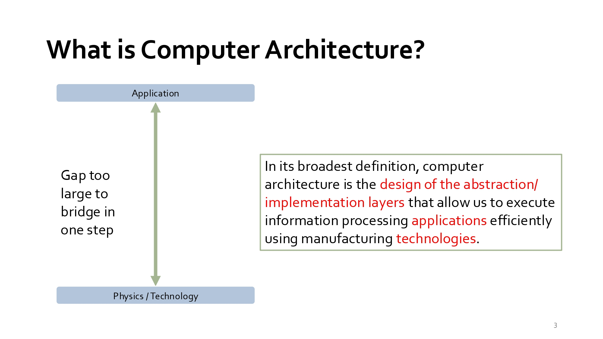
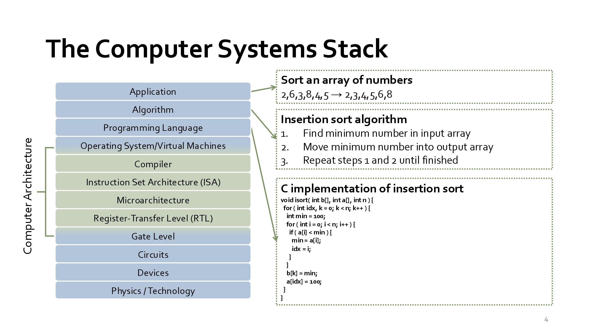
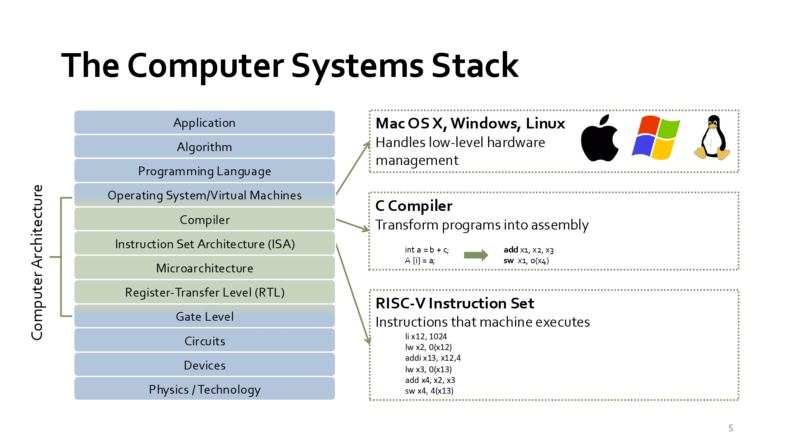
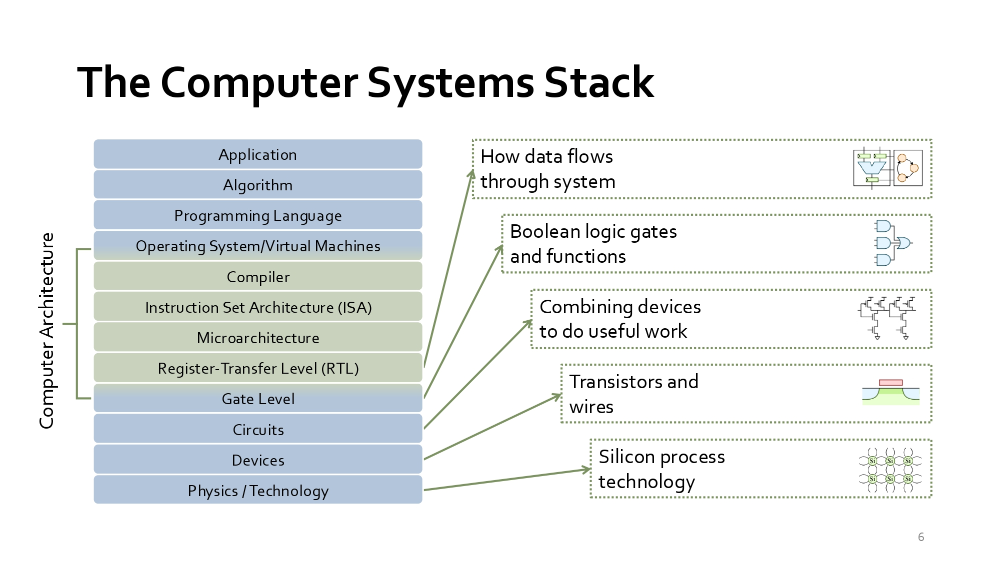
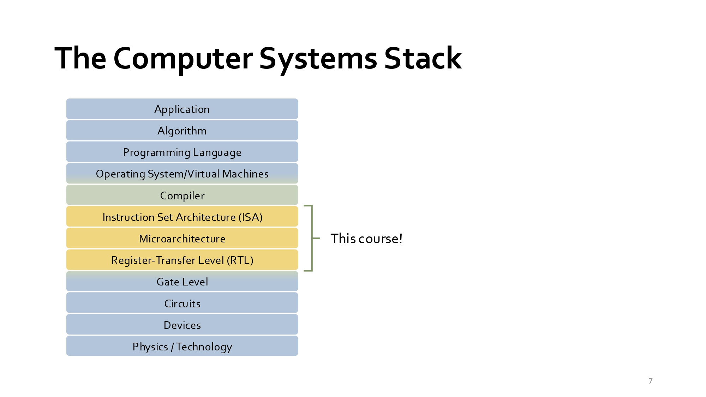
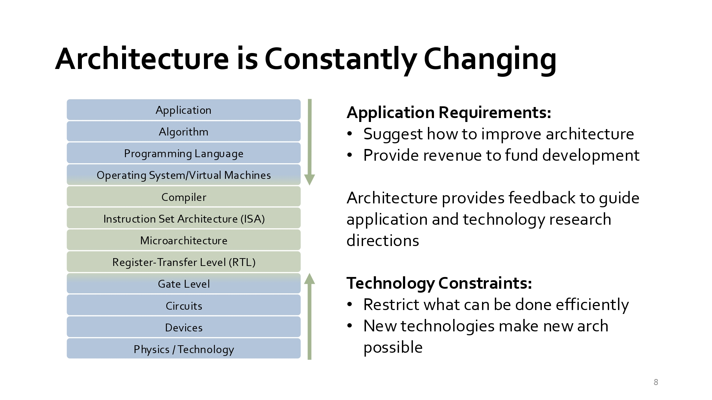

### Week 1 課堂逐字稿
#### slide：1
<div align="left" >
  
</div>

Computer Architecture = 計算機架構
<br>這門課並不是教如何寫程式，而是教：「電腦到底如何執行程式？」從軟體一路往下看到硬體，是資工系的重要核心課程。

#### slide：2
<div align="left" >
  
</div>

Agenda（課程大綱）
- What is Computer Architecture?
  >什麼是計算機架構？
- Course Logistics
  >課程規則與安排

#### slide：3 What is Computer Architecture?
<div align="left" >
  
</div>

What is Computer Architecture?（什麼是計算機架構？）
- Computer architecture is the design of abstraction and implementation layers that allow applications to execute efficiently.
  >計算機架構是在應用程式與硬體技術之間建立多層次抽象與實作機制，使程式能有效率地執行。
- 重點：
  - Application（應用）
  - Physics/Technology（物理技術）
  <br>中間需要許多層來連接。

#### slide：4 The Computer Systems Stack（電腦系統層級架構）
<div align="left" >
  
</div>

層級：
|英文	|中文|
|--|--|
|Application  |應用  |
|Algorithm	|演算法|
|Programming Language	|程式語言|
|Operating System/Virtual Machines	|作業系統|
|Compiler	|編譯器|
|Instruction Set Architecture (ISA)	|指令集架構|
|Microarchitecture	|微架構|
|Register-Transfer Level (RTL)	|暫存器傳輸層|
|Gate Level	|邏輯閘|
|Circuit	|電路|
|Device	|元件|
|Physics / Technology|物理技術|

**考試常問：ISA、Microarchitecture、RTL 差在哪裡？**
<br>ISA（指令集架構）、Microarchitecture（微架構） 與 RTL（暫存器傳輸級） 是電腦系統疊層（Computer Systems Stack）中硬體與軟體交界處的三個不同抽象層次：
|階層  |定義與核心概念  |角色與責任  |範例|
|--|--|--|--|
|ISA(Instruction Set Architecture)  |軟硬體的介面與契約定義處理器能理解的指令集、暫存器數量、記憶體位址模式等規格。   |規範「處理器應該做什麼（What）」，使軟體/編譯器能編譯出可執行的程式碼。   |x86, ARM, RISC-V|
|Microarchitecture  |硬體的設計與組織實現 ISA 所規範功能的硬體架構設計概念（如管線化、快取階層、分支預測）。  |決定「硬體要如何實現（How）ISA」，直接影響 CPU 的效能與功耗。|Intel Alder Lake, Apple M1/M2, Cortex-A78|
|RTL(Register-Transfer Level)  |硬體的程式碼實現用硬體描述語言寫出資料如何在暫存器與組合邏輯間傳輸的詳細邏輯。   |將微架構設計轉化為「可被合成與晶片製造的程式碼」。|Verilog, SystemVerilog, VHDL 代码|

階層關係與具體範例
<br>以運算 a = b + c 為例：
- ISA：編譯器將其轉譯為 ISA 規範的組合語言指令（如 RISC-V 的 add x4, x2, x3）。ISA 規定了 add 指令格式與操作數位置。
- Microarchitecture：設計師規劃這條 add 指令要在哪一個流水線（Pipeline）階段執行、是否需要亂序執行（Out-of-order execution）、如何從快取（Cache）預取資料。
- RTL：工程師編寫具體的 Verilog/VHDL 程式碼，例如定義加法器電路 assign x4 = x2 + x3; 以及暫存器觸發時脈（Clock）的邏輯。

簡單來說：ISA 是軟硬體溝通的「語言規範」，Microarchitecture 是 CPU 的「藍圖設計」，而 RTL 則是把藍圖寫成「具體的電路程式碼」。

#### slide：5 The Computer Systems Stack（電腦系統層級架構）
<div align="left" >
  
</div>

Compiler、OS、ISA（編譯器把 C 轉為組合語言）
- Compiler（編譯器把 C 轉為組合語言）
  <br>例如：a = b + c; 變成：add x1, x2, x3
- ISA
  <br>RISC-V 指令：add、addi、lw、sw
- OS
  <br>Linux Windows macOS 負責管理硬體。

**總結**：
<br>這張告訴你：C語言 → Compiler → RISC-V 指令 → CPU 執行 之後學 RISC-V 時會一直看到。

#### slide：6 The Computer Systems Stack
<div align="left" >
  
</div>

低階硬體世界
- How data flows through system.
  <br>資料如何在硬體內部流動。
  ```
  從下到上
  Physics ↓ Devices ↓ Circuits ↓ Logic Gates ↓ RTL
  ```

看法：這是數位電路課與計算機架構課的連結。
```
AND Gate ↓ ALU ↓ CPU
```

#### slide：7 This Course
<div align="left" >
  
</div>

- 本課程主要聚焦在：
  - ISA
  - Microarchitecture
  - RTL

表示你不會深入：半導體製程、電晶體設計，而是專注於 CPU 設計。

#### slide：8 Architecture is Constantly Changing（架構持續演進）
<div align="left" >
  
</div>

驅動因素
- Application Requirements
  <br>應用需求：例如：AI、Gaming、Cloud
- Technology Constraints

我的看法：這張是研究領域的核心思想：需求推動架構、架構推動科技、科技再推動應用，三者互相影響。


