### Week 1 課堂逐字稿
#### slide：1
<div align="left" >
  
</div>

Computer Architecture = 計算機架構
<br>這門課並不是教如何寫程式，而是教：「電腦到底如何執行程式？」從軟體一路往下看到硬體，是資工系的重要核心課程。

#### slide：2
<div align="left" >
  
</div>

Agenda（課程大綱）
- What is Computer Architecture?
  >什麼是計算機架構？
- Course Logistics
  >課程規則與安排

#### slide：3 What is Computer Architecture?
<div align="left" >
  
</div>

What is Computer Architecture?（什麼是計算機架構？）
- Computer architecture is the design of abstraction and implementation layers that allow applications to execute efficiently.
  >計算機架構是在應用程式與硬體技術之間建立多層次抽象與實作機制，使程式能有效率地執行。
- 重點：
  - Application（應用）
  - Physics/Technology（物理技術）
  <br>中間需要許多層來連接。

#### slide：4 The Computer Systems Stack（電腦系統層級架構）
<div align="left" >
  
</div>

層級：
|英文	|中文|
|--|--|
|Application  |應用  |
|Algorithm	|演算法|
|Programming Language	|程式語言|
|Operating System/Virtual Machines	|作業系統|
|Compiler	|編譯器|
|Instruction Set Architecture (ISA)	|指令集架構|
|Microarchitecture	|微架構|
|Register-Transfer Level (RTL)	|暫存器傳輸層|
|Gate Level	|邏輯閘|
|Circuit	|電路|
|Device	|元件|
|Physics / Technology|物理技術|

**考試常問：ISA、Microarchitecture、RTL 差在哪裡？**
<br>ISA（指令集架構）、Microarchitecture（微架構） 與 RTL（暫存器傳輸級） 是電腦系統疊層（Computer Systems Stack）中硬體與軟體交界處的三個不同抽象層次：
|階層  |定義與核心概念  |角色與責任  |範例|
|--|--|--|--|
|ISA(Instruction Set Architecture)  |軟硬體的介面與契約定義處理器能理解的指令集、暫存器數量、記憶體位址模式等規格。   |規範「處理器應該做什麼（What）」，使軟體/編譯器能編譯出可執行的程式碼。   |x86, ARM, RISC-V|
|Microarchitecture  |硬體的設計與組織實現 ISA 所規範功能的硬體架構設計概念（如管線化、快取階層、分支預測）。  |決定「硬體要如何實現（How）ISA」，直接影響 CPU 的效能與功耗。|Intel Alder Lake, Apple M1/M2, Cortex-A78|
|RTL(Register-Transfer Level)  |硬體的程式碼實現用硬體描述語言寫出資料如何在暫存器與組合邏輯間傳輸的詳細邏輯。   |將微架構設計轉化為「可被合成與晶片製造的程式碼」。|Verilog, SystemVerilog, VHDL 代码|

階層關係與具體範例
<br>以運算 a = b + c 為例：
- ISA：編譯器將其轉譯為 ISA 規範的組合語言指令（如 RISC-V 的 add x4, x2, x3）。ISA 規定了 add 指令格式與操作數位置。
- Microarchitecture：設計師規劃這條 add 指令要在哪一個流水線（Pipeline）階段執行、是否需要亂序執行（Out-of-order execution）、如何從快取（Cache）預取資料。
- RTL：工程師編寫具體的 Verilog/VHDL 程式碼，例如定義加法器電路 assign x4 = x2 + x3; 以及暫存器觸發時脈（Clock）的邏輯。

簡單來說：ISA 是軟硬體溝通的「語言規範」，Microarchitecture 是 CPU 的「藍圖設計」，而 RTL 則是把藍圖寫成「具體的電路程式碼」。

#### slide：5 The Computer Systems Stack（電腦系統層級架構）
<div align="left" >
  
</div>

Compiler、OS、ISA（編譯器把 C 轉為組合語言）
- Compiler（編譯器把 C 轉為組合語言）
  <br>例如：a = b + c; 變成：add x1, x2, x3
- ISA
  <br>RISC-V 指令：add、addi、lw、sw
- OS
  <br>Linux Windows macOS 負責管理硬體。

**總結**：
<br>這張告訴你：C語言 → Compiler → RISC-V 指令 → CPU 執行 之後學 RISC-V 時會一直看到。

#### slide：6 The Computer Systems Stack
<div align="left" >
  
</div>

低階硬體世界
- How data flows through system.
  <br>資料如何在硬體內部流動。
  ```
  從下到上
  Physics ↓ Devices ↓ Circuits ↓ Logic Gates ↓ RTL
  ```

看法：這是數位電路課與計算機架構課的連結。
```
AND Gate ↓ ALU ↓ CPU
```

#### slide：7 This Course
<div align="left" >
  
</div>

- 本課程主要聚焦在：
  - ISA
  - Microarchitecture
  - RTL

表示你不會深入：半導體製程、電晶體設計，而是專注於 CPU 設計。

#### slide：8 Architecture is Constantly Changing（架構持續演進）
<div align="left" >
  
</div>

驅動因素
- Application Requirements
  <br>應用需求：例如：AI、Gaming、Cloud
- Technology Constraints

我的看法：這張是研究領域的核心思想：需求推動架構、架構推動科技、科技再推動應用，三者互相影響。

本教學頁面的重點在於說明電腦架構（Computer Architecture）如何受到應用需求與技術限制的雙向推動而持續演進：
- 電腦系統疊層（The Computer Systems Stack）
  <br>圖表左側展示了從最上層的軟體應用到最底層的物理技術所構成的抽象層級：
  - 軟體/應用層：Application → Algorithm → Programming Language → OS / Virtual Machines → Compiler。
  - 架構/介面層：Instruction Set Architecture (ISA) → Microarchitecture → Register-Transfer Level (RTL)。
  - 硬體/物理層：Gate Level → Circuits → Devices → Physics / Technology。
- 架構變革的兩大核心推動力
  <br>圖表右側指出推動電腦架構變化的兩大方向（即上下兩個箭頭）：
  - 由上而下的驅動力 —— 應用需求（Application Requirements）
    - 引導架構改進：新的應用需求（如 AI、大數據、遊戲）會驅動並建議如何改進電腦架構。
    - 提供研發資金：成功的應用帶來商業收益，進而資金回流用於支援新硬體與架構的研發。
  - 由下而上的限制與突破 —— 技術限制（Technology Constraints）
    - 限制執行效率：物理與半導體技術的極限（如功耗、散熱、製程）會限制哪些設計能夠被高效實現。
    - 開創新架構可能：新技術的突破（如新材料、新製程）能讓過去無法實現的新架構變為可能。
- 架構的回饋機制（Feedback Mechanism）
  <br>電腦架構位於中央樞紐位置，能夠提供回饋資訊（Provide feedback），進一步引導上層應用發展以及下層技術研究的方向。

#### slide：9-10 Computers Then
<div align="left" >
  
  
</div>

過去的電腦：IBM 650
<br>特色：
- 早期大型電腦
- 體積巨大
- 成本昂貴

#### slide：11 Computers Now
<div align="left" >
  
</div>

現代電腦類型：
- Personal（個人電腦）
- Autonomous（自動駕駛）
- Embodied（機器人）
- Spatial（空間運算）
- AI Factory（AI資料中心）

我的看法：AI 已成為主流運算需求。未來許多架構設計都圍繞 AI。

#### slide：12 Moore's Law（摩爾定律）
<div align="left" >
  
</div>

#### slide：13-14 Sequential Processor Performance
<div align="left" >
  
  
</div>

#### slide：15 Amdahl's Law（阿姆達爾定律）
<div align="left" >
  
</div>

本教學頁面討論的核心主題為阿姆達爾定律（Amdahl's Law）與平行化的效能極限。以下為教學重點內容整理、個人的觀點評析與總結：
- Speedup（加速比）定義：
  ```
                    未改進時執行整個任務的時間
  Speedup（加速比）= ------------------------------------
                    使用改進技術後執行整個任務的時間

  指標用於量化「加入某種硬體優化或平行處理器後，系統整體變快了多少倍」。
  ```
- 可平行化比例（Parallel Portion）對加速比的限制：
  <br>圖表展現了在不同「可平行化比例」（$50\%, 75\%, 90\%, 95\%$）之下，增加處理器數量（Number of Processors）對整體加速比的影響：
  - 邊際效應遞減：不論處理器增加到幾千甚至上萬個，加速比最終都會趨於平緩並達到上限。
  - 串行瓶頸（Serial Bottleneck）：整體加速比的最大上限取決於無法被平行化的串行部分（1 - Parallel Portion）。
    - 若可平行化比例為 50%，無論放再多處理器，加速比極限就是 2 倍。
    - 若可平行化比例提升至 95%，理論加速比極限可達 20 倍。
- 對此定律的看法：
  - 指出硬體堆疊的盲點：Amdahl's Law 揭示了「暴力增加 CPU 核心數」無法無限制提升效能的現實，硬體盲目堆疊只會帶來嚴重的資源浪費與功耗上升。
  - 強調軟硬體協同設計（Co-design）：若要讓更多核心發揮價值，關鍵不在於硬體有多強，而在於**軟體演算法**與**編譯器**能否將串行邏輯拆解為可平行執行的任務（即拉高 Parallel Portion）。
- 總結：
  <br>Amdahl's Law 提醒架構師與軟體工程師：系統的最終效能往往不由「最快的部分」決定，而是由「無法改進的瓶頸（串行部分）」所限制。因此在進行系統優化時，應優先找出並縮減不可平行的瓶頸段落，才能最大化硬體投資的報酬率（ROI）。

#### slide：16 Upheaval in Computer Design（電腦設計的重大變革）
<div align="left" >
  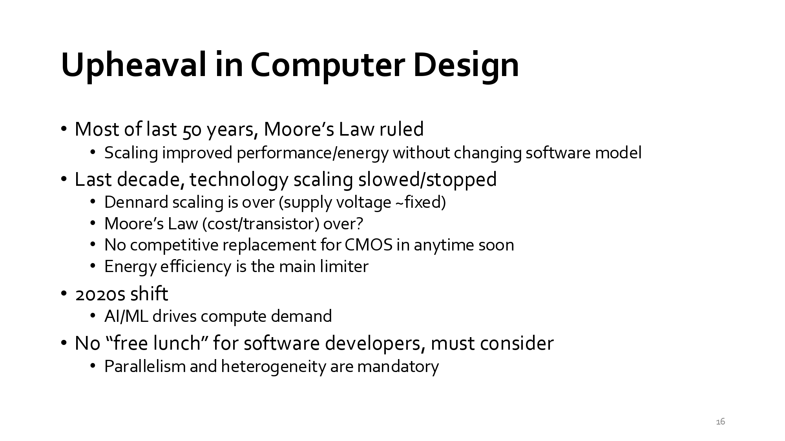
</div>

探討了推動半導體與電腦架構演進的物理限制，以及當前產業正面臨的重大轉型與範式轉移（Paradigm Shift）。
- 本教學頁面重點內容
  - 過去 50 年：摩爾定律主導（Moore's Law Ruled）<br>軟體模型的紅利：透過微縮（Scaling）技術，可以在不改變軟體寫法與模型的情況下，直接獲得更高的處理效能與更佳的能源效率（即「免費的午餐」）。
  - 過去 10 年：技術微縮趨緩甚至停滯（Technology Scaling Slowed/Stopped）
    - 丹納德縮放定律終結（Dennard Scaling is over）：工作電壓（Supply voltage）無法再按比例下降，導致晶片功耗與散熱問題加劇。
    - 摩爾定律減速：每個電晶體的成本不再顯著下降。
    - CMOS 無替代品：短期內尚無能商業化替代 CMOS 的新技術。
    - 能耗瓶頸：能源效率（Energy efficiency）成為限制系統效能的主要關卡。
  - 2020 年代起的轉變（2020s Shift）<br>AI / ML 驅動：人工智慧與機器學習成為算力需求的龐大推手。
  - 軟體開發者再無「免費午餐」（No "free lunch" for software developers）<br>軟體工程師必須主動調整架構，平行化（Parallelism）與異質運算（Heterogeneity）已成為強制要求。
- 對此頁面的看法與分析
  - 單核效能紅利終結：傳統單純拉高 CPU 時脈的時代早已結束。如 Amdahl's Law 所預示，當單核效能無法靠製程自然提升時，系統設計必須轉向微架構創新與平行處理。
  - DSA（領域特定架構）的崛起：如 Hennessy 與 Patterson（本課程教材作者）所強調，為了因應 AI/ML 的算力爆炸，傳統通用型 CPU（如 x86）逐漸讓位給異質運算（Heterogeneous Computing），例如結合 GPU、NPU、TPU 等專用加速器，在有限的功耗預算下追求極致的能源效率。   
- 總結：<br>這頁投影片為整門「電腦架構」課程奠定了核心動機：當硬體物理層面（Dennard Scaling/Moore's Law）面臨極限時，電腦架構師的角色變得比以往任何時候都更加重要。現代軟硬體工程師必須深刻理解微架構、平行運算與記憶體階層設計，才能打造出能滿足 AI 時代需求的的高效能系統。

#### slide：17 Today's Dominant Target Systems（當前主流目標系統）
<div align="left" >
  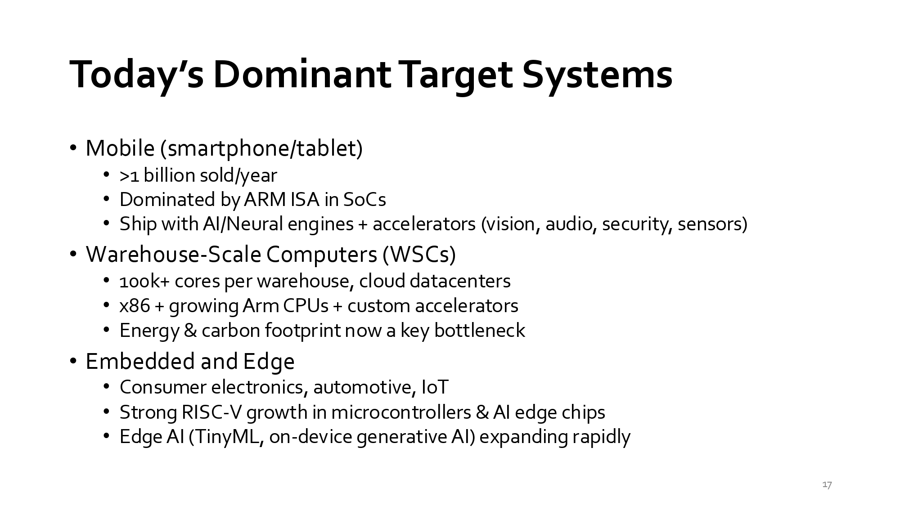
</div>

- 本教學頁面重點內容
  - 行動裝置（Mobile: smartphone/tablet）
    - 規模：每年出貨量超過 10 億台。
    - 核心 ISA：由 ARM 指令集架構（ISA） 在單晶片系統（SoCs）中佔據主導地位。
    - 異質整合：整合了 AI/神經網路引擎（Neural Engines）與各類專用加速器（如影像、音訊、資安、感測器）。
  - 倉庫級電腦 / 雲端資料中心（Warehouse-Scale Computers, WSCs）
    - 規模：每個資料中心擁有超過 10 萬個 CPU 核心。
    - 架構組合：以 x86 架構為主，搭配快速成長的 Arm CPU 以及客製化加速器（如 Google TPU 等）。
    - 瓶頸：能源消耗與碳足跡已成為當前最主要的發展瓶頸。
  - 嵌入式與邊緣運算（Embedded and Edge）
    - 應用領域：消費性電子、汽車電子（Automotive）與物聯網（IoT）。
    - RISC-V 崛起：RISC-V ISA 在微控制器（MCU）與邊緣 AI 晶片中展現強勁的成長趨勢。
    - Edge AI 爆發：邊緣 AI（如 TinyML、裝置端生成式 AI）正在快速擴張。
- 看法與分析
  - 三種市場，三套生存法則：
    - Mobile 強調「極致能效比」；
    - WSC 追求「大規模平行與降低 TCO（總擁有成本/能源開銷）」；
    - Edge 則看重「成本、彈性與即時性」。
  - ISA 的陣營演變（x86 vs ARM vs RISC-V）：
    - 過去 x86 壟斷 PC 與伺服器，但現在 Arm 已跨入資料中心；
    - 開源的 RISC-V 則在邊緣裝置與特定領域加速器（DSA）中快速崛起，呼應了本課程選用 RISC-V 作為教材核心 ISA 的趨勢。
  - AI 驅動架構無所不在：從手機的神經網路引擎到 Edge 端運算，再到雲端的 AI 加速晶片，驗證了上一頁（Slide 16）提到的「AI/ML 正在驅動整體算力需求與異質運算發展」。
- 總結<br>本頁投影片精準歸納了現代晶片設計的戰場——沒有單一架構能通吃所有市場。現代電腦架構師必須根據目標系統（Mobile、Cloud、Edge）的約束條件，靈活結合 ISA 選型、平行化設計與異質 AI 加速器，才能打造出具備競爭力的系統。

#### slide：18 Beyond Moore's Law（超越摩爾定律？）
<div align="left" >
  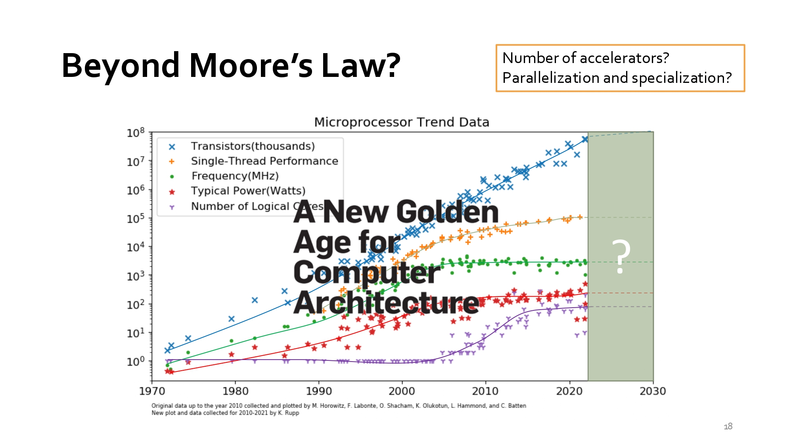
</div>

本頁投影片（Slide 18）主題為 「Beyond Moore’s Law?」（超越摩爾定律？），引用了電腦圖靈獎（Turing Award）得主 John Hennessy 與 David Patterson 的著名觀點：「電腦架構的全新黃金時代」（A New Golden Age for Computer Architecture）。
- 本教學頁面重點內容
  - 微處理器歷史發展趨勢圖（Microprocessor Trend Data）：
    - 電晶體數量（Transistors, 藍標）：持續呈指數成長（摩爾定律）。
    - 單線程效能（Single-Thread Performance, 橘標）：約在 2005–2010 年間開始平緩，成長幅度極低。
    - 時脈頻率（Frequency, 綠標） 與 典型功耗（Typical Power, 紅標）：受限於 Dennard Scaling（丹納德縮放定律）的終結，頻率與功耗在 2005 年左右即觸及天花板而無法繼續提升。
    - 邏輯核心數（Number of Logical Cores, 紫標）：為彌補單核效能停滯，核心數自 2005 年起開始急速上升（邁向多核/平行時代）。
  - 後摩爾定律時代的關鍵疑問（右上角方框）：
    - 加速器數量（Number of accelerators?）：未來的晶片該整合多少個專用加速器？
    - 平行化與專業化（Parallelization and specialization?）：如何進一步推動平行處理與針對特定領域進行硬體客製化/專業化？
- 對此頁面的看法與分析
  - 從「軟體通用」轉向「硬體專業化（DSA）」
    - 過去 40 年，軟體工程師享有「免費午餐」——只要等新 CPU 出來，程式就會自動變快。
    - 如今單核效能成長幾乎歸零，唯有透過 領域特定架構（Domain-Specific Architecture, DSA）、特定領域加速器（如 NPU/TPU/GPU） 以及 軟硬體協同設計（Hardware/Software Co-Design），才能在功耗受限的情況下持續拉高效能。
  - 為什麼是「電腦架構的黃金時代」？
    - 當最底層的物理製程（Moore's Law）無法再獨立解決效能問題時，責任便轉移到了架構師（Architects）身上。
    - 如今開放指令集（如 RISC-V）普及與敏捷晶片開發（Agile Chip Development）抬頭，讓學者與工程師能以更低的門檻創新設計專用晶片，造就了電腦架構研究最活躍的新時代。
- 總結：<br>本頁投影片給出了電腦架構發展的終極解答：「摩爾定律的放緩並非危機，而是轉機」。未來的算力提升將不再依賴單一微處理器頻率的提升，而是取決於如何靈活結合**平行運算(Parallelization)**、**專用加速器(Specialization)**與開放 ISA，以回應 AI 與新世代應用的龐大算力需求。

#### slide：19 Trends in Machine Learning Hardware（機器學習硬體發展趨勢）
<div align="left" >
  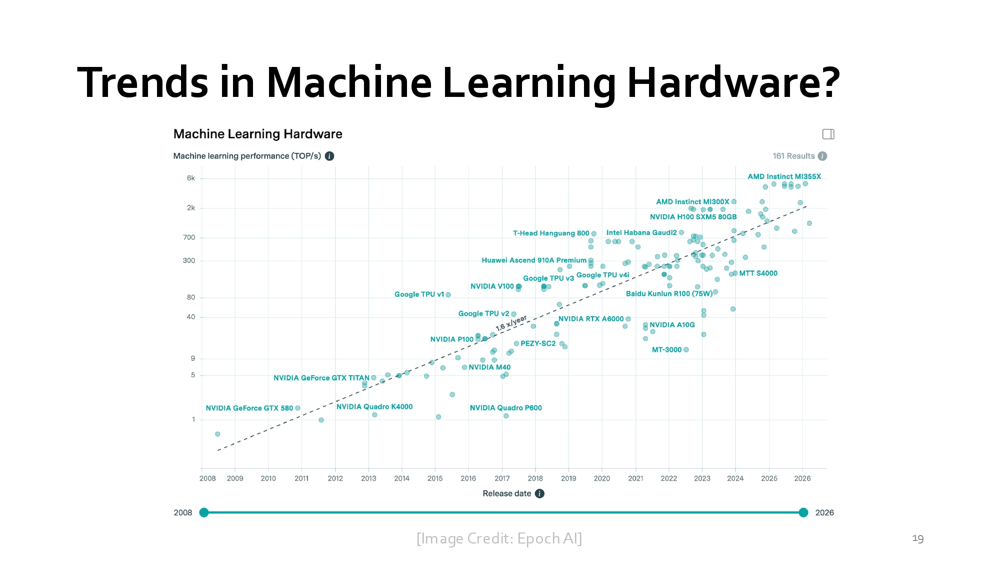
</div>

本教學頁面（Slide 19）主題為 「Trends in Machine Learning Hardware?」（機器學習硬體發展趨勢），引用了研究機構 Epoch AI 的資料庫圖表，展現深度學習時代各類 AI 晶片（如 GPU、TPU 等）運算效能的爆發性成長趨勢。
- 本教學頁面重點內容
  - AI 晶片效能（TOP/s）的時間軸演進：
    - 圖表縱軸為 Machine Learning Performance (TOP/s, Tera Operations Per Second，對數尺度)，橫軸為晶片發布時間（2008 年至 2026 年）。
    - 早期的 GPU 階段（2008–2015）：如 NVIDIA GeForce GTX 580、GTX TITAN 等傳統繪圖卡，算力約在 1 ～ 10 TOP/s 範圍。
    - 專用加速器與 Tensor Core 的引進（2016 年起）：Google TPU v1/v2/v3/v4i 以及 NVIDIA Volta 核心（P100, V100）上市後，算力成長曲線大幅陡峭化，達到每年約 1.6 的成長斜率。
    - 現代巨型 AI 晶片（2020 至今）：如 NVIDIA H100 SXM5、AMD Instinct MI300X/MI355X、Intel Habana Gaudi2 等，算力已突破數千 TOP/s（甚至達到 2,000 ～ 5,000 TOP/s）。
- 對此頁面的看法與分析：
  - 呼應前頁的「黃金時代」與「專用化（Specialization）」：
    - 前一頁（Slide 18）提到單核 CPU 效能成長停滯，而本頁則直接展示了解決方案——針對機器學習矩陣運算進行硬體優化與專用化。
    - 圖表中算力陡升的拐點（約 2016–2017 年），正對應了業界開始導入 Tensor Core（張量核心） 與 低精度算術格式（如 FP16, BF16, INT8, FP8） 的時間點。
  - 低精度運算帶來的「偽摩爾定律」續航：
    - 傳統 CPU 著重 32-bit 或 64-bit 高精度浮點運算；但 AI 模型對精度容忍度高，AI 晶片改以 16-bit 甚至 8-bit/4-bit 進行大量平行矩陣乘法，讓算力（TOP/s）能以遠超傳統單核 CPU 的速度持續翻倍。
- 總結：<br>本頁投影片證明了「應用需求（AI/ML）正以驚人的速度重塑硬體架構」。**未來的電腦架構師不僅要懂傳統的流水線與快取設計，更必須具備軟硬體協同優化（Co-Design）的能力**，以設計出能支撐大語言模型（LLM）與生成式 AI 的新世代專用硬體。

#### slide：20 The Verticalization of Silicon（晶片垂直整合趨勢）
<div align="left" >
  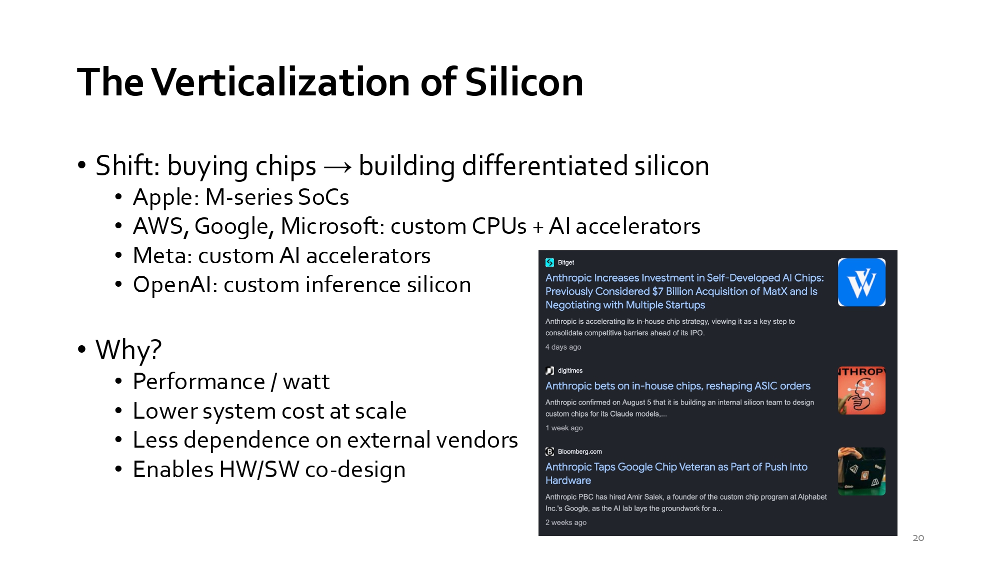
</div>

這張簡報探討的是「晶片垂直整合趨勢（The Verticalization of Silicon）」，核心傳達了科技巨頭與 AI 頂尖實驗室從「外購晶片」轉向「自研客製化晶片」的產業大趨勢。
- 產業轉變：從外購晶片到自研差異化晶片<br>傳統上，企業多向輝達（Nvidia）、英特爾（Intel）或 AMD 等廠商採購通用晶片。如今，各大科技巨頭皆投入自研晶片：
  - Apple：開發 M 系列整合晶片（SoCs），應用於 Mac、iPad 等終端設備。
  - AWS、Google、Microsoft：開發客製化 CPU 與 AI 加速器（例如 Google 的 TPU、AWS 的 Trainium/Inferentia、Microsoft 的 Azure Maia/Cobalt）。
  - Meta：開發專屬的客製化 AI 加速器（如 MTIA）。
  - OpenAI：開發客製化推理晶片（Custom Inference Silicon，例如與 Broadcom 合作推出的 Jalapeño 晶片）。
  - 右側新聞插圖（Anthropic）：報導指出 Anthropic 亦成立專屬團隊，為其 Claude 模型自研客製化晶片。
- 為何要自研晶片？（Why?）<br>簡報列出了四大關鍵驅動力：
  - 每瓦效能（Performance / watt）：客製化架構能剔除不必要的**通用算力單元**，大幅提高**能源利用效率**與**單位功耗下的算力**表現。
  - 大規模下的系統成本降低（Lower system cost at scale）：隨著 AI 模型的部署規模達到吉瓦（GW）等級，擺脫高昂的第三方晶片溢價可大幅降低營運與硬體成本。
  - 降低對外部供應商的依賴（Less dependence on external vendors）：減輕對市場主導者（如 Nvidia）的晶片配額限制與供應鏈風險。
  - 實現硬體/軟體協同設計（Enables HW/SW co-design）：針對特定演算法（如 LLM 的 Transformer 推理與 KV Cache 機制）客製化晶片設計，讓軟體與硬體相輔相成，發揮極限效能。

#### slide：21-22 Course Logistics（課程行政與基本資訊）
<div align="left" >
  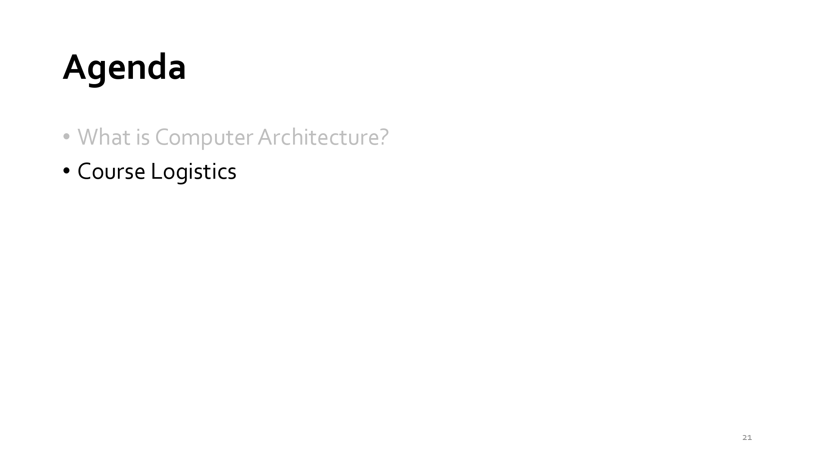
  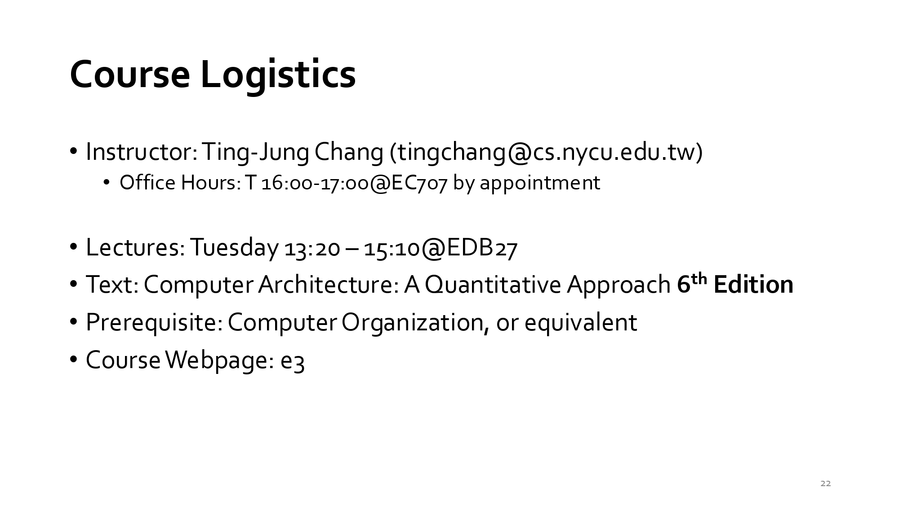
</div>

詳細說明了國立陽明交通大學（NYCU）資訊工程學系「電腦架構（Computer Architecture）」課程的授課資訊、參考教材與先修要求。
- 本教學頁面重點內容
  - 授課教師（Instructor）：張庭綜教授（Ting-Jung Chang，E-mail: tingchang@cs.nycu.edu.tw）。
    <br>Office Hours：每週二 16:00–17:00 於工程三館 EC707（採預約制）。
  - 上課時間與地點（Lectures）：每週二 13:20–15:10 於工程二館 EDB27。
  - 指定教科書（Text）：Computer Architecture: A Quantitative Approach, 6th Edition（由 John L. Hennessy 與 David A. Patterson 所著的電腦架構經典權威教材）。
  - 先修課程（Prerequisite）：電腦組織（Computer Organization）或同等課程。
  - 課程網頁（Course Webpage）：校內 e3 教學平台。
- 對此頁面的看法與總結
  - 定位高階且注重定量分析：採用被譽為電腦架構「聖經」的 Quantitative Approach（量化研究法）第 6 版作為教材，代表本課程並非停留在基礎的概念介紹（如大學部初階的 Computer Organization），而是著重於效能量化、複雜的微架構設計（如 Superscalar、Cache 記憶體階層與 Out-of-Order 執行）與效能優化分析。
  - 紮實的先修要求：門檻要求具備「電腦組織」的基礎知識，這是為了確保學生已掌握基本的組合語言（RISC-V/MIPS）、單週期/多週期 CPU 與基礎管線化（Pipeline）的概念，方能順利接軌後續的 4 個 Verilog 設計實驗與高階架構探討。
<br>總體而言，這是一門針對資工系中高年級或研究所設計的深度電腦架構核心課程，建議修課學生預先複習電腦組織的內容，並熟悉 Verilog 語法以因應後續的實作挑戰。

**計算機結構－計量方法 (Computer Architecture: A Quantitative Approach, 5/e)**
<br>這本由 John Hennessy 與 David Patterson 合著的《電腦架構：量化研究方法》第六版，是該領域最具影響力的經典教材，旨在透過量化分析與實務工程設計來拆解電腦系統。書中收錄了衡量效能、功耗與可靠性的核心數學公式，並提出諸如 Amdahl’s Law 與 90/10 局部性法則等設計準則，引導讀者理解硬體與軟體間的權衡。隨著 Moore’s Law 的減緩與 Dennard Scaling 的終結，本版特別強調了從通用型處理器向領域特定架構（DSA）的範式轉移，並深入探討了開源指令集 RISC-V、GPU 以及**倉庫級運算（WSC）**等現代技術。其核心目的在於教會工程師如何在物理限制與運算需求爆炸的時代，利用平行處理與新興材料重塑電腦架構的未來。
- Chapter 1 計量設計與分析的基礎
- Chapter 2 記憶體層級的設計
- Chapter 3 指令階層平行化及其開發
- Chapter 4 向量、SIMD 與 GPU 結構當中的資料階層平行化
- Chapter 5 執行緒階層平行化
- Chapter 6 開發需求階層與資料階層平行化的數位倉儲型電腦
- Appendix A 指令集原理
- Appendix B 記憶體層級的回顧
- Appendix C 管線化：基本與進階的觀念


#### slide：23 Course Logistics
<div align="left" >
  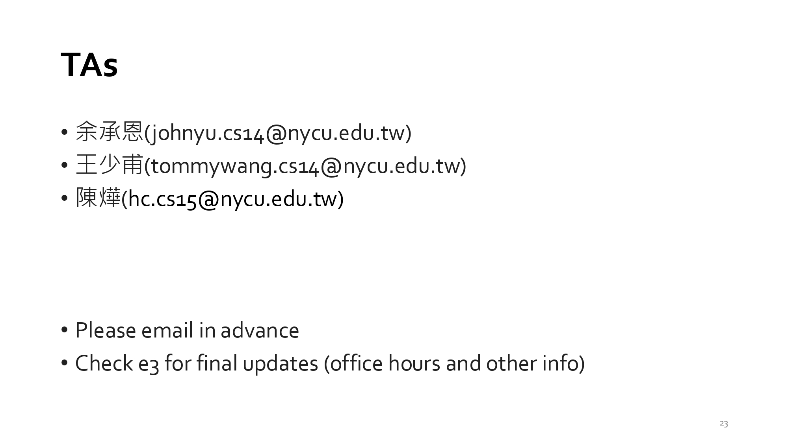
</div>

## slide：24 Course Format（課程授課與學習形式）
<div align="left" >
  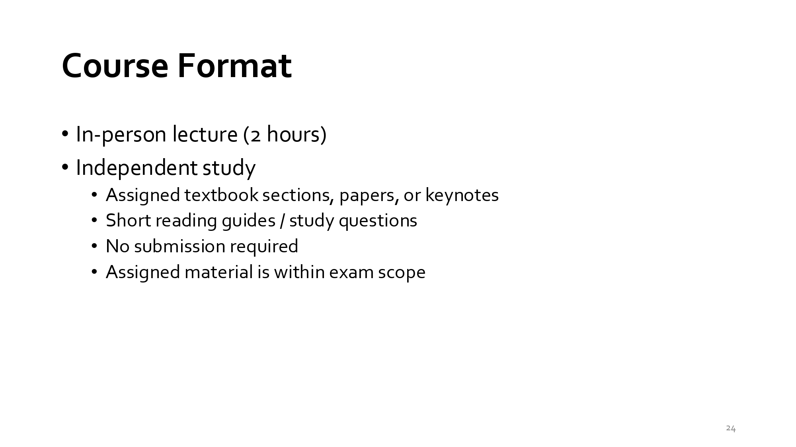
</div>

本教學頁面（Slide 24）主題為 「Course Format」（課程授課與學習形式），說明了本課程在課堂教學與課後自主學習方面的規範與要求：
- 本教學頁面重點內容
  - 實體授課（In-person lecture）：每週 2 小時的實體課堂教學。
  - 自主學習（Independent study）：
    - 指定閱讀材料：包含教科書指定章節（Computer Architecture: A Quantitative Approach, 6th Edition）、學術論文（Papers）或主題專題演講影片/導讀（Keynotes）。
    - 學習輔助資源：提供簡短的閱讀指南（Reading guides）與研習問題（Study questions），協助學生掌握重點。
    - 免繳交作業（No submission required）：這些自主學習的閱讀材料與問題無需額外上傳繳交。
    - 納入考試範圍（Assigned material is within exam scope）：雖然不強制繳交，**但所有指定的閱讀材料均屬於期中與期末考的考題範圍**。
- 對此頁面的看法與分析
  - 自主學習與高度自律的要求：<br>「不用交作業（No submission required）但『會考（In exam scope）』」是高階大學/研究所課程常見的設計方式。這代表課程將學習主動權交給學生，但考核力道依然嚴謹。
  - 培養閱讀軟硬體前沿文獻的能力：<br>課程除了指定 Hennessy & Patterson 的經典教科書外，還涵蓋了 Papers 與 Keynotes。對於現代電腦架構來說（例如前幾頁討論到的 AI 加速器、DSAs 與 晶片垂直整合等最新發展），單靠教科書是不夠的，必須透過閱讀最新論文與產業報告才能掌握實務脈動。
- 總結：<br>本頁投影片提醒學生：課堂上的 2 小時只是精華導讀，真正的學習發生在課後的自主閱讀與思考。建議學生務必跟緊每週的 Reading guides 與 Study questions，將其作為自主檢測與備考的重要工具。

#### slide：25 Course Structure（課程結構與成績評分機制）
<div align="left" >
  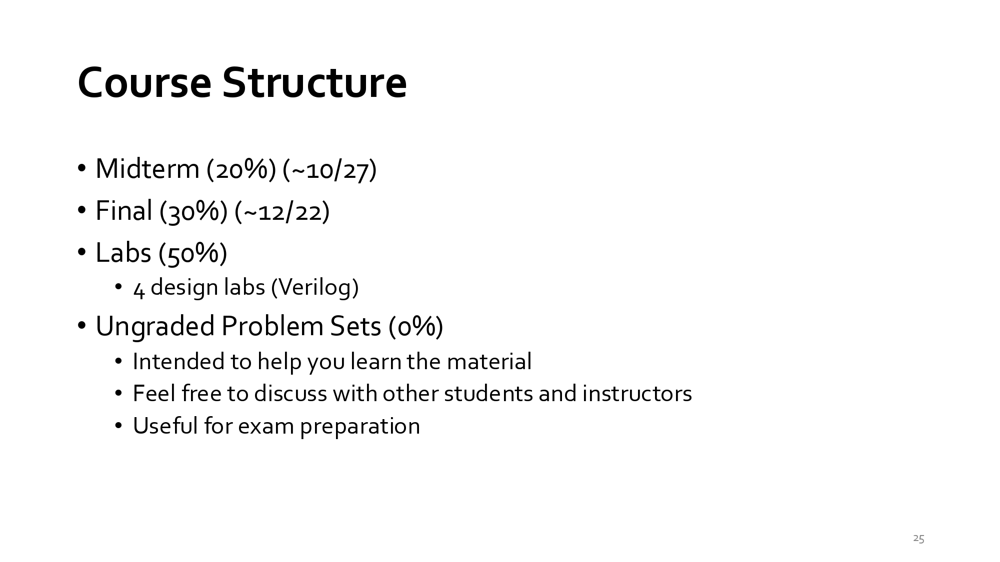
</div>

- 本教學頁面重點內容
  - 學期評分項目與佔比（Grading Scheme）：
    - Midterm（期中考）：20%（預計於 10/27 左右舉行）。
    - Final（期末考）：30%（預計於 12/22 左右舉行）。
    - Labs（實驗作業）：50%，包含 4 個 Verilog 硬體設計實驗。
  - 不計分練習（Ungraded Problem Sets）：0%
    - 目的：旨在協助學生理解與掌握課程觀念。
    - 討論：鼓勵學生與同儕及助教/教授自由討論。
    - 備考：對於期中、期末考的準備非常有幫助。
- 對此課程結構的觀點與看法
  - 重質重實作（Hands-on Emphasis）：
    <br>實驗占比高達 50%，搭配前面的教學內容（包含需要實作 Pipeline、Reorder Buffer、Superscalar 與 Cache 等），顯示這門課程極度看重將理論轉化為 Verilog RTL 程式碼的實作能力。
  - 考試與作業並重：
    <br>期中與期末考合佔 50%，代表僅會寫 Code 還不夠，對指令集架構與微架構的理論觀念（如 Amdahl's Law、Hazards 機制等）也必須深刻理解。
  - 學習資源的合理利用：
    <br>雖然 Problem Sets 佔比為 0%，但它是連結「理論」與「筆試（50%）」的橋樑。不計分能減輕交作業的壓力，但認真完成將是考高分的關鍵。
- 總結與建議：
  <br>這是一門典型的硬核硬體設計與架構課程。建議策略為：
  - 全力攻克 Labs：提早開始撰寫與 Debug Verilog，拿到這 50% 的基本盤。
  - 活用 Problem Sets：雖然不計分，但務必親自練習並參與討論，作為期中/期末考前最佳的檢測指標。

## slide：26 Preview of Lab Assignments（實驗作業預覽）
<div align="left" >
  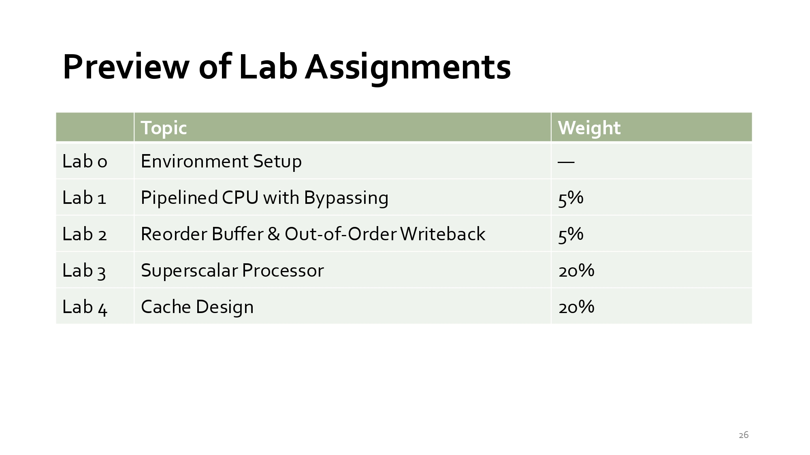
</div>

- 本教學頁面重點內容
  |實驗代號  |主題（Topic）  |成績占比（Weight）  |核心學習內容與目標|
  |--|--|--|--|
  |Lab 0  |Environment Setup  |— (不計分)  |建立與熟悉 Verilog 開發環境與模擬工具鏈。|
  |Lab 1  |Pipelined CPU with Bypassing  |5%  |設計具備管線化（Pipeline）與旁路/前饋機制（Bypassing/Forwarding）的 CPU，解決 Data Hazard。|
  |Lab 2  |Reorder Buffer & Out-of-Order Writeback  |5%  |引入重排序緩衝區（ROB），實現亂序執行與寫回（Out-of-Order Execution & Writeback），支援精確中斷。|
  |Lab 3  |Superscalar Processor|  20%  |設計超純量（Superscalar）處理器，實現單一時脈週期內發射與執行多條指令（Multi-issue）。|
  |Lab 4  |Cache Design  |20%  |設計快取記憶體（L1 Cache），處理 Hit/Miss 邏輯與記憶體控制傳輸。|
  
- 對此頁面的看法與分析
  - 漸進式的架構難度升級：
    - Lab 1 & 2（各佔 5%）：屬於暖身與基礎奠基。從最基礎的 Pipeline 開始，接著加入 Out-of-Order 機制（ROB），讓學生逐步建立處理器資料通道（Datapath）與控制邏輯的概念。
    - Lab 3 & 4（各佔 20%，合計 40%）：為本課程的重頭戲。Superscalar 處理器需處理極度複雜的平行發射與 Hazard 判斷；Cache Design 則直接挑戰記憶體階層（Memory Hierarchy）的設計，這兩項正是現代高效能 CPU 設計的最核心技術。
  - 實作比重大（佔總成績 50%）：
    - 配合 Slide 25 的成績占比，這 4 個 Lab 就佔了學期總成績的半壁江山（50%）。這意味著本課程不僅要求學生理解 Hennessy & Patterson 教科書中的理論公式，更強制要求能用 RTL（Verilog）實作出來。
- 總結：<br>這份 Lab 清單展現了一門高強度、重實作的頂尖電腦架構課程。對於想從事 IC 設計、CPU/GPU 微架構設計或軟硬體協同優化的學生來說，完成這 4 個 Lab 將能獲得極為紮實的 RTL 寫作與硬體 Debug 實戰經驗。

## slide：27 Lab Integrity & Responsible AI Use（實驗作業誠信與責任式 AI 使用規範）
<div align="left" >
  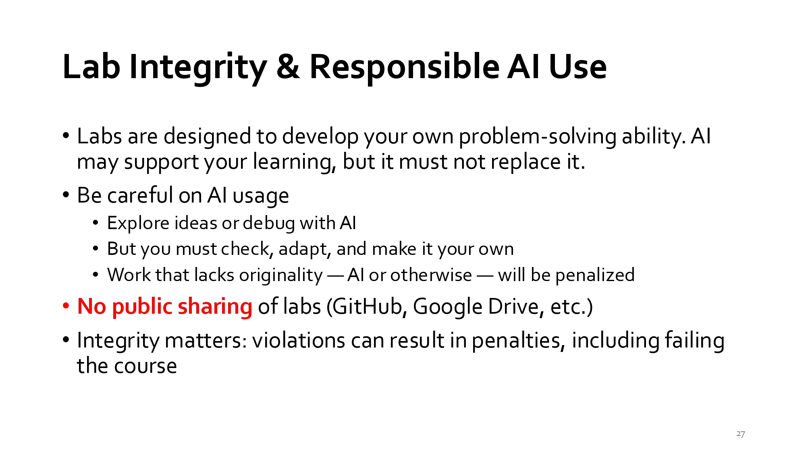
</div>

本頁投影片（Slide 27）主題為 「Lab Integrity & Responsible AI Use」（實驗作業誠信與責任式 AI 使用規範），明確宣佈了在生成式 AI 時代下，本課程對作業獨立性與學術誠信的界線：
- 本教學頁面重點內容
  - 實驗作業的核心目標：<br>Lab 的設計是為了培養學生獨立解決問題的能力。AI 工具可以作為學習輔助，但絕對不能取代學生自身的思考與實作。
  - 使用 AI 工具的規範與界線：
    - 允許範疇：可用於探索概念（Explore ideas）或進行程式碼除錯（Debug）。
    - 學生責任：學生必須親自檢查、改寫並內化 AI 產生的建議，使其成為自己的作品。
    - 抄襲與缺乏原創性的懲處：無論是抄襲他人還是直接複製 AI 生成的程式碼，只要作品缺乏原創性，一律予以懲處。
  - 嚴禁公開散佈 Lab 成果（Red Line）：<br>禁止公開分享：嚴禁將 Lab 程式碼或解答公開上傳至 GitHub、Google Drive 等平台。
  - 學術誠信後果：違反學術誠信規範者將面臨嚴厲處分，最高可導致本課程直接不及格（Failing the course）。
- 對此頁面的看法與分析
  - 極具前瞻性且務實的 AI 政策：<br>許多課程選擇一律禁止使用 AI，但本課程採取「負責任地使用（Responsible Use）」。這反映了產業現狀——業界（如 Google、Nvidia 等）已經廣泛使用 AI 來輔助寫碼與驗證，重點在於學生是否真正理解邏輯（Check, adapt, and make it your own）。
  - 保護課程資產與維護公平性：<br>由於前一頁（Slide 26）提到的 Superscalar 與 Cache 等硬體設計 Lab 佔總成績高達 50%，嚴禁在 GitHub 上公開程式碼（No public sharing）是為了避免往後學期的作業被抄襲，維護課程評分的公平性。
- 總結：<br>本頁投影片為學生劃出了明確的紅線：你可以把 AI 當成助教或 Debug 工具，但不能當成代寫工具。獨立完成這些高難度的 Verilog 實驗，才能真正建立起晶片設計的硬實力。

## slide：28 Statistics（往年修課統計與成績分佈）
<div align="left" >
  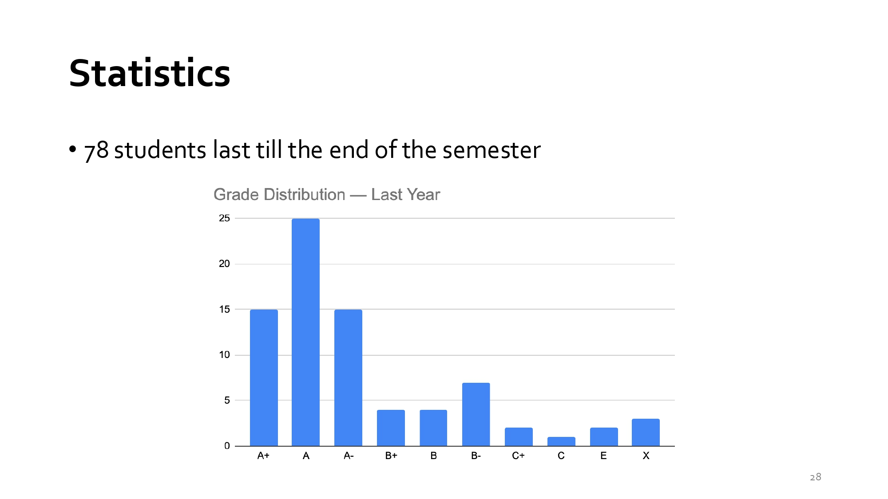
</div>

本頁投影片（Slide 28）主題為 「Statistics」（往年修課統計與成績分佈），呈現了前一年（Last Year）學生修完這門電腦架構課程的最終成績分佈圖：
- 本教學頁面重點內容
  - 修課人數與留存率：<br>78 名學生堅持修完到了學期末（78 students last till the end of the semester）。
  - 成績分佈（Grade Distribution）：
    - 高分群（A族群）佔絕大多數：
      - A 級距人數最多（約 25 人）。
      - A+ 與 A- 各約 15 人。
      - A 系統（A+, A, A-）合計約 55 人，佔總修課人數（78 人）的 70% 以上。
    - 中等群（B族群）：<br>B+、B、B- 的人數顯著減少（各約 4~7 人不等）。
    - 低分與未通過群（C / E / X）：<br>C+、C、E、X 等級距僅有極少數個位數學生（各約 1~3 人）。
- 對此頁面的看法與分析
  - 高投入、高回報（Hard work pays off）：<br>結合前面幾頁提到的硬核內容——包含高難度的 Superscalar 與 Cache Design 等 RTL 實作（佔 50%）、每週指定論文閱讀（In exam scope），這門課雖然極具挑戰性，但只要學生堅持到最後（last till the end），絕大多數（>70%）都能拿到 A- 以上的優異成績。
  - 「高停修/棄選率」與「優勝劣汰」現象：
    - 標題特意寫出「78 人堅持到最後」，隱含期初選課人數可能更多，中間有部分無法負擔 Lab 評估或理論難度的學生選擇退選。
    - 留在課堂上的學生因投入大量時間完成高比重的 Lab 專案（50%）與備考（50%），整體學習效果顯著，因此呈現出非常漂亮的高分偏態（Right-skewed / Top-heavy）分佈。
- 總結：<br>這張統計圖給予新學期學生的訊息非常明確：這是一門硬課，但絕非甜課或殺手課。只要願意付出時間克服 4 個 Lab 的寫碼挑戰並緊跟教學進度，順利通關並取得高分（A/A+）的機率非常高。


## slide：29 Enrollment Cap Selection Process（選課人數上限與篩選流程）
<div align="left" >
  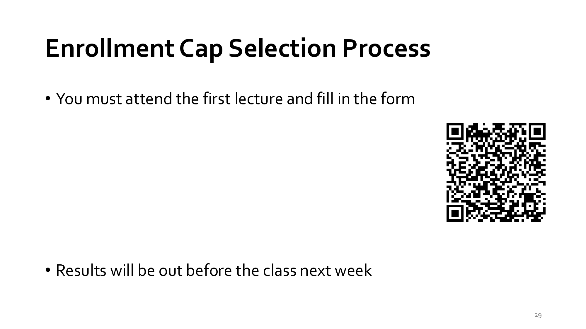
</div>

本頁投影片（Slide 29）主題為 「Enrollment Cap Selection Process」（選課人數上限與篩選流程），說明了當修課人數超出容量限制時的加簽/選課篩選規則：


## slide：30 Computer Organization（電腦組織）
<div align="left" >
  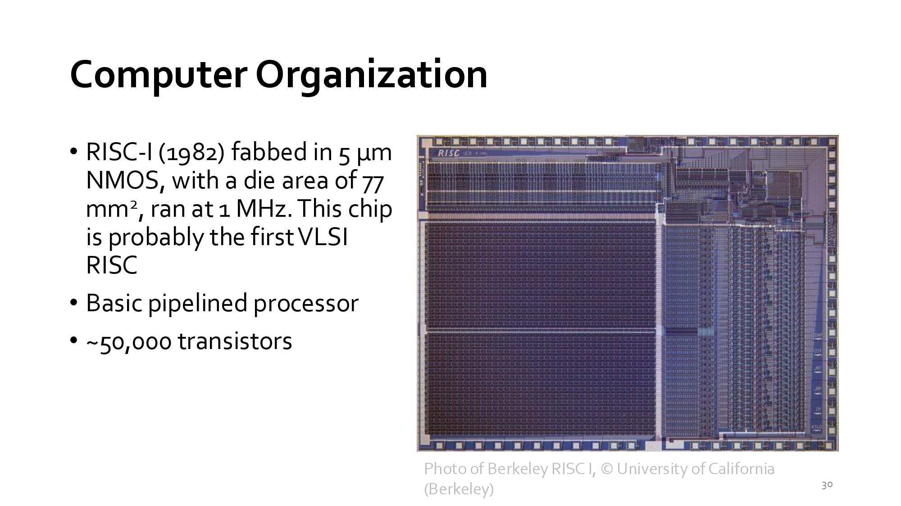
</div>

本頁投影片（Slide 30）主題為 「Computer Organization」（電腦組織），以歷史著名的 RISC-I 處理器 為例，展示了早期的微處理器設計與晶片架構規範：
- 本教學頁面重點內容
  - RISC-I 晶片規格（1982 年）：
    - 製程（Process）：採用 5um NMOS 製程製造。
    - 晶片面積（Die Area）：77mm^2。
    - 運作時脈（Clock Speed）：1MHz。
    - 歷史地位：可能是世界上第一款超大型積體電路（VLSI）精簡指令集（RISC）微處理器。
  - 架構特色：
    - 基礎管線化處理器（Basic pipelined processor）：具備早期基本的指令管線化架構。
    - 電晶體數量（Transistor Count）：約包含 50,000 個電晶體（~50,000 transistors）。
  - 右側圖示：<br>展示了著名的 Berkeley RISC-I 晶片顯微剖面照片（Photo of Berkeley RISC I, © University of California, Berkeley）。
- 對此頁面的看法與分析
  - 歷史對比與摩爾定律（Moore's Law）的發端：<br>電晶體數量的震撼對比：1982 年的 RISC-I 僅有 50,000 個電晶體、主頻 1MHz；而現代的 AI 加速器（如 Nvidia B200）電晶體數量已高達 2,080 億個，提升了四百萬倍以上。本頁作為課程導論的結尾，為學生建立了電腦架構演進的縱深視角。
  - 與課程講義與教科書作者的淵源：<br>Berkeley RISC-I 是本課程指定教科書作者之一 David A. Patterson 教授在加州大學柏克萊分校主導的代表性專案。該專案證明了使用簡單、精簡的指令集（RISC）能以更少電晶體達成更高的效能，並成為後續 SPARC、ARM 及今日 RISC-V 架構的重要基石。
- 總結：<br>本頁投影片透過 RISC-I 這顆開創性的晶片，正式為後續的「電腦組織與微架構（Pipeline, Out-of-Order, Cache）」課程內容拉開序幕。它告訴學生：現代極度複雜的超級電腦與 AI 晶片，都是建立在這個基礎的流水線與硬體組織架構之上。

## slide：31 Computer Architecture」（電腦架構）
<div align="left" >
  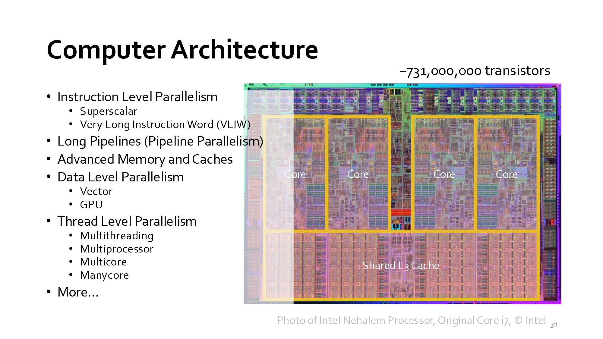
</div>

本頁投影片（Slide 31）主題為 「Computer Architecture」（電腦架構），相較於前一頁（Slide 30）介紹的單核心與基礎管線化，本頁展示了現代多核心與進階平行處理（Parallelism）的電腦架構：
- 本教學頁面重點內容
  - 各種層級的平行處理（Parallelism Techniques）：
    - 指令級平行（Instruction Level Parallelism, ILP）：
      - Superscalar（超純量）：每個時脈週期可發射與執行多條指令。
      - Very Long Instruction Word (VLIW)：由編譯器將多個獨立指令打包成超長指令字元並平行執行。
    - 長管線與管線平行（Long Pipelines / Pipeline Parallelism）：透過深度管線提升主頻與指令吞吐量。
    - 進階記憶體與快取架構（Advanced Memory and Caches）：包含多層級快取（L1/L2/L3 Cache）等記憶體階層設計。
    - 資料級平行（Data Level Parallelism, DLP）：<br>Vector（向量處理器）與 GPU：單一指令處理大量陣列/向量資料。
    - 執行緒級平行（Thread Level Parallelism, TLP）：<br>Multithreading（多執行緒）、Multiprocessor（多處理器）、Multicore（多核心）、Manycore（眾核心）。
  - 右側圖示：
    - Intel Nehalem 微架構（Original Core i7） 晶片顯微照片（Photo of Intel Nehalem Processor, © Intel）。
    - 電晶體數量：約 7 億 3100 萬個（~731,000,000 transistors）。
    - 結構特徵：明顯可見 4 個 CPU 核心（Core）以及下方的共享三級快取（Shared L3 Cache）。
- 對此頁面的看法與分析
  - 對比 1982 年 RISC-I 的演進（Slide 30 vs Slide 31）：<br>從 RISC-I 的 5 萬個電晶體（1MHz、單核基本管線），躍升至 Intel Nehalem 的 7.31 億個電晶體（四核心、多執行緒、共享 L3 Cache）。這展現了摩爾定律（Moore's Law）與 Dennard 縮放比例定律（Dennard Scaling）如何推動電腦架構邁向多核與多層次平行。
  - 貫穿本課程核心主題：<br>本頁所列出的技術，完全涵蓋了 Hennessy & Patterson 的經典教科書《Computer Architecture: A Quantitative Approach》的核心章節，也是學生在後續 Lab 中需要實作的關鍵技術（如 Lab 3 的 Superscalar 與 Lab 4 的 Cache Design）。
- 總結：<br>本頁說明了現代電腦架構的核心就是「透過不同層級的平行（ILP, DLP, TLP）與記憶體階層來榨取極致效能」。從單核管線邁向多核、巨型快取與向量/GPU 運算，是現代高算力系統不可或缺的基石。

#### slide：32 Course Logistics（課程行政與宣導事項）
<div align="left" >
  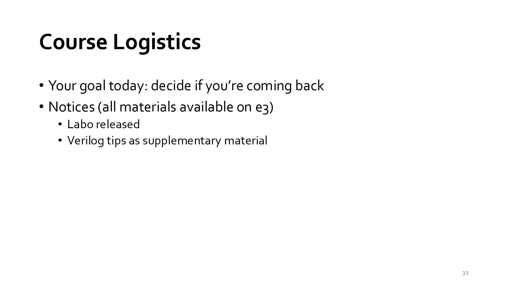
</div>

- 本教學頁面重點內容
  - 今天的核心目標（Your goal today）：<br>決定是否繼續修讀本課程（decide if you're coming back）。提醒學生綜合考量評分機制、作業難度（如 Superscalar 與 Cache 等 RTL 實驗）與個人時間規劃後做出決定。
  - 重要公告（Notices）：
    - 所有教學資源皆已上架至 e3 平台（all materials available on e3）。
    - Lab 0 已開放（Lab 0 released）：供學生建立與熟悉 Verilog 開發環境。
    - 提供 Verilog Tips 補充教材（Verilog tips as supplementary material）：協助學生複習硬體描述語言寫作技巧，為後續高難度的硬體實驗打下基礎。

#### slide：33 Acknowledgements（致謝與教材來源聲明）
<div align="left" >
  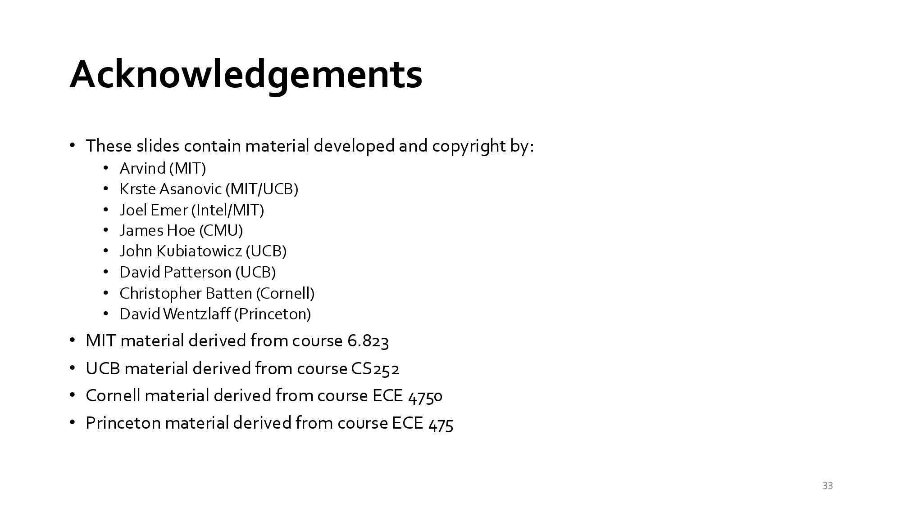
</div>

本頁投影片（Slide 33）主題為 「Acknowledgements」（致謝與教材來源聲明），列出了本課程簡報所採用的頂尖名校與產業專家之教學教材與著作權歸屬：
- 本教學頁面重點內容
  - 學者與專家致謝名單（Material & Copyright）：
  - 引用之名校課程（Derived Courses）：
    - MIT（麻省理工學院）：衍生自 6.823 課程。
    - UCB（加州大學柏克萊分校）：衍生自 CS252 課程。
    - Cornell（康奈爾大學）：衍生自 ECE 4750 課程。
    - Princeton（普林斯頓大學）：衍生自 ECE 475 課程。
- 對此頁面的看法與分析
  - 頂級學術與產業血統（State-of-the-Art Curriculum）：<br>本課程集結了全世界最頂尖電腦架構研究機構的精華。例如列名的 David Patterson（圖靈獎得主、RISC 與 RAID 奠基人） 及 Krste Asanović（RISC-V 共同發明人），皆為晶片設計與電腦架構領域的權威巨擘。
  - 國際一流研究所等級的課程標準：<br>採用的參考來源（如 MIT 6.823、UC Berkeley CS252）皆為全球最著名的電腦架構進階/研究所課程。這再次印證了前面投影片所呈現的高強度教學內容（涵蓋 Out-of-Order Execution、Superscalar、L1 Cache RTL 設計與最新 AI 專用晶片/DSAs）。


