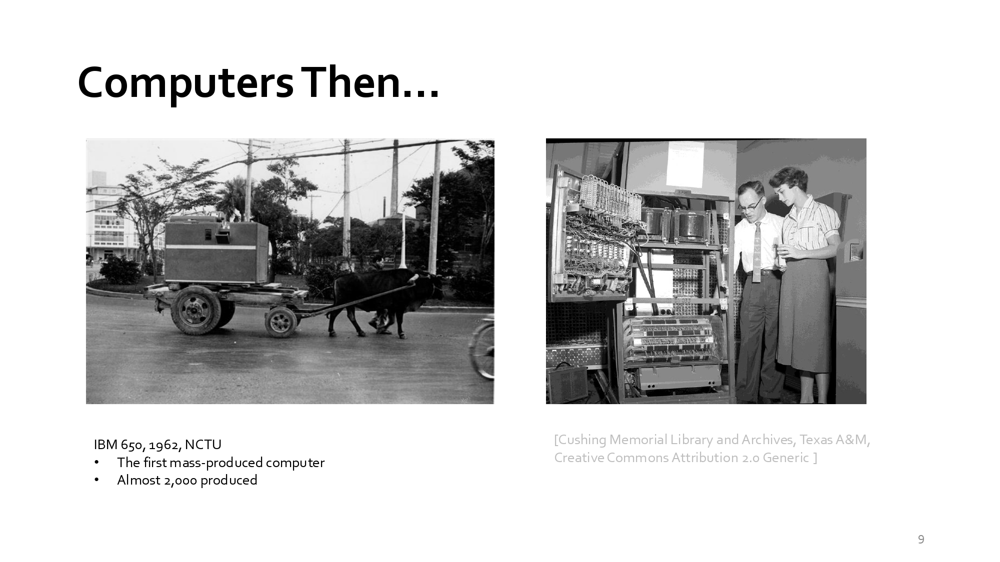
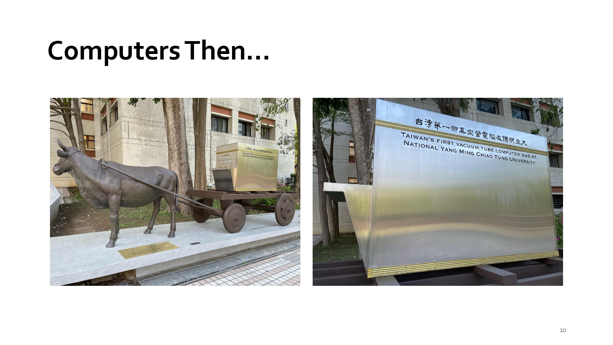
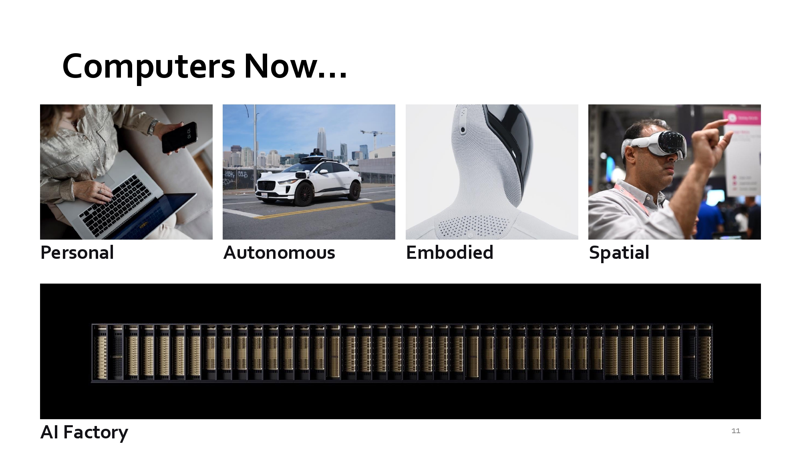
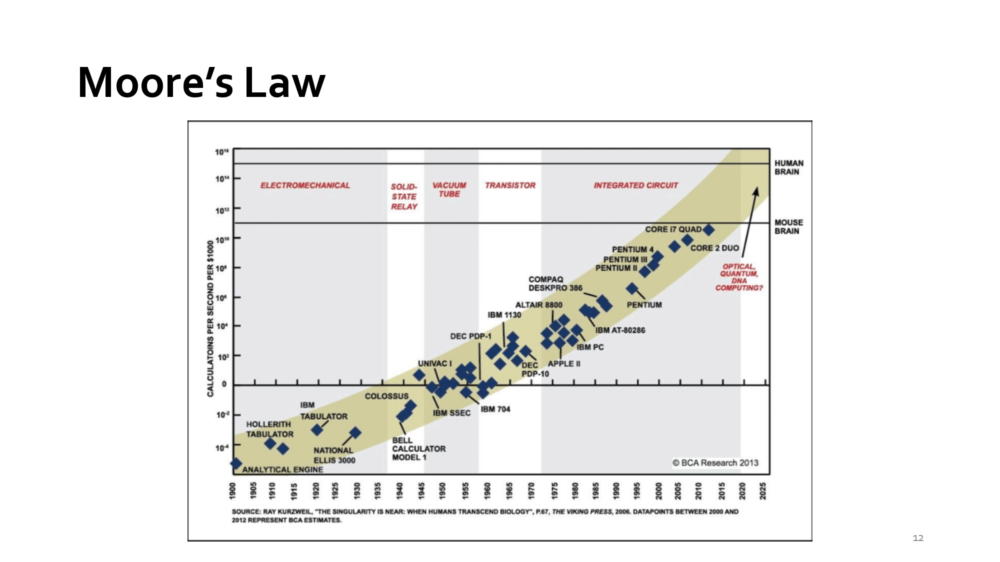
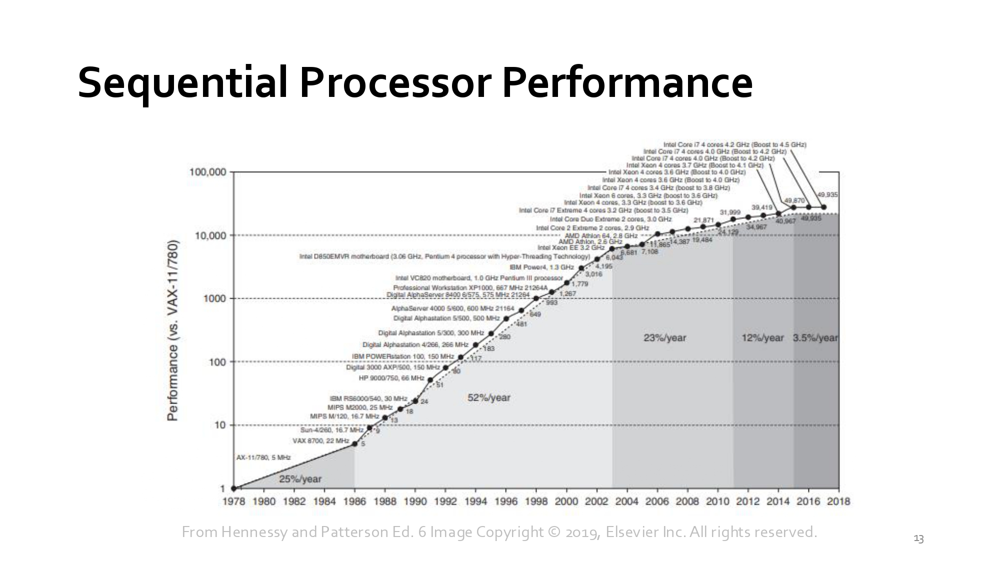
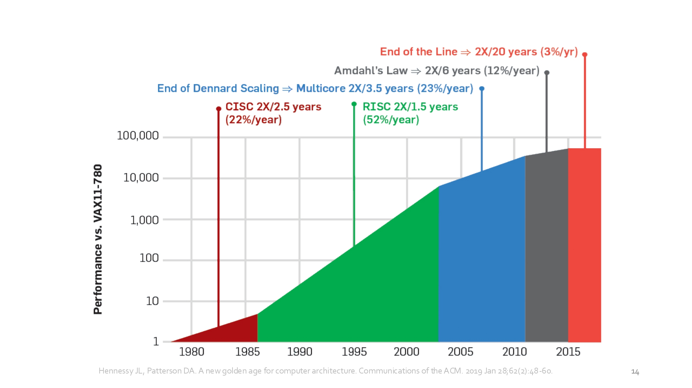
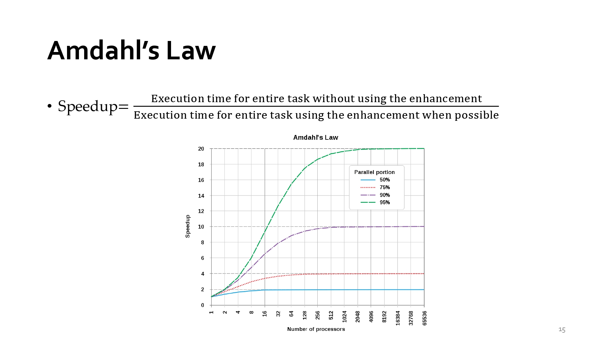

### Week 1 課堂逐字稿
#### slide：1
<div align="left" >
  
</div>

Computer Architecture = 計算機架構
<br>這門課並不是教如何寫程式，而是教：「電腦到底如何執行程式？」從軟體一路往下看到硬體，是資工系的重要核心課程。

#### slide：2
<div align="left" >
  
</div>

Agenda（課程大綱）
- What is Computer Architecture?
  >什麼是計算機架構？
- Course Logistics
  >課程規則與安排

#### slide：3 What is Computer Architecture?
<div align="left" >
  
</div>

What is Computer Architecture?（什麼是計算機架構？）
- Computer architecture is the design of abstraction and implementation layers that allow applications to execute efficiently.
  >計算機架構是在應用程式與硬體技術之間建立多層次抽象與實作機制，使程式能有效率地執行。
- 重點：
  - Application（應用）
  - Physics/Technology（物理技術）
  <br>中間需要許多層來連接。

#### slide：4 The Computer Systems Stack（電腦系統層級架構）
<div align="left" >
  
</div>

層級：
|英文	|中文|
|--|--|
|Application  |應用  |
|Algorithm	|演算法|
|Programming Language	|程式語言|
|Operating System/Virtual Machines	|作業系統|
|Compiler	|編譯器|
|Instruction Set Architecture (ISA)	|指令集架構|
|Microarchitecture	|微架構|
|Register-Transfer Level (RTL)	|暫存器傳輸層|
|Gate Level	|邏輯閘|
|Circuit	|電路|
|Device	|元件|
|Physics / Technology|物理技術|

**考試常問：ISA、Microarchitecture、RTL 差在哪裡？**
<br>ISA（指令集架構）、Microarchitecture（微架構） 與 RTL（暫存器傳輸級） 是電腦系統疊層（Computer Systems Stack）中硬體與軟體交界處的三個不同抽象層次：
|階層  |定義與核心概念  |角色與責任  |範例|
|--|--|--|--|
|ISA(Instruction Set Architecture)  |軟硬體的介面與契約定義處理器能理解的指令集、暫存器數量、記憶體位址模式等規格。   |規範「處理器應該做什麼（What）」，使軟體/編譯器能編譯出可執行的程式碼。   |x86, ARM, RISC-V|
|Microarchitecture  |硬體的設計與組織實現 ISA 所規範功能的硬體架構設計概念（如管線化、快取階層、分支預測）。  |決定「硬體要如何實現（How）ISA」，直接影響 CPU 的效能與功耗。|Intel Alder Lake, Apple M1/M2, Cortex-A78|
|RTL(Register-Transfer Level)  |硬體的程式碼實現用硬體描述語言寫出資料如何在暫存器與組合邏輯間傳輸的詳細邏輯。   |將微架構設計轉化為「可被合成與晶片製造的程式碼」。|Verilog, SystemVerilog, VHDL 代码|

階層關係與具體範例
<br>以運算 a = b + c 為例：
- ISA：編譯器將其轉譯為 ISA 規範的組合語言指令（如 RISC-V 的 add x4, x2, x3）。ISA 規定了 add 指令格式與操作數位置。
- Microarchitecture：設計師規劃這條 add 指令要在哪一個流水線（Pipeline）階段執行、是否需要亂序執行（Out-of-order execution）、如何從快取（Cache）預取資料。
- RTL：工程師編寫具體的 Verilog/VHDL 程式碼，例如定義加法器電路 assign x4 = x2 + x3; 以及暫存器觸發時脈（Clock）的邏輯。

簡單來說：ISA 是軟硬體溝通的「語言規範」，Microarchitecture 是 CPU 的「藍圖設計」，而 RTL 則是把藍圖寫成「具體的電路程式碼」。

#### slide：5 The Computer Systems Stack（電腦系統層級架構）
<div align="left" >
  
</div>

Compiler、OS、ISA（編譯器把 C 轉為組合語言）
- Compiler（編譯器把 C 轉為組合語言）
  <br>例如：a = b + c; 變成：add x1, x2, x3
- ISA
  <br>RISC-V 指令：add、addi、lw、sw
- OS
  <br>Linux Windows macOS 負責管理硬體。

**總結**：
<br>這張告訴你：C語言 → Compiler → RISC-V 指令 → CPU 執行 之後學 RISC-V 時會一直看到。

#### slide：6 The Computer Systems Stack
<div align="left" >
  
</div>

低階硬體世界
- How data flows through system.
  <br>資料如何在硬體內部流動。
  ```
  從下到上
  Physics ↓ Devices ↓ Circuits ↓ Logic Gates ↓ RTL
  ```

看法：這是數位電路課與計算機架構課的連結。
```
AND Gate ↓ ALU ↓ CPU
```

#### slide：7 This Course
<div align="left" >
  
</div>

- 本課程主要聚焦在：
  - ISA
  - Microarchitecture
  - RTL

表示你不會深入：半導體製程、電晶體設計，而是專注於 CPU 設計。

#### slide：8 Architecture is Constantly Changing（架構持續演進）
<div align="left" >
  
</div>

驅動因素
- Application Requirements
  <br>應用需求：例如：AI、Gaming、Cloud
- Technology Constraints

我的看法：這張是研究領域的核心思想：需求推動架構、架構推動科技、科技再推動應用，三者互相影響。

本教學頁面的重點在於說明電腦架構（Computer Architecture）如何受到應用需求與技術限制的雙向推動而持續演進：
- 電腦系統疊層（The Computer Systems Stack）
  <br>圖表左側展示了從最上層的軟體應用到最底層的物理技術所構成的抽象層級：
  - 軟體/應用層：Application → Algorithm → Programming Language → OS / Virtual Machines → Compiler。
  - 架構/介面層：Instruction Set Architecture (ISA) → Microarchitecture → Register-Transfer Level (RTL)。
  - 硬體/物理層：Gate Level → Circuits → Devices → Physics / Technology。
- 架構變革的兩大核心推動力
  <br>圖表右側指出推動電腦架構變化的兩大方向（即上下兩個箭頭）：
  - 由上而下的驅動力 —— 應用需求（Application Requirements）
    - 引導架構改進：新的應用需求（如 AI、大數據、遊戲）會驅動並建議如何改進電腦架構。
    - 提供研發資金：成功的應用帶來商業收益，進而資金回流用於支援新硬體與架構的研發。
  - 由下而上的限制與突破 —— 技術限制（Technology Constraints）
    - 限制執行效率：物理與半導體技術的極限（如功耗、散熱、製程）會限制哪些設計能夠被高效實現。
    - 開創新架構可能：新技術的突破（如新材料、新製程）能讓過去無法實現的新架構變為可能。
- 架構的回饋機制（Feedback Mechanism）
  <br>電腦架構位於中央樞紐位置，能夠提供回饋資訊（Provide feedback），進一步引導上層應用發展以及下層技術研究的方向。

#### slide：9-10 Computers Then
<div align="left" >
  
  
</div>

過去的電腦：IBM 650
<br>特色：
- 早期大型電腦
- 體積巨大
- 成本昂貴

#### slide：11 Computers Now
<div align="left" >
  
</div>

現代電腦類型：
- Personal（個人電腦）
- Autonomous（自動駕駛）
- Embodied（機器人）
- Spatial（空間運算）
- AI Factory（AI資料中心）

我的看法：AI 已成為主流運算需求。未來許多架構設計都圍繞 AI。

#### slide：12 Moore's Law（摩爾定律）
<div align="left" >
  
</div>

#### slide：13-14 Sequential Processor Performance
<div align="left" >
  
  
</div>

#### slide：15 Amdahl's Law（阿姆達爾定律）
<div align="left" >
  
</div>

本教學頁面討論的核心主題為阿姆達爾定律（Amdahl's Law）與平行化的效能極限。以下為教學重點內容整理、個人的觀點評析與總結：
- Speedup（加速比）定義：
  ```
                    未改進時執行整個任務的時間
  Speedup（加速比）= ------------------------------------
                    使用改進技術後執行整個任務的時間

  指標用於量化「加入某種硬體優化或平行處理器後，系統整體變快了多少倍」。
  ```
- 可平行化比例（Parallel Portion）對加速比的限制：
  <br>圖表展現了在不同「可平行化比例」（$50\%, 75\%, 90\%, 95\%$）之下，增加處理器數量（Number of Processors）對整體加速比的影響：
  - 邊際效應遞減：不論處理器增加到幾千甚至上萬個，加速比最終都會趨於平緩並達到上限。
  - 串行瓶頸（Serial Bottleneck）：整體加速比的最大上限取決於無法被平行化的串行部分（1 - Parallel Portion）。
    - 若可平行化比例為 50%，無論放再多處理器，加速比極限就是 2 倍。
    - 若可平行化比例提升至 95%，理論加速比極限可達 20 倍。
- 對此定律的看法：
  - 指出硬體堆疊的盲點：Amdahl's Law 揭示了「暴力增加 CPU 核心數」無法無限制提升效能的現實，硬體盲目堆疊只會帶來嚴重的資源浪費與功耗上升。
  - 強調軟硬體協同設計（Co-design）：若要讓更多核心發揮價值，關鍵不在於硬體有多強，而在於**軟體演算法**與**編譯器**能否將串行邏輯拆解為可平行執行的任務（即拉高 Parallel Portion）。
- 總結：
  <br>Amdahl's Law 提醒架構師與軟體工程師：系統的最終效能往往不由「最快的部分」決定，而是由「無法改進的瓶頸（串行部分）」所限制。因此在進行系統優化時，應優先找出並縮減不可平行的瓶頸段落，才能最大化硬體投資的報酬率（ROI）。


