Prompt：請說明本教學重點內容及你的看法，最後以250字內總結
### Week 3 課堂逐字稿

## slide：1 -2

  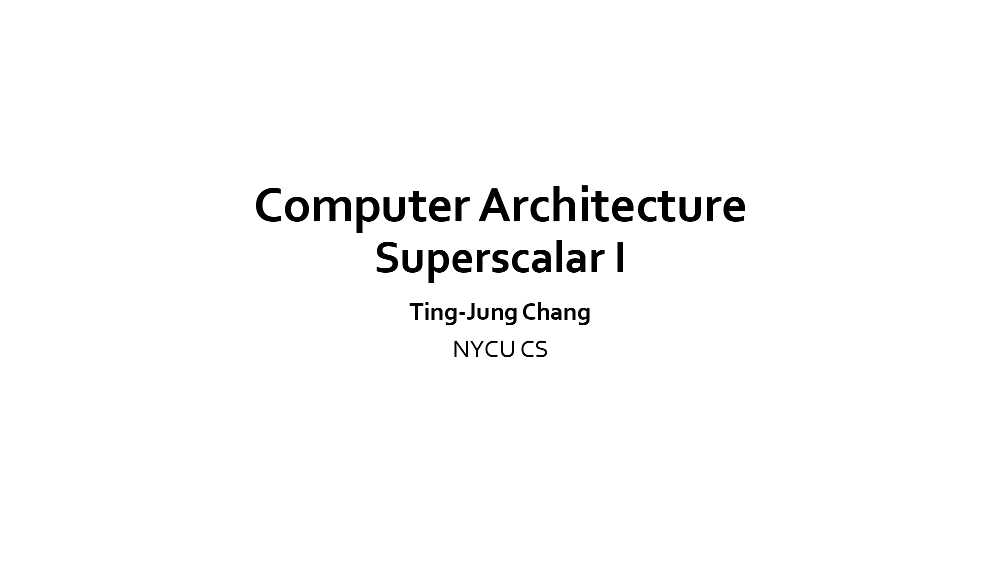
  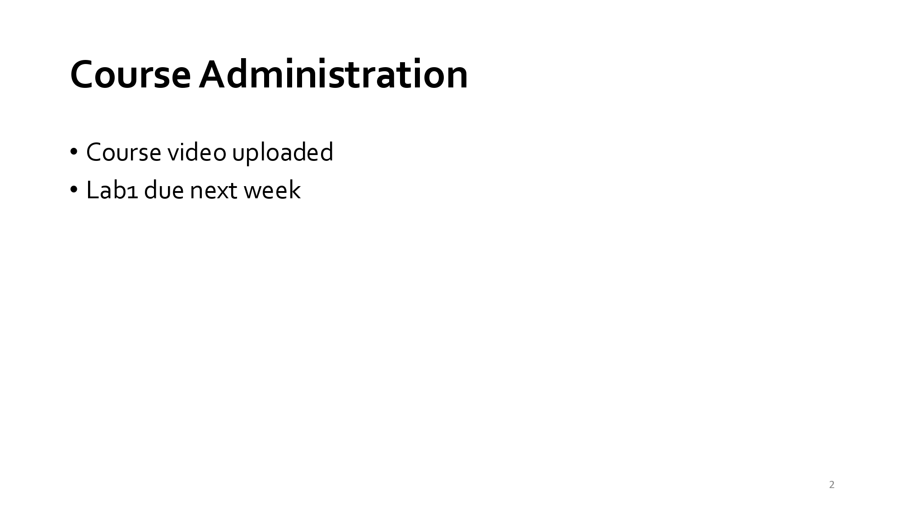

- 本教學重點內容：
  - 課程影片上傳（Course video uploaded）：提示學生本週或最新的課程教學影片已經上傳至平台，可供學生觀看與複習。
  - Lab 1 作業繳交期限（Lab1 due next week）：公告實驗作業 Lab 1 將於下週截止繳交（Due next week）。
- 個人看法：
  - 這是一張典型且標準的課程開場與行政宣導投影片。
  - 教學目的：在正式進入複雜的微架構（如 Scoreboard、管線控制）等硬體技術主題前，先明確告知學生課務進度與實驗作業的時間節點，能幫助學生規劃時間與完成實務實作。
- 總結：
   本投影片為課務行政公告，提醒學生課程影片已上傳，並通知 Lab 1 實驗作業將於下週截止繳交，提醒學生規劃時間完成學習與作業。

## slide：3

  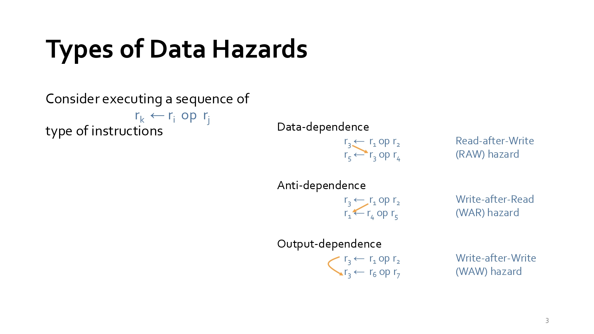

這張投影片主題為 「Types of Data Hazards（資料冒險/資料相依性的類型）」。
- 本教學重點內容：
  - 資料相依性（Data-dependence）與 Hazards 類型： 對於指令序列 $r_k \leftarrow r_i \text{ op } r_j$，依據資料讀寫順序可分為三類： 
    - RAW (Read-after-Write) / 真資料相依（Data-dependence）：後續指令需要讀取前指令尚未寫入的暫存器（例如 $r_3 \leftarrow r_1 \text{ op } r_2$ 後接 $r_5 \leftarrow r_3 \text{ op } r_4$）。這是真正的資料相依。
    - WAR (Write-after-Read) / 反相依（Anti-dependence）：後續指令試圖寫入前指令正在讀取的暫存器（例如 $r_3 \leftarrow r_1 \text{ op } r_2$ 後接 $r_1 \leftarrow r_4 \text{ op } r_5$）。
    - WAW (Write-after-Write) / 輸出相依（Output-dependence）：兩條指令試圖寫入同一個暫存器（例如 $r_3 \leftarrow r_1 \text{ op } r_2$ 後接 $r_3 \leftarrow r_6 \text{ op } r_7$）。
- 個人看法：
   這張投影片是理解動態排程（如 Scoreboard 或 Tomasulo 演算法）的基礎核心。
  - RAW vs. WAR/WAW 的本質差異：RAW 代表真正的資料傳遞（真相依），無法憑空消除，必須透過 Forwarding/Bypassing 或 Stall 來解決；而 WAR 與 WAW 屬於「名字相依（Name Dependence）」，僅是因為暫存器數量有限而重複使用相同暫存器名稱所致。
  - 設計延伸：傳統的 Scoreboard 透過在 Issue 階段停頓指令來處理解決 WAW hazard；而更進階的處理器（如 Tomasulo 架構）則透過「暫存器重命名（Register Renaming）」完全消除 WAR 與 WAW，極大地解放了指令平行度（ILP）。
- 總結：
   本投影片介紹了三種資料冒險：RAW（讀後寫）、WAR（寫後讀，反相依）與 WAW（寫後寫，輸出相依）。RAW 為真實資料相依，需透過轉發或停頓解決；WAR 與 WAW 則為暫存器名稱重複使用造成的假性相依，是後續管線設計與動態排程（如暫存器重命名）必須識別與克服的核心問題。

## slide：4

  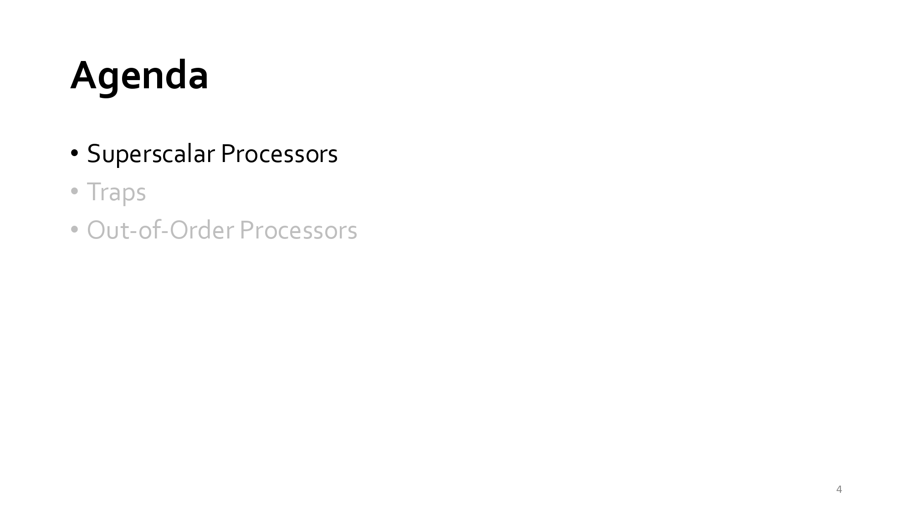

這張投影片為 Agenda（課程大綱/主題目錄）。
- 本教學重點內容：
  - Superscalar Processors（超純量處理器）：
    - 本單元的核心主題，探討如何在每個時脈週期發射與執行多條指令（ILP, Instruction-Level Parallelism）以提升效能。
  - 未來的延伸主題（目前灰底預告）：
    - Traps（中斷與異常處理）：探討精確中斷（Precise Interrupts）機制與例外處理。
    - Out-of-Order Processors（亂序執行處理器）：介紹動態排程與 Tomasulo 演算法等進階微架構。
- 個人看法：
   這是一張典型的章節切換與大綱導覽頁面。
  - 教學脈絡：在前面討論完單發射（Single-Issue）的流水線與 Scoreboard 機制後，課程正式邁入 Superscalar（超純量） 領域。
  - 核心挑戰： Superscalar 架構需要同時發射多條指令，這意味著 Scoreboard 或 Hazard Detection 的複雜度會呈平方級成長（需要同時檢查多個 Source/Destination 暫存器衝突）。
- 總結：
   本投影片標示了當前的學習主題為「Superscalar Processors」，並預告後續將探討 Traps 與亂序執行處理器（Out-of-Order Processors），為接下來的微架構進階概念揭開序幕。

## slide：5

  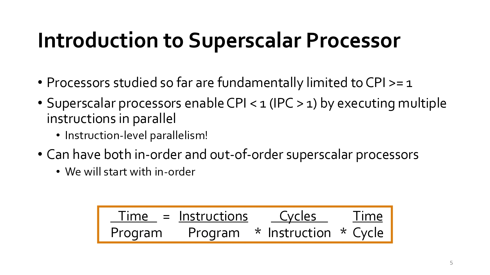

這張投影片介紹了 Superscalar Processor（超純量處理器） 的基本概念與效能指標。
- 本教學重點內容：
  - 突破傳統效能瓶頸（CPI < 1）：
    - 傳統單發射（Single-Issue）處理器的效能極限為 $\text{CPI} \ge 1$（每個週期最多執行一條指令）。
    - Superscalar 架構 透過平行執行多條指令（Instruction-Level Parallelism, ILP），實現 $\text{CPI} < 1$（即 $\text{IPC} > 1$）。
  - 分類與執行模式：
    - Superscalar 可分為 In-order（順序執行） 與 Out-of-order（亂序執行） 超純量處理器。
    - 本單元將從 In-order superscalar 開始介紹。
  - CPU 效能公式（Iron Law of Processor Performance）：
    - $\text{CPU 時間} = \frac{\text{指令數}}{\text{程式}} \times \frac{\text{時脈週期數}}{\text{指令}} \times \frac{\text{時間}}{\text{時脈週期}}$。
    - Superscalar 主要透過降低 $\frac{\text{Cycles}}{\text{Instruction}}$（即 CPI）來縮短程式執行總時間。
- 個人看法：
   Superscalar 是現代高效能 CPU（如 Apple M 系列、Intel Core、AMD Ryzen）不可或缺的核心技術。
  - 硬體代價與挑戰：為了在同一週期內 Issue 多條指令，硬體必須具備多套 Fetch/Decode 邏輯與多個執行單元，並且 Hazard Detection（如 Scoreboard 或 Register Renaming）的檢查對數會成倍增加。
  - In-order 的侷限：In-order superscalar 雖然簡單，但只要前面有一條指令發生 Dependency Stall（如 RAW），後方原本無相依關係的指令也會跟著被卡住，這也是為何進階處理器會轉向 Out-of-order（如 Tomasulo 演算法）來最大化挖掘 ILP。
- 總結：
   本投影片標示了處理器設計由單發射邁向超純量（Superscalar）的轉折點。超純量技術利用平行執行多條指令（ILP）成功將 CPI 降低至 1 以下（IPC > 1），藉此大幅提升 CPU 執行效率。

## slide：6

  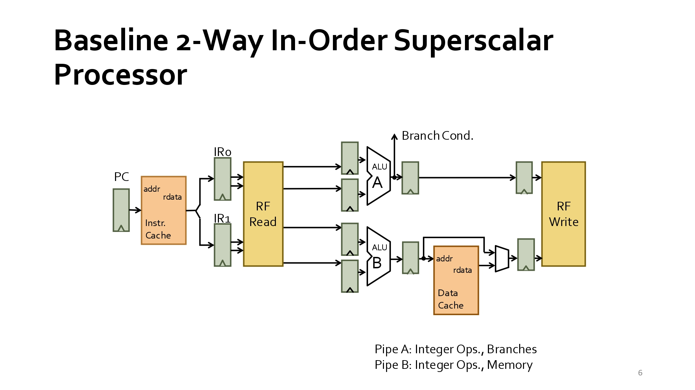

這張投影片展示了 基線 2 管道順序超純量處理器（Baseline 2-Way In-Order Superscalar Processor） 的微架構硬體區塊圖。
- 本教學重點內容：
  - 2-Way（雙發射）前端架構：
    - Instruction Cache（指令快取）：每個週期可同時讀取（Fetch）兩條指令。
    - IR0 / IR1（指令暫存器）：將兩條擷取的指令分別鎖存，並送入 RF Read（暫存器檔讀取） 階段。
  - 雙管線（Dual Execution Pipelines）分工：
    - Pipe A：負責整數運算（Integer Ops）與分支指令（Branches），包含 ALU A。
    - Pipe B：負責整數運算（Integer Ops）與記憶體存取（Memory），包含 ALU B 與 Data Cache。
  - 順序寫回（In-Order Writeback）：
    - 兩條管線算完後，最終將結果寫回暫存器檔（RF Write）。
- 個人看法：
   這是在介紹 Superscalar 時最標準且經典的入門架構設計（例如早期 Intel Pentium 的 $U/V$ pipeline）。
  - 硬體開銷：暫存器檔（RF）必須支援更多 Read/Write Ports（雙發射需要至少 4 個 Read Ports 與 2 個 Write Ports），這會顯著增加晶片面積與功耗。
  - 結構限制（Structural Hazard）：Pipe A 與 Pipe B 功能不完全對稱（只有 Pipe B 能存取 Data Cache，只有 Pipe A 能處理 Branch）。若兩條同時抓進來的指令都是 Memory 存取指令，第二條指令就無法發射，必須延後到下一個週期，這稱之為發射限制（Issue Restrictions）。
- 總結：
   本投影片展示了 2-Way 順序超純量處理器的硬體架構，透過雙路管線（Pipe A 負責整數/分支，Pipe B 負責整數/記憶體）實現單一週期平行發射與執行兩條指令。此設計揭示了 Superscalar 對暫存器埠數量的需求增加，以及功能單元不對稱所產生的 Issue 限制。

## slide：7

  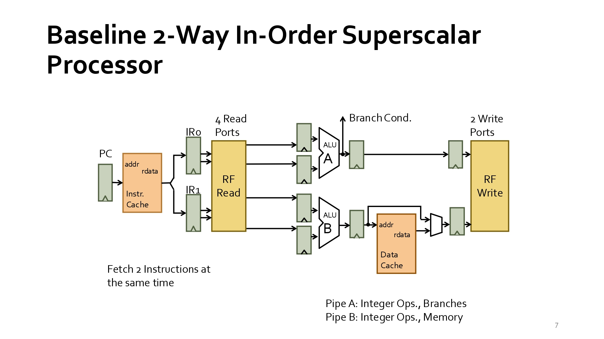

這張投影片補充說明了  Baseline 2-Way In-Order Superscalar Processor  在硬體埠數（Ports）與前端擷取（Fetch）上的具體規格。
- 本教學重點內容：
  - 同週期雙指令擷取（Fetch 2 Instructions at the same time）：
    - Instruction Cache 支援單週期讀取兩條指令，分別鎖存至 IR0 與 IR1 兩個指令暫存器。
  - 暫存器檔埠數需求（Register File Ports）：
    - 4 Read Ports（4 個讀取埠）：因為雙發射最多需要同時讀取兩條指令的操作數（每條指令最多 2 個來源暫存器），故 RF Read 需要 4 個讀取埠。
    - 2 Write Ports（2 個寫入埠）： Pipe A 與 Pipe B 可能在同一週期同時執行完畢並寫回，故 RF Write 需要 2 個寫入埠。
- 個人看法：
   這展現了 Superscalar 帶來顯著硬體開銷（Hardware Overhead）的經典案例。
  - 暫存器檔的面積與功耗：暫存器檔（Register File）的晶片面積大約與埠數的平方成正比（$\text{Area} \propto (\text{Read Ports} + \text{Write Ports})^2$）。從 Single-Issue（2R/1W）升級到 2-Way Superscalar（4R/2W），RF 的電路複雜度與存取延遲均大幅增加。
  - 效能與成本平衡：增加 Ports 雖然是實現 IPC > 1 的硬性門檻，但硬體設計師必須仔細評估增加的面積與功耗成本是否能帶來相應的 IPC 提升。
- 總結：
   本投影片著重於 2-Way 順序超純量處理器的硬體規格細節，特別指出其需配備 4 個讀取埠與 2 個寫入埠的暫存器檔，以支援同一週期內雙指令的同時擷取、讀取與寫回。

## slide：8

  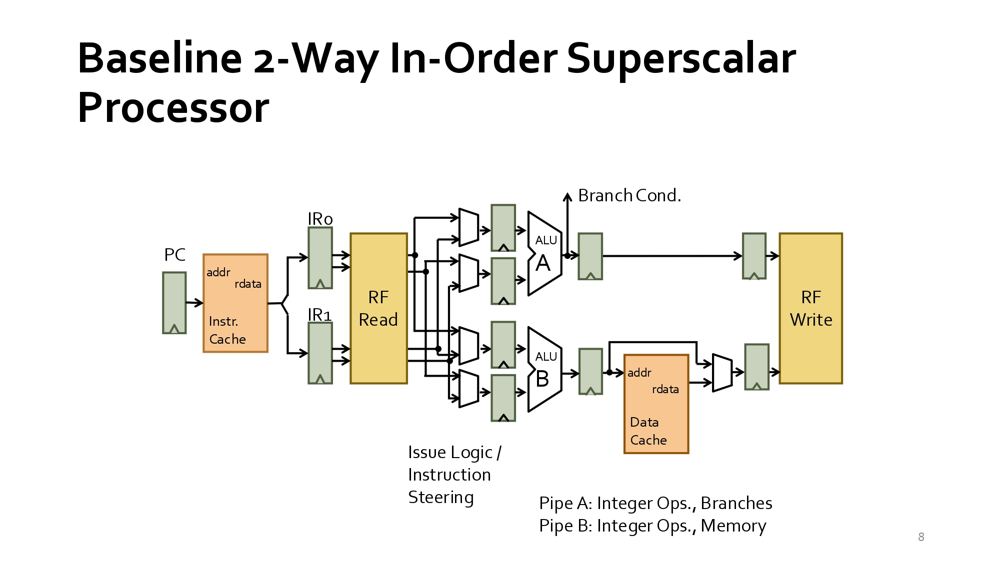

這張投影片說明了  Baseline 2-Way In-Order Superscalar Processor（基線 2 管道順序超純量處理器） 中的 Issue Logic / Instruction Steering（發射邏輯與指令分流/轉向）。
- 本教學重點內容：
  - 指令分流與轉向（Instruction Steering）：
    - 前端同時從 Instruction Cache 擷取兩條指令，鎖存於 IR0 與 IR1。
    - 多路複用器（Multiplexers, Mux）與 Issue Logic 負責根據指令類型，將指令操作數動態分流至對應的執行管線（Pipe A 或 Pipe B）。
  - 管線分工與限制：
    - Pipe A：僅能執行整數運算（Integer Ops）與分支指令（Branches）。
    - Pipe B：僅能執行整數運算（Integer Ops）與記憶體存取指令（Memory）。
- 個人看法：
   這展現了多發射（Multi-Issue）硬體設計中 Instruction Steering（指令分流邏輯） 的重要性與挑戰。
  - 硬體複雜度升級：除了上一頁提到的 4R/2W 多埠暫存器檔以外，Mux 與 Steering 邏輯使得 ID/Issue 階段的關鍵路徑（Critical Path）變長，可能會影響 CPU 的時脈頻率（Clock Frequency）。
  - 不對稱管線的碰撞限制：如果 IR0 是分支指令，而 IR1 也是分支指令，由於只有 Pipe A 支援分支，IR1 就無法在同一週期發射（Structural Hazard）。這種情況下，Issue Logic 必須進行硬體 Stalling，僅發射 IR0，並將 IR1 留到下一個週期。
- 總結：
   本投影片展示了雙發射順序超純量處理器的 Issue Logic / Instruction Steering 運作機制，透過多路複用器將兩條擷取的指令分流至 Pipe A（整數/分支）與 Pipe B（整數/記憶體），突顯了硬體控制邏輯在處理非對稱執行管線時的角色與限制。

## slide：9

  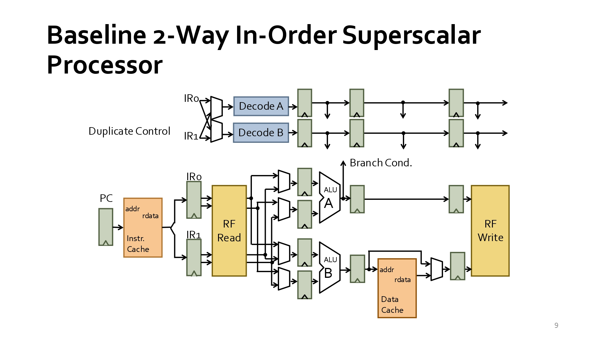

這張投影片展示了  Baseline 2-Way In-Order Superscalar Processor（基線 2 管道順序超純量處理器） 的完整控制邏輯與 Duplicate Control（重複的控制邏輯） 架構。
- 本教學重點內容：
  - 重複的控制邏輯（Duplicate Control）：
    - Decode A & Decode B ：為了能在同一個時脈週期內同時解碼（Decode）從 IR0 與 IR1 擷取進來的兩條指令，處理器必須配備兩套獨立且並行的解碼電路（Decode A 與 Decode B）。
    - 控制訊號管道（Control Pipelines）：解碼後的控制訊號（Control Signals）會沿著各自對應的管線暫存器向下傳遞，控制後續 Pipeline 階段的運算與路徑選擇。
  - 雙管線硬體結構全貌：
    - 前端：雙路解碼與多埠暫存器檔（4 Read Ports / 2 Write Ports）。
    - 發射與轉向： Issue Logic / Instruction Steering 負責將指令分流至 Pipe A（整數/分支）與 Pipe B（整數/記憶體）。
- 個人看法：
   這展現了 Superscalar 為了實現 $\text{IPC} > 1$ 所支付的硬體代價（Hardware Overhead）。
  - 面積與功耗雙重增加：不僅資料路徑（Datapath）需要雙份（如 2 個 ALU、多 Port RF），控制路徑（Control Logic）也需要 Duplicate Decode 電路，這會直接增加晶片面積與靜態/動態功耗。
  - 控制邏輯互相干擾：Decode A 與 Decode B 並非完全獨立運作，它們之間還需要額外的 Hazard Detection 邏輯來檢查 IR0 與 IR1 之間是否存在 RAW、WAR 或 WAW 衝突，這使得 Issue 階段的控制訊號產生變得更加複雜。
- 總結：
   本投影片展示了雙發射順序超純量處理器的全貌，說明其除了資料路徑需擴增外，更需要重複建置控制邏輯（Duplicate Control：Decode A/B），以便同時處理兩條指令的解碼與控制訊號傳遞，進一步突顯了超純量設計在效能提升與硬體複雜度之間的權衡。

## slide：10

  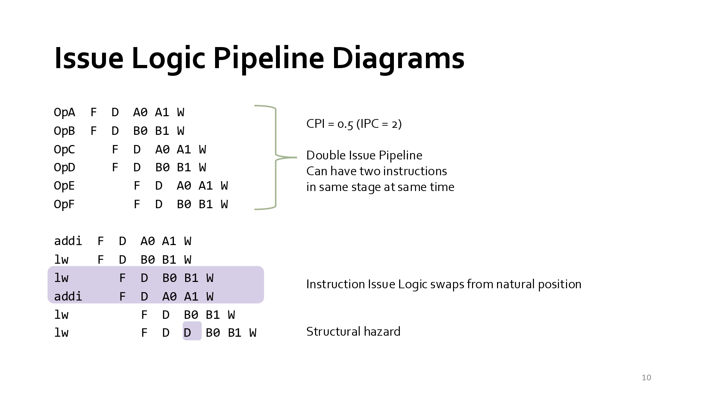

這張投影片主題為 「Issue Logic Pipeline Diagrams（發射邏輯流水線圖）」，透過流水線時脈圖展示 2-Way Superscalar 的執行情況與遇到衝突時的處理機制。
- 本教學重點內容：
  - 理想狀況：雙發射（Double Issue Pipeline）：
    - IPC = 2 ($\text{CPI} = 0.5$)：在沒有資料相依（Hazard）且指令類型不衝突的情況下，同一個週期可以同時執行兩條指令（例如 $OpA$ 與 $OpB$ 同時 Fetch/Decode/Execute）。
  - 指令交換與轉向（Instruction Issue Logic Swaps）：
    - 動態路由：圖中紫框部分（lw 與 addi），發射邏輯（Issue Logic）會自動將指令從自然順序（Natural Position）調整/交換轉向至對應的執行路徑（Pipe A 處理 addi，Pipe B 處理 lw）。
  - 結構衝突（Structural Hazard）導致的 Stall：
    - 硬體資源限制：當連續出現兩條 lw 指令時，由於只有 Pipe B 支援記憶體存取（Memory Operations），第二條 lw 指令無法在同一個週期發射至 Pipe B。
    - 結果：第二條 lw 指令必須在 Decode/Issue 階段多停頓一個週期（D Stage Stall），延後進入 Pipe B 執行。 
- 個人看法：
   這張圖非常直觀地展現了 順序超純量（In-Order Superscalar） 的瓶頸與複雜之處。
  - 非對稱管線的致命傷：雖然理論最高吞吐量是 $\text{IPC} = 2$，但一旦遭遇 Structural Hazard（如連續兩條 Load 指令）或 RAW Hazard，Pipeline 就會產生 Bubble，使得實際 IPC 遠低於 2。
  - 編譯器排程（Compiler Scheduling）的重要性：在 In-Order Superscalar 下，編譯器如果能在編譯階段調整指令順序（例如將 addi 填入兩條 lw 之間），就能避免 Structural Hazard 並填滿發射槽（Issue Slots），最大化流水線效率。
- 總結：
   本投影片展示了 2-Way Superscalar 的時脈圖，說明理想下可實現 $\text{IPC}=2$ 的雙發射；然而當遇到功能單元不對稱（如多條 lw 同時競爭 Pipe B）時，發射邏輯會因結構衝突（Structural Hazard）而被迫產生流水線停頓（Stall）。

## slide：11

  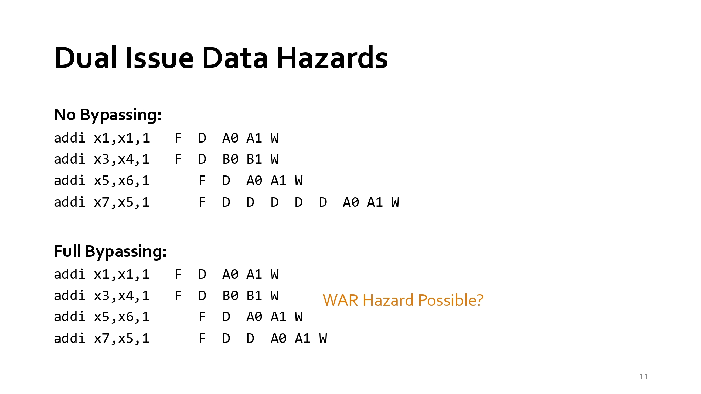

這張投影片討論了 「Dual Issue Data Hazards（雙發射資料相依衝突）」 在不同旁路（Bypassing / Forwarding）機制下的流水線行為，以及其對效能與正確性的影響。
- 本教學重點內容：
  - 無旁路機制（No Bypassing）：
    - 情境：addi x5, x6, 1 需要寫入 x5，而下一週期發射的 addi x7, x5, 1 需要讀取 x5（RAW Hazard）。
    - 結果：在完全沒有 Bypassing 的情況下，x7 的指令必須在 Decode 階段停頓 4 個週期（D D D D D），直到前一條指令完成 WB（寫回暫存器）後才能繼續執行。
  - 完整旁路機制（Full Bypassing）：
    - 情境：透過 Forwarding 電路，將前一條指令在 ALU 階段（A0）算出的結果直接前遞（Forward）給下一個週期的 ALU 輸入端。
    - 結果：即使有相依性，x7 指令也只需要在 D 階段多插入 1 個時脈週期的 Stall（D D）即可順利取得前遞資料並執行。
  - 思考題：WAR Hazard Possible?（會產生 WAR 衝突嗎？）：
    - 投影片右下角提出了關於 WAR（Write-After-Read，反相依）衝突在雙發射架構中是否可能發生的疑問。
- 個人看法：
   這展現了雙發射順序超純量（In-Order Dual-Issue）在處理資料相依性時的挑戰。
  - 關於 WAR Hazard 的疑問：
    - 在 In-Order 管道中：因為指令是嚴格按順序發射與寫回（In-Order Fetch/Issue/Writeback），後面的指令不可能比前面的指令更早寫回暫存器，因此在標準的 In-Order 雙發射架構中是不會發生真正的 WAR Hazard 的。
    - 同一週期的 Intra-pair WAR：如果同一週期同時發射的兩條指令（如 Pipe A 的 addi x1, x2, 1 與 Pipe B 的 addi x2, x3, 1），因為兩者同時讀取 RF（或 Pipe A 寫回時 Pipe B 正在讀取），硬體與控制邏輯必須確保 Pipe B 讀取到的是 x2 的舊值，這需要靠 Register Read / Forwarding 邏輯正確隔離。
- 總結：
   本投影片對比了 2-Way Superscalar 在無旁路與有完整旁路機制下的 RAW 衝突處置（Stall 週期從 4 次大幅縮減至 1 次），並引導思考在順序執行管線下，WAR Hazard 是否會發生的微架構特性。

## slide：12

  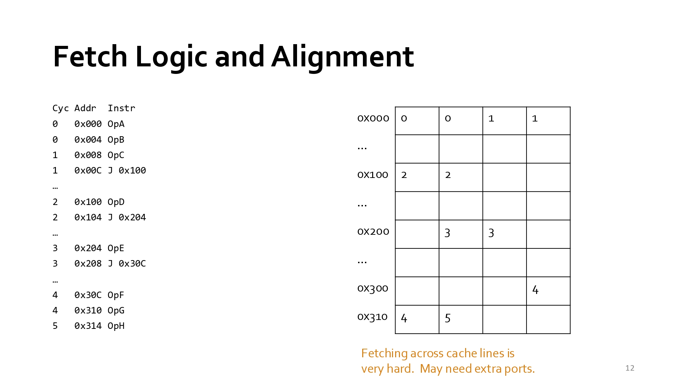

這張投影片主題為 「Fetch Logic and Alignment（擷取邏輯與記憶體對齊）」，探討多發射（Multi-Issue）處理器在面對非對齊位址與分支指令時，前端擷取（Fetch Stage）所面臨的硬體挑戰與複雜度。
- 本教學重點內容：
  - 指令流水線執行過程（時脈週期對照表）：
    - Cycle 0：PC 位址從 0x000 開始，同時擷取（Fetch）OpA（0x000）與 OpB（0x004）。
    - Cycle 1：擷取 OpC（0x008）以及一條跳躍指令 J 0x100（0x00C）。
    - Cycle 2：跳躍至 0x100，擷取 OpD（0x100）與下一個跳躍指令 J 0x204（0x104）。
    - Cycle 3：跳躍至非對齊位址 0x204，擷取 OpE（0x204）與 J 0x30C（0x208）。
    - Cycle 4 & 5（跨 Cache Line 擷取範例）：
      - 跳躍至 0x30C 擷取 OpF（位於 Cache Line 0x300 的最後一個 Slot）。
      - 下一條指令 OpG（0x310）與 OpH（0x314）則落在下一個 Cache Line（0x310）。
      - 由於跨越了 Cache Line 邊界，造成 Cycle 4 只能擷取到 1 條指令（OpF），OpG 必須等到 Cycle 4/5 才能處理，無法在一週期內同時湊齊兩條指令。
  - 核心微架構瓶頸：
    - 「Fetching across cache lines is very hard. May need extra ports.」（跨快取行擷取極為困難，可能需要額外的 Memory Ports）。
- 個人看法：
   這張投影片精準揭露了超純量（Superscalar）處理器前端最棘手的 「Alignment & Line-Crossing Hazards（對齊與跨行衝突）」。
  - 吞吐量流失（IPC Penalty）：即便後端有雙發射能力，只要遇到分支目標位址沒有對齊 Cache Line 邊界（如跳轉到 Cache Line 尾端），或是兩條連續指令恰好跨越兩個不同的 Cache Lines，前端單一週期就無法提供 2 條有效指令給後端，導致 Issue Slot 浪費（IPC 下降）。
  - 硬體成本高昂：若要解決跨 Cache Line 擷取的問題，必須使用多 Port 或 Banked Cache，並搭配額外的 Alignment Network / Shift Logic 來拼接兩個不同 Cache Line 的指令，這會顯著拉長 Fetch 階段的 Critical Path。
- 總結：
   本投影片透過時脈分析範例展示了 2-Way Superscalar 在遇到分支跳躍與未對齊位址時的 Fetch 瓶頸，說明跨快取行（Cache Line）擷取指令會大幅增加前端控制邏輯與記憶體埠數的需求，是限制 Superscalar 效能發揮的主要原因之一。

## slide：13

  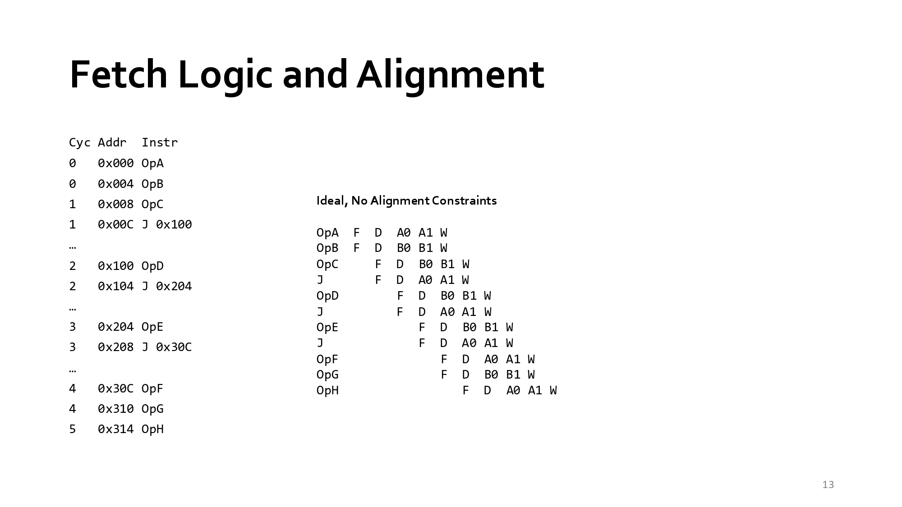

這張投影片同樣主題為 「Fetch Logic and Alignment（擷取邏輯與記憶體對齊）」，但展示的是 理想、無對齊限制（Ideal, No Alignment Constraints） 下的流水線執行對照圖。
- 本教學重點內容：
  - 理想流水線排程（Ideal Timeline）：
    - Cycle 0：OpA（0x000）與 OpB（0x004）同時 Fetch 並進入 Pipe A / Pipe B。
    - Cycle 1：OpC（0x008）與分支/跳躍指令 J（0x00C）同時 Fetch。
    - Cycle 2：理想狀態下無對齊懲罰，直接從跳轉目標位址 0x100 擷取 OpD 與下一個跳躍指令 J。
    - Cycle 3：從非對齊目標位址 0x204 擷取 OpE 與 J。
    - Cycle 4：跨快取行目標位址 0x30C 與 0x310 被理想地同時擷取，OpF 與 OpG 於同一週期進入流水線，完全沒有浪費任何 Issue Slot。
  - 與前一頁的對比（無 Alignment 瓶頸）：
    - 前一頁展示了真實硬體遇到跨 Cache Line 或未對齊時會被迫 Stall，導致 Cycle 4 只能 Fetch 到 1 條指令（OpF）。
    - 本頁展示如果硬體具備理想的交叉與拼接能力（No Alignment Constraints），所有時脈週期都能滿載發射 2 條指令（$\text{IPC}=2$）。
- 個人看法：
   這張投影片與上一張形成強烈對比，用來說明 理想微架構 vs. 實際硬體限制 的差距。
  - 理想很豐滿，現實很骨感：要達到本頁所示的「無對齊限制」，硬體必須付出極高代價——包含需要配備雙 Port 或多 Bank 的 Instruction Cache、跨 Cache Line 的資料拼接電路（Crossbar / Alignment Network），以及能在 Fetch 階段就解開 Target Address 的複雜分支預測器（Branch Predictor）。
  - 效能上限（Performance Upper Bound）：這張圖代表了 2-Way In-Order Superscalar 在 Fetch 端所能達到的理論效能極限。
- 總結：
   本投影片展示了在假設沒有對齊限制（No Alignment Constraints）的理想情況下，雙發射超純量處理器能完美維持每週期兩條指令的擷取與執行，用以作為對照，突顯真實硬體處理非對齊位址與跨行擷取時的效能損耗。

## slide：14

  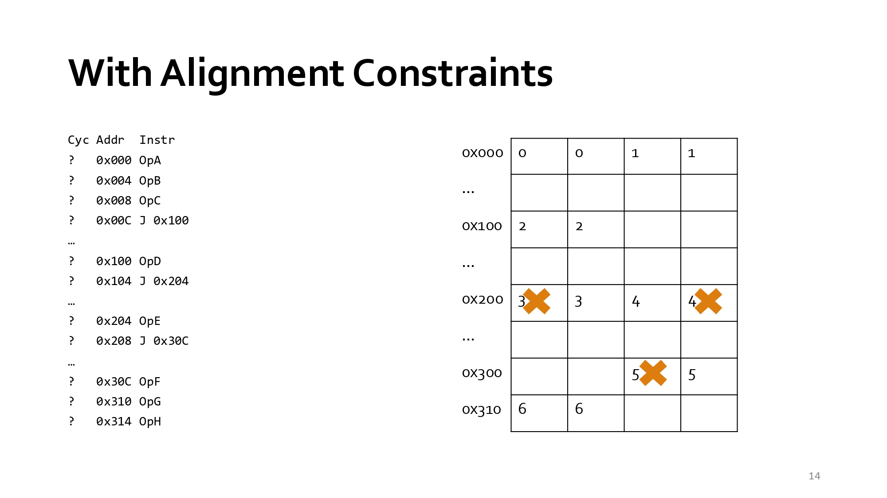

這張投影片主題為 「With Alignment Constraints（存在對齊限制時）」，透過對映圖表具體展示了在真實硬體存在記憶體對齊限制（Alignment Constraints）時，前端擷取（Fetch）會發生的 Issue Slot 浪費（Waste）與時脈週期增加。
- 本教學重點內容：
  - 對齊限制下的擷取行為與廢棄槽（Wasted Slots）：
    - 未對齊目標（Non-Aligned Target）：
      - 指令 J 0x204 跳躍至位址 0x204（位於 Cache Line 0x200 的第 2 個 Word）。
      - 由於硬體一次以 Cache Line 或對齊區塊讀取，位址 0x200 的第 1 個 Word 無法被使用，形成被浪費的 Slot（圖中以橘色 X 標示）。
    - 跨行與零散擷取（Line Boundary Crossing）：
      - 當跳轉目標位於 Cache Line 的尾端（如 0x30C），在對齊限制下，Cycle 5 只能擷取出位於 0x30C 的單一指令（OpF），而該 Cache Line 前後的無效 Slot 都會被廢棄（橘色 X）。
      - 這導致後續指令 OpG 與 OpH 被延後到 Cycle 6 才能從下一個對齊區塊（0x310）開始擷取。
  - 週期數與吞吐量變化（Cycle Comparison）：
    - 理想狀況（前一頁 No Constraints）：執行完所有指令僅需 5 個 Cycles。
    - 限制狀況（本頁 With Constraints）：由於對齊限制與跨行導致多個 Slot 被打叉廢棄，總執行週期被拉長至 6 個 Cycles（且 left-column 中的 Cycle 計數器以 ? 標示，代表時間會動態延後）。
- 個人看法：
   這張圖非常直觀地解釋了為什麼 編譯器對齊（Compiler Code Alignment） 對 Superscalar 處理器的效能至關重要。
  - Issue Slot 浪費（Bubble / NOP）：橘色 X 代表硬體明明有能力在單一週期 Fetch/Issue 兩條指令，卻因為記憶體邊界限制，不得不吐出空白 Slot（Bubble），這會直接降低實際的 IPC（Instructions Per Cycle）。
  - 編譯器優化的必要性：為了避免這種硬體懲罰，現代編譯器（如 GCC / Clang）在生成組譯碼時，會在函式開頭或迴圈入口處（Loop Head）自動插入 NOP 或進行 .align 16 等對齊指令，確保關鍵的跳轉目標位址落在 Cache Line 的開頭，從而避免圖中的 X 發生。
- 總結：
   本投影片展示了在真實記憶體對齊限制（Alignment Constraints）下，非對齊的分支跳轉與跨 Cache Line 擷取會導致大量的 Issue Slot 被浪費（橘色 X），使整體執行時間從理想的 5 個週期增加至 6 個週期，突顯了對齊問題對超純量處理器前端效能的負面影響。

## slide：15

  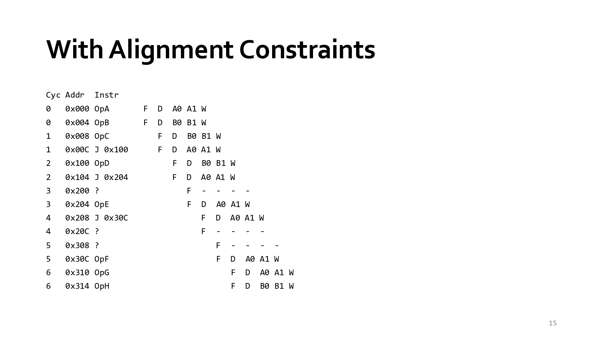

這張投影片以 流水線時脈圖（Pipeline Timeline Diagram） 的形式，完整還原了在前一張投影片（Slide 14）中，處理器在 對齊限制（With Alignment Constraints） 下執行的具體細節與 Bubbles 生成過程。
- 本教學重點內容：
  - 無效位址擷取與 Bubbles（F - - - -）：
    - Cycle 3：跳轉至 0x204（OpE）時，由於對齊限制，處理器同時抓取了位於 0x200 的區塊。0x200 處無有效指令（或非跳轉目標），雖然發起了 F（Fetch），但隨後被丟棄，形成無效指令（圖中標示為 ? 與 F - - - -）。
    - Cycle 4：0x208 為跳躍指令 J 0x30C，而同區塊對齊位址 0x20C 抓取的內容為無效 Slot（標示為 ? 與 F - - - -）。
    - Cycle 5：跳轉至 0x30C 擷取 OpF，但同區塊的前半段位址 0x308 抓取的為無效 Slot（標示為 ? 與 F - - - -）。
  - 吞吐量懲罰與效能影響：
    - 單發射退化：在 Cycle 3、4、5 中，每個週期原本可處理 2 條指令的管道，都只剩 1 條有效指令（OpE、J、OpF）在執行，另一個 Issue Slot 則完全浪費。
    - 週期拉長：所有指令（OpA ~ OpH）執行完畢總共耗費了 6 個 Cycles（Cycle 0 到 Cycle 6），相較於理想無限制狀況下的 5 個 Cycles，效能受到了明顯折損。
- 個人看法：
   這張時脈圖完美演示了 Alignment Constraints（對齊限制）對流水線效率的致命打擊。
  - Issue Slot 浪費的硬體實態：圖中的 F - - - - 即為硬體層面的 Bubble/NOP。雖然後端雙管線（Pipe A / Pipe B）有能力同時運算兩條指令，但前端因為記憶體對齊邊界問題，無法提供第 2 條有效指令，直接導致 IPC（Instructions Per Cycle）大幅下降。
  - 軟硬體協同優化：要解決這個問題，硬體上需要更複雜的 Align Logic 與 Branch Target Buffer (BTB)；而在軟體層面，則需要編譯器進行 Branch Target Alignment（分支目標對齊），在編譯時將跳轉目標對齊至 Cache Line 的開頭，確保 Fetch 階段能隨時吃滿 2-Way 的吞吐量。
- 總結：
   本投影片透過流水線時脈圖，具體呈現了記憶體對齊限制如何導致 Fetch 階段產生無效擷取（F - - - -），進而浪費發射槽（Issue Slots）並將總執行週期拉長至 6 個 Cycles，直觀地展示了對齊瓶頸對超純量處理器整體 IPC 的削弱。

## slide：16

  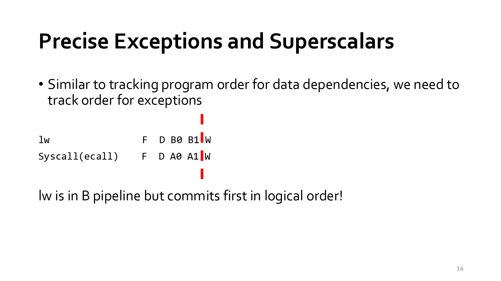

這張投影片主題為 「Precise Exceptions and Superscalars（精確異常與超純量處理器）」，探討在超純量架構下維持 精確中斷/異常（Precise Exceptions） 所面臨的順序控制挑戰。
- 本教學重點內容：
  - 例外順序追蹤需求（Order Tracking for Exceptions）：
    - 類似於追蹤資料相依性（Data Dependencies）需要維持程式順序（Program Order），處理器在處理例外與系統呼叫時，也必須嚴格按照程式的邏輯順序（Logical Order）來引發與提交。
  - 雙發射管線中的順序衝突範例：
    - 情境：在同一週期同時發射 lw（記憶體載入，位於 Pipe B）與 Syscall / ecall（系統呼叫，位於 Pipe A）。
    - 關鍵問題（lw is in B pipeline but commits first in logical order!）：
      - 在程式邏輯上，lw 是先執行的指令，Syscall 是後執行的指令。
      - 雖然兩者在同一週期發射並平行推進，但若 Syscall 在 Pipe A 發生 Trap/Exception，或是兩者準備寫回（Commit/Writeback）時，硬體必須保證 lw 的狀態變更（如暫存器寫入或 Page Fault 檢查）優先於 Syscall 完成提交。
- 個人看法：
   這張投影片切中了多發射（Superscalar）處理器在設計 control logic 時最核心的難題之一：如何兼顧「平行執行」與「精確語意（Precise Semantics）」。
  - In-Order Issue 不等於 Precise State：即便是在順序發射（In-Order Issue）的超純量處理器中，因為指令被分流到不同的執行管線（Pipe A / Pipe B），若兩條指令在相同的 Pipe Stage 產生 Trap 或 Exception，硬體必須有能力依據 Program Order 決定哪一個 Exception 先發生，並將後續指令的狀態撤銷（Flush）。
  - 邁向 ROB（Reorder Buffer）的契機：當處理器變得更複雜（例如引入多週期浮點數、記憶體延遲或亂序執行 Out-of-Order）時，依靠單純的硬體 Stall 來維持 Precise Exceptions 會大幅降低效能。這也是為什麼現代 Superscalar 處理器幾乎都會導入 ROB（Reorder Buffer） 與 In-Order Commit 機制，將「執行（Execute）」與「提交（Commit）」解耦，從根本上解決 Precise Exceptions 的問題。
- 總結：
   本投影片展示了超純量處理器在維持精確中斷（Precise Exceptions）時的挑戰：當同時發射的多條指令分屬不同 Pipe 時，硬體必須嚴格確保較早邏輯順序的指令（如 lw）比較晚的指令（如 Syscall）優先提交狀態與處理例外，防止處理器狀態陷入不一致。

## slide：17

  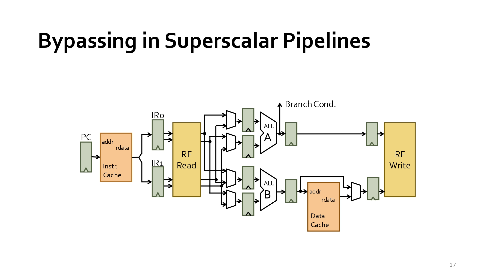

這張投影片主題為 「Bypassing in Superscalar Pipelines（超純量流水線中的旁路/前遞機制）」，再次呈現了 2-Way Superscalar 的微架構硬體圖，重點放在 ALU 階段與暫存器讀取間的數據前遞需求。
- 本教學重點內容：
  - 跨管線與跨階段旁路（Cross-Pipeline Bypassing）：
    - 在超純量架構中，資料前遞比單發射流水線複雜得多。
    - Pipe A 與 Pipe B 產生的運算結果（例如 ALU A、ALU B 或 Data Cache 的輸出），必須能夠同時前遞至下一個週期的 Pipe A 或 Pipe B 的輸入端。
  - 旁路網路（Bypassing Network / Forwarding Muxes）的硬體開銷：
    - 為了支援完整的旁路（Full Bypassing），每個執行單元輸入端的 Mux 需要接收來自多條管線不同階段（如 Execute、Memory/Cache、Writeback）的結果。
    - 這意味著 Mux 的輸入數量與旁路連線（Bypass Paths）會呈指數級增長。
- 個人看法：
   這張投影片點出了 Superscalar 硬體設計中另一個關鍵的「物理瓶頸」—— Bypass Network 複雜度。
  - 關鍵路徑（Critical Path）延遲：旁路連線不僅佔用大量的金屬佈線面積（Routing Area），更多輸入的 Mux 也會拉長 ALU 輸入端的組合邏輯延遲，這往往會成為限制處理器最高時脈頻率（Clock Frequency）的主因之一。
  - 設計權衡（Trade-off）：為了提升 IPC，硬體必須加寬 Bypass 網路；但若 Bypass 網路過於庞大導致時脈下降，總體執行時間（Time = Instructions * CPI * Clock Cycle Time）反而可能變差。因此部分現代 CPU 會選擇性省去不常用的 Bypass 路徑，改以 1-cycle stall 來換取更高的時脈。  
- 總結：
   本投影片展示了超純量處理器中 Bypass 網路的架構，突顯了為了防止 RAW 衝突造成流水線停頓，雙管線間必須建立複雜的多路復用旁路（Cross-Pipeline Forwarding Paths），這在提升吞吐量的同時也大幅增加了硬體面積與關鍵路徑延遲。

## slide：18

  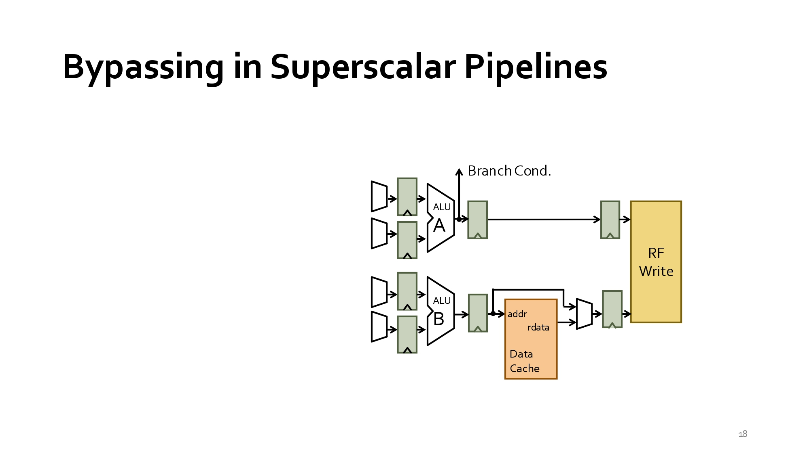

這張投影片持續聚焦於 「Bypassing in Superscalar Pipelines（超純量流水線中的旁路/前遞機制）」，並簡化了前端結構，將焦點放在 執行階段（Execution Stages）與寫回階段（Writeback）之間的旁路路徑細節。
- 本教學重點內容：
  - 執行單元輸入端的旁路選擇器（Bypass Muxes）：
    - 在 ALU A 與 ALU B 的兩側輸入端（前級暫存器前），均配備了多路復用器（Muxes）。
    - 這些 Mux 用於在每一個時脈週期決定操作數（Operands）是來自上一階段的解碼暫存器，還是來自其他流水線階段前遞（Forwarded）過來的最新運算結果。
  - 跨管線與跨階段的資料前遞（Cross-Pipeline Data Forwarding）：
    - ALU A / ALU B 輸出：運算完的結果會立刻拉出旁路連線，前遞給下一週期需要該結果的 ALU A 或 ALU B。
    - Data Cache / Writeback 輸出：記憶體讀取的資料（rdata）或準備寫回暫存器檔（RF Write）的資料，也會拉回前端 Mux。
- 個人看法：
   這張簡化圖更清楚地展現了 2-Way Superscalar 處理器中 前遞路徑（Forwarding Paths）爆發性成長 的物理難題。
  - 交叉連結的開銷（Crossbar Complexity）：
    - 在單發射（Single-Issue）管線中，ALU 前只需要接收來自 EX/MEM 或 MEM/WB 的資料前遞。
    - 在雙發射（2-Way Superscalar）中，因為有 2 個 ALU（共 4 個輸入端），每個輸入端都必須能夠接收來自 Pipe A 的 EX、Pipe B 的 EX、Pipe B 的 Data Cache，以及 Writeback 階段的資料。這使得旁路連線的總數量呈平方級成長（$O(N^2)$，其中 $N$ 為 Issue Width）。
  - 時脈頻率（Clock Frequency）瓶頸：
    - 這些龐大的金屬佈線（Routing Wires）會帶來顯著的寄生電容與訊號延遲，多輸入 Mux 也會拉長組合邏輯時間。這正是為什麼隨著發射寬度（Issue Width）增加（如 4-Way 或 8-Way），處理器非常容易面臨極限時脈下降的硬體瓶頸。
- 總結：
   本投影片聚焦於雙管線超純量處理器的 **Bypass Muxes 與前遞路徑**，說明了為了在 Pipe A 與 Pipe B 之間無縫傳遞最新數據以消除 RAW 衝突，硬體必須建置高度交叉連結的旁路網路，這點出了 Issue Width 擴展時硬體複雜度與時脈延遲大幅增加的核心挑戰。

## slide：19

  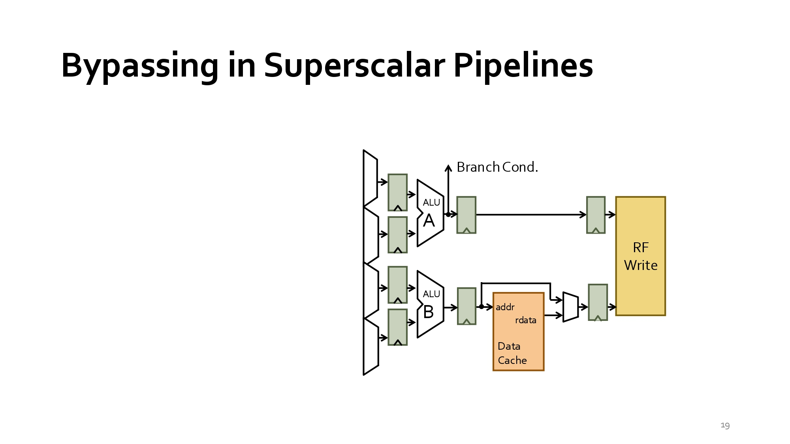

這張投影片進一步將前端的細節完全抽象化，將重點集中在 **執行階段（Execution Stage）前的巨大多工選擇器矩陣（Mux Crossbar Matrix）** 上。
- 本教學重點內容：
  - 旁路多工器矩陣（Bypass Mux Matrix）的整合：
    - 圖中左側將所有 ALU A 與 ALU B 輸入端的 Mux 串接繪製成一個大型的多工陣列（Crossbar Network）。
    - 這代表來自 ALU A 輸出、ALU B 輸出、Data Cache 讀取資料以及 Writeback 暫存器寫入的所有潛在資料源，都必須能隨時切換接入 2 個 ALU 的 4 個輸入端（每個 ALU 各有 2 個 Operand 輸入）。
  - Superscalar 硬體複雜度的核心根源：
    - 當發射寬度（Issue Width, $N$）從 1（Single Issue）增加到 2（2-Way Superscalar）時，前遞路徑的組合數量呈現次方級暴增。
    - 每個 Mux 的控制邏輯（Control Logic）與輸入埠數大幅增加，使得解碼與前遞控制電路變得極為龐大。
- 個人看法：
   這張圖以極具視覺衝擊力的方式，展現了 **超純量處理器（Superscalar Processor）中最可怕的「Physical Layout / Scaling Problem（實體佈局與擴展瓶頸）」**。
  - 面積與功耗的代價（Area & Power Overhead）：
    - 左側這一整排巨大的 Mux Crossbar，實體上代表著大量的 Multiplexers 與跨線（Crossbar Wires）。
    - 這些線路不僅佔據了巨大的晶片面積（Silicon Area），其充放電過程更帶來了極大的動態功耗（Dynamic Power Consumption）。
  - 發射寬度（Issue Width）的極限：
    - 這正是為什麼業界處理器很難無限制加寬 Superscalar 發射寬度（例如從 2-Way 擴展到 8-Way 或 12-Way）。
    - 當 $N$ 增加時，Bypass Mux 的輸入數量會以 $O(N^2)$ 的速度成長，產生的邏輯延遲很快就會拉低整顆 CPU 的最高運作時脈（Frequency），反而削弱了發射寬度增加所帶來的 IPC 效益。
- 總結：
   本投影片透過抽象化的 Mux 矩陣圖，極致突顯了 2-Way 超純量處理器為了支援完整資料前遞（Full Bypassing）所付出的硬體代價，點出了前遞網路（Forwarding Network）複雜度隨發射寬度暴增是限制硬體時脈與面積擴展的最核心瓶頸。

## slide：20

  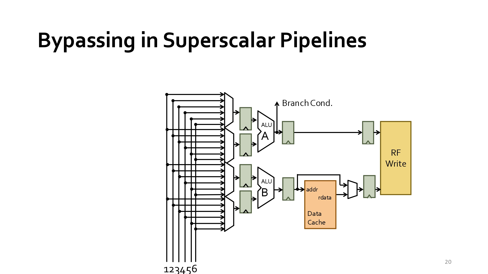

這張投影片將前幾頁討論的 Bypassing / Forwarding（旁路/前遞機制） 正式以完整的電路連接細節繪製出來，徹底解構了 2-Way Superscalar 處理器中旁路網路（Bypass Network）的龐大規模與物理連線。
- 本教學重點內容：
  - 6條前遞數據匯流排（Forwarding Busses 1–6）：
    - 圖下方標示的 1 2 3 4 5 6 代表來自管線各階段（Pipe A 的 EX、Pipe B 的 EX、Data Cache 讀出資料、 Writeback 階段等）的 6 條獨立數據匯流排（Bypassing Busses）。
  - 交叉連線矩陣（Full Bypass Crossbar）：
    - 4 個 6-to-1 Muxes：因為 2-Way Superscalar 包含 2 個 ALU（ALU A 與 ALU B），共需要 4 個 Operand 輸入端（src1_A, src2_A, src1_B, src2_B）。
    - 每個輸入端前方的 Mux 均需要拉出 6 條分支線路，分別連接至匯流排 1 到 6。這代表執行階段前方共設置了 $4 \times 6 = 24$ 條多工器輸入接線！
- 個人看法：
   這張圖可謂是 In-Order Superscalar 走向瓶頸的「終極具象化」！
  - $O(N^2)$ 的規模暴增效應：
    - 在單發射（Single-Issue）處理器中，Bypass 匯流排通常只需 2–3 條。
    - 當發射寬度（Issue Width, $N$）增加到 2 時，Bypass Paths 的數量直接暴增至 6 條，產生了 $4 \times 6 = 24$ 條交叉佈線。若進一步擴增至 4-Way Superscalar，匯流排與 Mux 輸入數量將呈幾何級數激增，形成極為恐怖的金屬佈線叢林（Routing Jungle）。
  - 物理極限與時脈衝擊：
    - 這些大量的 Bypass 匯流排與大型多工器（Mux）會帶來嚴重的寄生電容（Parasitic Capacitance）與訊號延遲，直接延長了 Execution 階段的 Critical Path。
    - 這解釋了為什麼單純依靠「加寬 In-Order 發射寬度」無法持續提升 Performance——因為硬體時脈頻率（ $f_{clk}$ ）很快就會被龐大的 Bypass Network 拖垮。這也是微架構演進最終走向 Out-of-Order（亂序執行） 與 Reservations Stations（保留站/動態排程） 的重要驅動力之一。  
- 總結：
   本投影片透過詳細的電路連線圖，展示了 2-Way 超純量處理器為了支援完整數據前遞（Full Bypassing），需要在 4 個 ALU 輸入端前配置 6 條前遞匯流排（共 24 條多工器輸入連線）。這直觀地揭示了旁路網路複雜度隨發射寬度擴展而呈平方級成長（ $O(N^2)$ ）的物理瓶頸，是限制超純量時脈與面積擴展的最核心問題。

## slide：21

  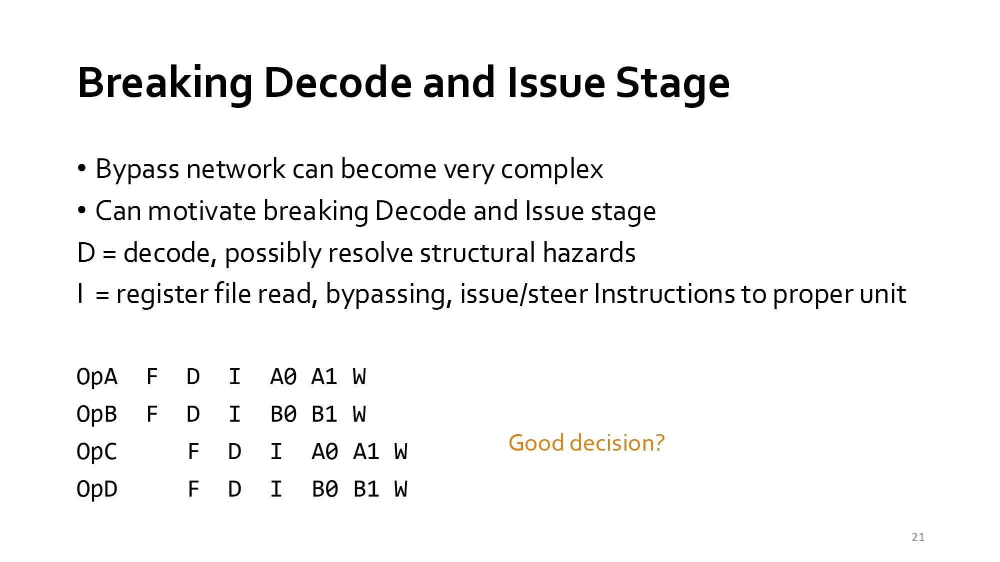

這張投影片主題為 「Breaking Decode and Issue Stage（拆分解碼與發射階段）」，提出了將 Decode (D) 與 Issue (I) 拆分為兩個獨立流水線階段的架構設計，並拋出思考題「Good decision?（這是一個好決定嗎？）」。
- 本教學重點內容：
  - 拆分 Decode (D) 與 Issue (I) 的動機：
    - 前幾頁展示的 Bypass Network 龐大且極度複雜（如 4 個 6-to-1 Muxes），若將解碼、Hazard 檢測、RF Read 與 Bypass Mux 的選擇全部擠在單一週期，會使得關鍵路徑（Critical Path）過長，進而拉低時脈頻率。
    - 拆分後的管線分工：
      - D（Decode）：負責指令解碼（Decode），並處理/解決結構衝突（Structural Hazards）。
      - I（Issue / RF Read）：負責暫存器檔讀取（Register File Read）、資料前遞（Bypassing），以及將指令發射/分流（Steer Instructions）至對應的執行單元。
  - 流水線深度增加（Pipeline Deepening）：
    - 時脈圖變更為 6 階段：F -> D -> I -> A0/B0 -> A1/B1 -> W。
- 個人看法：
   評估「Good decision?」的 Trade-offs 將 D/I 拆分為兩階段是一把 「雙面刃（Trade-off）」：
  - 優點（Pros）
    - 提高時脈頻率（Higher Clock Frequency, $f_{clk}$）：將複雜的 Decode Logic、Hazard Checking 與 Bypassing Mux 分開在兩個週期內完成，顯著縮短了每個週期的關鍵路徑（Critical Path Timing），讓 CPU 能跑在更高的主頻上。
  - 缺點（Cons）
    - Branch Penalty（分支懲罰）增加：流水線加長 1 階，代表分支指令（Branch）確定結果並更新 PC 的時間延後了 1 個週期，若發生 Branch Misprediction（分支預測錯誤），需要 Flush（沖刷）的流水線 Bubbles 也會增加 1 個週期。
    - Load Hazard / Data Dependency Stalls 增加：當發生 RAW Hazard 或 Load-To-Use Hazard 時，因為從 Execute 階段拉回 I 階段的 Bypass 距離拉長，資料相依所造成的 Stall 週期可能會增加。
- 總結：
   本投影片展示了為了減輕旁路網路與控制邏輯對時脈頻率的壓力，微架構設計選擇將解碼與發射拆分為 D（Decode）與 I（Issue）兩個階段。此設計雖然能提升 CPU 的運算時脈，但也同時拉長了流水線深度，增加了分支錯誤與資料相依時的停頓懲罰（Stall Penalty）。

## slide：22

  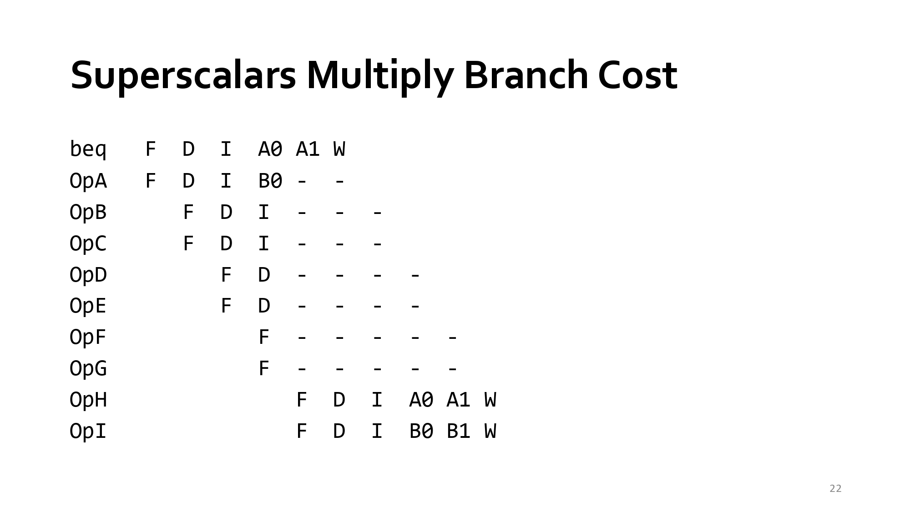

這張投影片主題為 「Superscalars Multiply Branch Cost（超純量加倍了分支懲罰成本）」，直接呼應並解答了前一張投影片（Slide 21）拆分 D/I 階段後的「Good decision?」質疑。
- 本教學重點內容：
  - 分支懲罰在超純量下的乘數效應（Multiplying Effect）：
    - 管線深度（Depth）的影響：分支指令 beq 在 A0 階段（Cycle 3）計算出跳轉條件與目標位址。由於增加了 I 階段，導致分支結果確認的時間延後，產生了 3 個週期的時間延遲（Cycles 1, 2, 3）。
    - 發射寬度（Width）的倍增效應：因為是 2-Way Superscalar，每個時脈週期原本能處理 2 條指令。這意味著 3 個週期的延遲會導致 $3 \times 2 = 6$ 個 Issue Slots（發射槽）完全浪費（圖中的 OpA ~ OpF 全部被 Flush 丟棄，標示為 -）。
  - 時脈圖細節解構：
    - Cycle 0：發射 beq（Pipe A）與 OpA（Pipe B）。
    - Cycle 1~2：流水線持續投機擷取/發射 OpB ~ OpG。
    - Cycle 3：beq 於 A0 階段確認跳轉成立，發動 Flush，將已進入管線的 OpA ~ OpG 全部撤銷。
    - Cycle 3：正確的目標指令 OpH 與 OpI 才重新於 Fetch 階段抓取（F）。
- 個人看法：
   這張投影片點出了 Superscalar Architecture 最核心的致命傷——分支懲罰（Branch Misprediction Penalty）爆發。
  - 浪費的 Slot 呈 $N \times D$ 成長：
     在傳統單發射流水線中，3 個週期的 Branch Penalty 只會損失 3 條指令；但在 2-Way 超純量下直接翻倍成 6 條；若是 4-Way 超純量，一次預測錯誤就會浪費高達 12 條指令的吞吐量！
  - 分支預測器（Branch Predictor）的迫切性：
     這完美解釋了為什麼超純量處理器 絕對無法承受簡單的 Static Branch Prediction（如 Always Not-Taken）。沒有高準確率（>95%）的 Dynamic Branch Predictor（動態分支預測器） 與 Branch Target Buffer (BTB)，超純量架構所帶來的多發射優勢會被龐大的 Flush Bubbles 完全吃掉。
- 總結：
   本投影片透過時脈圖視覺化展示了超純量架構下分支錯誤的代價：當管線加深且發射寬度拓寬時，分支預測錯誤所浪費的指令 Slot 會呈現「深度 $\times$ 寬度（$N \times D$）」的乘數級激增（此範例浪費了 6 個 Slots）。這說明了高準確率的分支預測機制是超純量處理器得以發揮效能的絕對前提。

## slide：23

  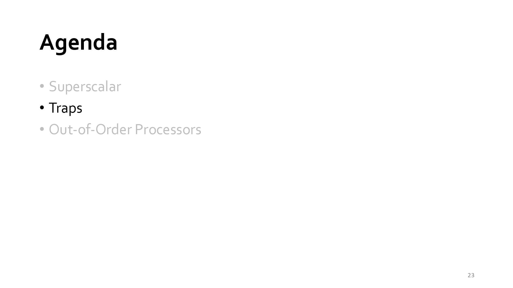

這張投影片為課程章節進度頁（Agenda），標示著我們已完成了第一階段的 Superscalar（超純量） 探討，並正式進入第二階段的主題：Traps（陷阱與異常處理）。
- 本教學重點內容：
  - 章節轉折與焦點（Agenda Transition）：
    - 已完成 (Superscalar)：解析了 2-Way In-Order Superscalar 的結構衝突、對齊瓶頸、Bypass Network 的 $O(N^2)$ 佈線開銷，以及管線加深帶來的分支懲罰倍增。
    - 當前主題 (Traps)：接續前面提到的 Precise Exceptions（精確異常）挑戰，深入探討處理器如何在中斷、系統呼叫（Syscall/ecall）或 Page Fault 發生時，安全且精確地保存與恢復狀態。
    - 下一階段 (Out-of-Order Processors)：為邁向 Tomasulo演算法、ROB（Reorder Buffer）與亂序執行架構鋪路。
  - 為什麼需要專章討論 Traps / Precise Exceptions？
    - 硬體一致性要求：當異常發生時，程式必須看起來像是嚴格按照順序執行到該指令前一條為止，所有較晚的指令狀態變更都必須被乾淨地撤銷（Flush）。
    - 多發射的挑戰：在超純量架構下，同一個週期發射的多條指令可能同時在不同管線（如 Pipe A 與 Pipe B）觸發 Exception，處理器必須建立一套仲裁與優先權機制來維持邏輯上的正確性。
- 個人看法：
   從 Superscalar 銜接到 Traps，是微架構設計中從「追求效能」跨入「確保正確性與作業系統支援」的關鍵轉折。
  - 控制邏輯的真正試金石：設計一個能跑很快的 CPU 固然困難，但設計一個在任何突發 Exception（如記憶體存取違規、除以零、除錯斷點）下都不會丟失狀態或破壞架構暫存器（Architectural State）的 CPU 更加困難。
  - 通往 Out-of-Order 的橋樑：了解 Traps 與 Precise Exceptions 如何在流水線中被追蹤與提交，是理解現代亂序執行處理器（OoO Processors）如何透過 Reorder Buffer (ROB) 實現 In-Order Commit / Precise Exception 的基礎。
- 總結：
   本投影片標誌著課程進入 Traps（陷阱/異常處理） 核心單元，準備詳細探討超純量與複雜流水線處理器如何在發生 Trap 或 Interrupt 時，精確追蹤程式順序並維持精確異常（Precise Exceptions）狀態。

## slide：24

  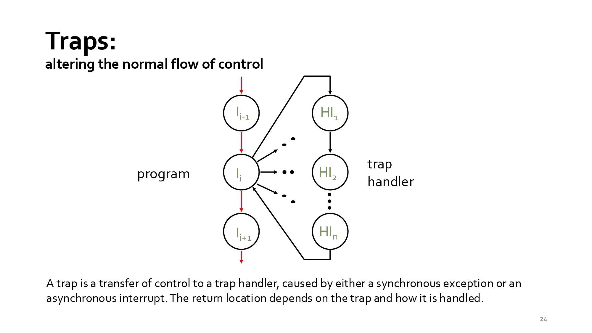

這張投影片主題為 「Traps: altering the normal flow of control（陷阱：改變正常的控制流程）」，定義了 Trap 的微架構與作業系統控制權轉移機制。
- 本教學重點內容：
  - Trap 的基本定義：
    - 控制權轉移：Trap 是指將控制流程從一般使用者程式（User Program）轉移至作業系統的 Trap Handler（陷阱處理程式） 執行的過程。
    - 兩種觸發來源：
      - 同步例外（Synchronous Exception）：由指令執行直接引發（如未定義指令、系統呼叫 ecall、記憶體存取違規 Page Fault、算術除零等）。
      - 異步中斷（Asynchronous Interrupt）：由外部硬體裝置觸發，與當前執行的指令無直接時間關聯（如 I/O 裝置完成、Timer 定時器中斷等）。
  - 控制流轉向與返回機制（Control Flow & Return）：
    - 程式執行至 $I_i$ 時觸發 Trap，控制權跳轉至 Trap Handler 的指令序列（ $HI_1 \rightarrow HI_2 \rightarrow \dots \rightarrow HI_n$ ）。
    - 返回位址的決定（Return Location）：
      - 完成 Handler 處理後，返回位址取決於 Trap 的類型：
        - 返回至 $I_i$：適用於可修復的 Fault（例如 Page Fault，需重新執行該指令）。
        - 返回至 $I_{i+1}$：適用於 Syscall / Traps 或已完成的 Trap（例如處理完系統呼叫後執行下一條指令）。
        - 不返回或終止程式：適用於不可恢復的 Fatal Abort（如 Segment Fault 崩潰）。
- 個人看法：
   這張圖標誌著微架構設計從「單純的流水線執行」進階到「與作業系統（OS）互動」的核心機制。
  - 精確狀態保存（Architectural State Preservation）：
    - 當控制流跳轉至 Trap Handler 時，處理器必須精確地保存當下的 PC 與架構暫存器狀態。
    - 在前面討論的 Superscalar 架構中，若 $I_i$ 觸發 Trap，所有在邏輯上晚於 $I_i$（如 $I_{i+1}, I_{i+2}$）且已經被發射或執行的指令，其結果絕對不能寫入暫存器或記憶體，否則 OS 將無法獲得 Precise Exception 狀態。
  - 軟硬體協同（Hardware-Software Interface）：
    - 硬體負責捕捉 Exception 並自動將 PC 設為 Trap Vector 位址，而軟體（OS Handler）則負責拯救與還原上下文（Context Switch）。這種分工是現代多工作業系統（Multitasking OS）與虛擬記憶體（Virtual Memory）能夠穩定運作的基石。
- 總結：
   本投影片建立了 Traps 的核心觀念，說明無論是同步引發的 Exception 還是異步的 Interrupt，處理器都會暫停正常的控制流程並轉移至 Trap Handler 執行，處置完畢後再根據 Trap 類型決定是否返回至原指令（ $I_i$ ）或下一條指令（ $I_{i+1}$ ）繼續執行。  

## slide：25

  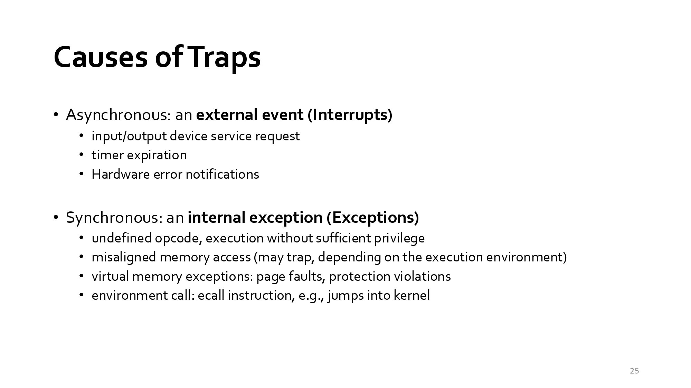

這張投影片主題為 「Causes of Traps（陷阱與中斷的引發原因）」，詳細分類並列舉了觸發 Traps 的兩大類來源：異步中斷（Asynchronous Interrupts） 與 同步例外（Synchronous Exceptions）。
- 本教學重點內容：
  - 異步中斷（Asynchronous: External Events / Interrupts）：
    - 指由處理器核心外部的事件所引發，與當前指令流水線正在執行的指令無關。
    - 常見類型：
      - I/O 裝置服務請求（Input/Output device service request）：例如鍵盤按鍵、網路封包到達、硬碟讀寫完成等。
      - 定時器到期（Timer expiration）：用於作業系統的時間分片（Time-Slicing）與多工作業排程。
      - 硬體錯誤通知（Hardware error notifications）：例如記憶體 ECC 錯誤、電源異常等。
  - 同步例外（Synchronous: Internal Exceptions / Exceptions）：
    - 指由處理器內部正在執行的特定指令所直接觸發，具repo預測性與重現性（重複執行同一指令必定觸發）。
    - 常見類型：
      - 未定義指令或權限不足（Undefined opcode, execution without sufficient privilege）：例如嘗試執行不支援的指令或在 User Mode 下執行 Kernel 特權指令。
      - 未對齊記憶體存取（Misaligned memory access）：依據執行環境（ISA / Hardware Support），可能觸發 Trap 交由 OS 軟體模擬。
      - 虛擬記憶體例外（Virtual memory exceptions）：包含 Page Faults（缺頁中斷）與 Protection Violations（記憶體保護違規）。
      - 環境呼叫（Environment call / ecall）：例如 RISC-V 的 ecall 指令，用於從 User Space 主動跳轉至 Kernel Space 執行系統呼叫（Syscall）。
- 個人看法：
   這張投影片在微架構與流水線控制（Pipeline Control）上具有非常重要的分類意義：
  - 流水線處置方式的根本差異：
    - Synchronous Exceptions（同步例外）：必須在特定指令到達管線特定階段（如 EX 或 MEM）時被精確捕捉。為了維持 Precise Exceptions，硬體必須等待該指令成為「邏輯上最老」的指令時才能觸發 Trap，並撤銷（Flush）其後方的所有指令。
    - Asynchronous Interrupts（異步中斷）：由於與當前執行的指令無關，流水線不需要立刻中斷當前指令，而是可以選擇在完成當前正在發射/執行的指令區塊後，於乾淨的指令邊界（Instruction Boundary）暫停並跳轉至 Handler，處理彈性較高。
  - 作業系統（OS）與微架構的交會點：
     無論是 Virtual Memory 的 Page Fault（需要載入硬碟資料後返回重新執行原指令），還是 ecall 系統呼叫（處理完後執行下一條指令），這些分類直接決定了硬體需要向 OS 提供哪一種 EPC (Exception Program Counter) 與 Cause Register。
- 總結：
   本投影片清楚劃分了 Traps 的兩大根源：外部硬體事件引發的 異步中斷（Interrupts） 與內部指令執行錯誤或請求引發的 同步例外（Exceptions）。理解這兩者的差異是設計流水線精確中斷（Precise Exceptions）機制與 OS 核心服務呼叫的核心關鍵。

## slide：26

  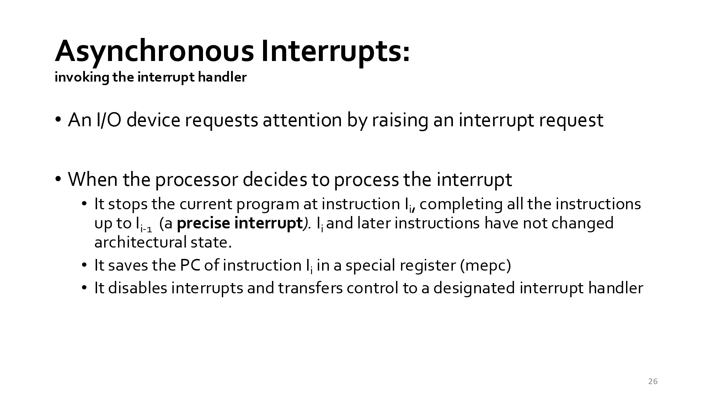

這張投影片主題為 「Asynchronous Interrupts: invoking the interrupt handler（異步中斷：呼叫中斷處理程式）」，說明處理器在接獲外部硬體中斷請求時，如何觸發並切換至 Interrupt Handler 的微架構處理流程。
- 本教學重點內容：
  - 中斷請求觸發（Interrupt Request）：
    - 外部 I/O 裝置（如網卡、鍵盤、Timer）透過發送中斷請求訊號（Interrupt Request Line），要求處理器暫停當前工作並進行服務。
  - 處理器回應與精確中斷（Precise Interrupt）處理：
    - 停止於指令 $I_i$：處理器決定處理該中斷時，會選擇在指令 $I_i$ 處暫停當前程式。
    - 精確中斷保證（Precise Interrupt）：所有早於 $I_i$ 的指令（$I_0$ 至 $I_{i-1}$）皆已完全執行完畢並寫入架構狀態；而指令 $I_i$ 以及更晚的指令則完全尚未修改任何架構暫存器狀態。
    - 保存返回點：將指令 $I_i$ 的 Program Counter (PC) 儲存在專用的硬體暫存器中（如 RISC-V 架構中的 mepc - Machine Exception Program Counter）。
    - 禁用中斷與控制權轉移：暫時關閉/禁用中斷（Disable Interrupts，防止中斷巢狀引發混亂），並將 PC 強制設定為指定 Interrupt Handler 的起始位址以轉移控制權。
- 個人看法：
   這張投影片點出了 Asynchronous Interrupts（異步中斷）與 Precise Exceptions（精確例外）的完美結合：
  - 彈性的選擇權（Timing Flexibility）：
    - 與必須「立即且精確在特定指令」觸發的 Synchronous Exception 不同，異步中斷是由外部發起，與流水線中的特定指令無關。
    - 這給了處理器設計極大的彈性——硬體可以在接收到中斷訊號後，選擇在流水線「最方便、最乾淨」的指令邊界（Instruction Boundary）切斷，將 $I_i$ 作為精確分割點，從而大幅降低控制邏輯的設計難度。
  - 硬體暫存器的設計細節（以 RISC-V 為例）：
    - 投影片特別提到的 mepc（Machine Exception Program Counter）是硬體自動寫入的。當中斷處理程式（Handler）執行完畢並呼叫返回指令（如 mret）時，硬體會自動將 mepc 的值複製回 PC，讓被中斷的程式從 $I_i$ 無縫接續執行，對使用者程式來說完全無感（Transparent）。
- 總結：
   本投影片詳細說明了處理器如何處置外部異步中斷：透過選擇一條指令 $I_i$ 作為界線，實現「精確中斷（Precise Interrupt）」，將 $I_i$ 的 PC 儲存至 mepc 等特殊暫存器，並在關閉後續中斷後跳轉至指定的 Handler 進行處置，確保中斷處理完畢後能完美還原程式原來的執行狀態。  

## slide：27

  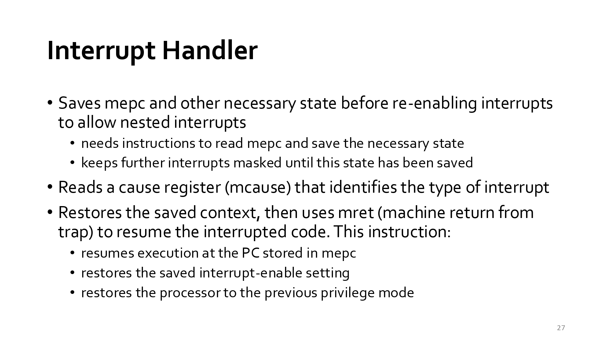

這張投影片主題為 「Interrupt Handler（中斷處理程式）」，從作業系統（OS）與系統軟體的層面，詳細說明進入中斷處理程式後的執行流程以及返回原程式的機制。
- 本教學重點內容：
  - 保存狀態與支援巢狀中斷（Saving State & Nested Interrupts）：
    - 保存 Context（上下文）：在重新開啟中斷（Re-enable Interrupts）前，Handler 必須先執行指令將 mepc（機器例外程式計數器）以及其他的通用暫存器狀態，儲存至記憶體的堆疊（Stack）中。
    - 中斷遮罩（Interrupt Masking）：在關鍵狀態保存完成前，必須將後續中斷保持遮罩（Masked / Disabled），避免新的中斷蓋掉暫存器中尚未儲存的 mepc 或其他關鍵資訊，導致狀態遺失。
  - 辨識中斷原因（Identifying Interruption Cause）：
    - 讀取原因暫存器 mcause（Machine Cause Register），辨識觸發中斷的具體類型（例如是 Timer 中斷、網卡封包到來還是鍵盤輸入），並跳轉至相應的子服務程式處理。
  - 還原上下文與返回指令（mret - Machine Return）：
    - 處理完中斷後，Handler 從堆疊還原先前保存的暫存器與 mepc。
    - 執行 mret（Machine Return from Trap）指令返回被中斷的程式。mret 硬體指令會同時自動完成三件事：
      - 恢復 PC：將 PC 設定為 mepc 中儲存的位址，使程式恢復執行。
      - 恢復中斷狀態：還原中斷前的「中斷啟用/禁用（Interrupt-Enable）」設定。
        - 恢復特權模式：將處理器狀態還原至發生中斷前的特權等級（Privilege Mode，例如從 Kernel Mode 切換回 User Mode）。
- 個人看法：
   這張投影片完美解構了 **軟硬體協同（Hardware-Software Co-Design）處理中斷的黃金工作流程**：
  - 硬體與軟體的分工界線：
    - 硬體負責「臨門一腳」：在中斷發生的瞬時，自動將 PC 存入 mepc、記錄原因至 mcause、關閉中斷並跳轉至 Handler 入口。
    - 軟體（OS Handler）負責「保存現場」：因為通用暫存器（x1~x31）數量眾多，硬體全部自動儲存會消耗極大的晶片面積與週期；因此交給軟體 Handler 透過幾條儲存指令（Store Instructions）存入 Stack，是效能與硬體複雜度之間最佳的折衷。
  - 原子性（Atomicity）與 mret 指令的巧妙設計：
    - 當中斷處理完畢要返回原程式時，「恢復 PC」、「開啟中斷」以及「降級特權模式（User Mode）」這三件事必須在同一個週期內原子性（Atomically）完成。
    - 如果用多條普通指令分開做，可能會產生安全性漏洞（Security Hole）或再度被中斷打斷；而專用的 mret 特權指令正是為了確保這三者同步生效而設計的硬體利器。
- 總結：
   本投影片完整說明了 Interrupt Handler 的運作邏輯：軟體 Handler 負責在遮罩狀態下保存 mepc 與暫存器上下文，讀取 mcause 處理對應事件；最後透過硬體原子指令 mret 一口氣恢復 PC、中斷狀態與特權模式，精確且安全地接續原程式的執行。

## slide：28

  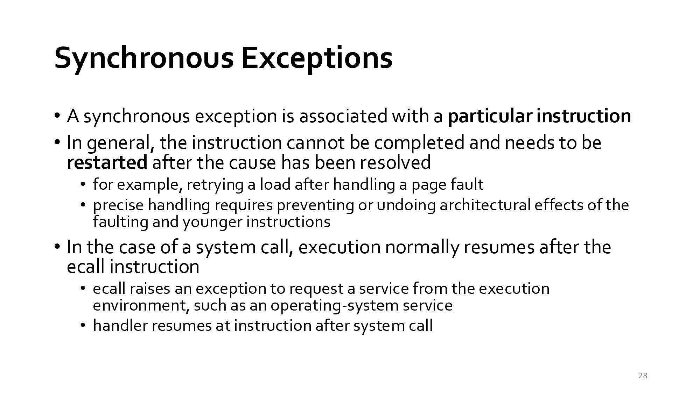

這張投影片主題為 「Synchronous Exceptions（同步例外）」，對同步例外的特性、處置方式以及系統呼叫（System Call / ecall）的運算行為進行了深入說明。
- 本教學重點內容：
  - 同步例外的核心特性（Specific Instruction Association）：
    - 同步例外是由特定的一條指令在執行過程中直接觸發的。
    - 需要重新執行（Restartable）：一般情況下，觸發例外的指令無法順利完成。在作業系統（OS）排解原因後，該指令需要重新被啟動並執行（Restarted）。
      - 範例：處理完 Page Fault（缺頁中斷）後，CPU 會重新執行原本讀取失敗的 load 指令。
    - 精確處理（Precise Handling）：要求必須撤銷或阻止（Undo/Prevent）該出錯指令本身及其後續（較晚）所有指令對架構狀態的修改。
  - 系統呼叫（System Calls / ecall）的特例：
    - 執行接續（Resume After Instruction）：與一般錯誤例外不同，當程式執行 ecall 指令引發系統呼叫向作業系統請求服務時，處理器在 Handler 完成服務後，通常會返回並接續執行 ecall 的下一條指令。
- 個人看法：
   這張投影片非常清楚地對比了 「錯誤型例外（Faults）」與「陷阱/服務請求型例外（Traps / Syscalls）」 在硬體控制流程上的關鍵差異：
  - 返回 PC 位址的硬體選擇（mepc vs mepc + 4）：
    - Page Fault / Execution Fault：硬體自動存入 mepc 的是出錯指令本身的 PC。當 OS 補完 Page 之後執行 mret，CPU 會回到原本那條指令重試。
    - ecall (Syscall)：硬體存入 mepc 的雖然也是 ecall 本身的 PC，但 OS Handler 在處理完請求後，軟體會手動將儲存在 Stack 中的 mepc 值加上 4（指令長度），使得 mret 時能夠跳過 ecall，順利執行下一條指令。
  - In-Order Commit 對 Precise Exception 的重要性：
    - 這正是為什麼流水線（特別是超純量或亂序執行處理器）必須保證指令按照程式順序提交（In-Order Commit）。
    - 只要 $I_i$ 觸發了 Synchronous Exception，管線必須有能力將 $I_{i+1}$ 及其後續指令的所有結果「乾淨地抹去」，否則將破壞 Precise Exception 的語意。
- 總結：
   本投影片解析了同步例外的處理原則：對於 Page Fault 等錯誤，OS 排解後須重新執行該指令；而對 ecall 等系統呼叫，則於處理完成後接續執行下一條指令。不論何種情況，硬體都必須滿足精確例外（Precise Exception）的要求，嚴格撤銷所有未完成指令的副作用。

## slide：29 五階段管線（5-Stage Pipeline）中的異常處理（Exception Handling）機制

  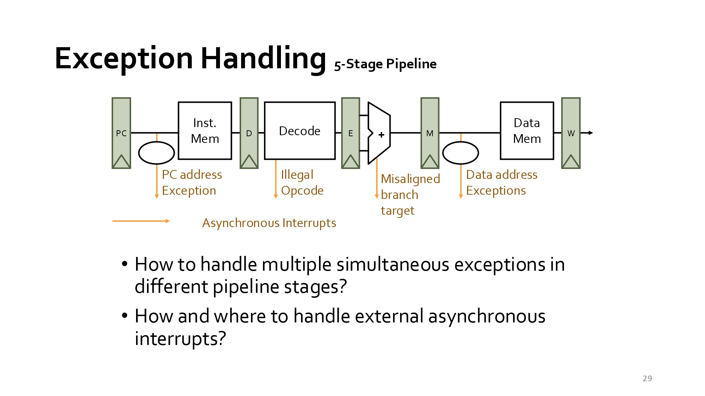

這張投影片討論的是五階段管線（5-Stage Pipeline）中的異常處理（Exception Handling）機制
- 投影片重點內容
  - 各管線階段可能發生的異常類別：
    - IF / PC 階段：PC 位址異常（PC address Exception）。
    - ID 階段：非法指令碼（Illegal Opcode）。
    - EX 階段：未對齊的跳躍目標位址（Misaligned branch target）。
    - MEM 階段：資料位址異常（Data address Exceptions）
    - 全階段：非同步中斷（Asynchronous Interrupts，如外部硬體中斷）。
  - 核心核心探討議題：
    - 當多個異常同時在不同管線階段觸發時，系統該如何進行優先順序處理與協調？
    - 外部非同步中斷應該在何時、何處（哪一個階段）被妥善處理？
  - 微架構面臨的兩大核心挑戰（Key Questions）：
    - 多重同時例外處理（Multiple Simultaneous Exceptions）：當不同指令在同一週期、不同的管線階段（例如指令 A 在 MEM 發生 Data Fault，而較晚發射的指令 B 在 IF 發生 PC Address Exception）同時觸發 Exception 時，處理器應如何判斷優先權並維護程式順序？
    - 異步中斷的注入點（Handling Asynchronous Interrupts）：外部異步中斷應該在何時、流水線的哪一個階段被捕捉與介入？
- 個人看法：
   這張圖直接揭示了流水線（Pipeline）與精確例外（Precise Exceptions）衝突的核心來源：
  - 挑戰點：管線化的優勢在於指令交錯執行，但這也代表「後進去的指令（較早階段）」可能會比「先進去的指令（較晚階段）」更早觸發異常。如果沒有妥善管理，會導致指令狀態混亂。
  - 解決方向：通常設計上會將各階段產生的異常標記在流水線暫存器（Pipeline Register）中，隨指令一路傳遞，直到 WB（寫回）階段前統一按指令順序處理，以確保程式執行狀態的正確性與可預測性。
  - 時間與空間的倒錯（Out-of-Order Exception Detection）：
    - 在流水線中，較早進管線（較老）的指令在 MEM 階段才發現 Data Page Fault，而較晚進管線（較新）的指令在 IF 階段就發現了 Instruction Page Fault。
    - 時間上，IF 階段的 Exception 會先被硬體邏輯偵測到；但邏輯上，MEM 階段才是程式順序較優先的指令！
    - 處置原則：硬體絕對不能直接觸發先偵測到的 IF Exception，否則會破壞 Precise Exception。硬體必須將 Exception 狀態沿著管線暫存器（Pipeline Registers）「往後傳遞（Hold status until Commit/WB Stage）」，確保永遠只處理程式順序中最老（Oldest）的 Exception。
- 總結：
   本教學聚焦於五階段 CPU 管線中的異常處理機制，說明 PC 位址錯誤、非法指令、位址未對齊及資料異常會分別發生於不同階段。核心課題在於如何協調多個階段同時發生的異常，以及如何妥善處理解析外部非同步中斷，以維持系統執行的精確性與穩定性。
   本投影片透過 5 階流水線圖示，點出 Exception 可能散布於 IF, ID, EX, MEM 等各個階段。為了滿足精確例外（Precise Exception），處理器必須建立一套優先權與狀態傳遞機制，確保在多個 Exception 同時發生時，能嚴格按照程式的邏輯順序（Program Order）進行處理。

## slide：30

  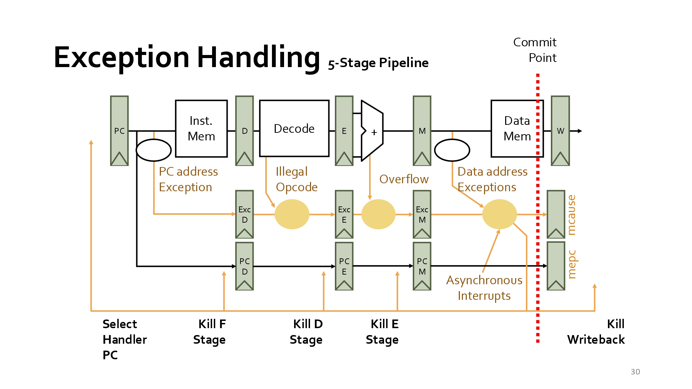

這張投影片主題為 「Exception Handling in a 5-Stage Pipeline（5 階流水線中的例外處理控制機制）」，詳細呈現了硬體如何在古典 5 階流水線（IF, ID, EX, MEM, WB）中維護 精確例外（Precise Exception） 的控制訊號與資料路徑。
- 本教學重點內容：
  - 例外狀態的沿線傳遞（Exception Status Propagation）：
    - 例外暫存器（Exc D, Exc E, Exc M）：當指令在前端（如 IF 階段）發生例外時，硬體不會立刻跳轉，而是將 Exception 狀態記錄下來，隨著指令像流水線暫存器一樣往後傳遞（Hold status until Commit）。
    - PC 暫存器傳遞（PC D, PC E, PC M）：與 Exception 狀態同步，該指令所在的 Program Counter (PC) 也會一路隨管線往後傳遞，以確保發生例外時能精確抓到正確的 PC。
  - 提交點（Commit Point）與暫存器寫入（mepc / mcause）：
    - Commit Point（提交點）：位於 MEM 與 WB 階段之間的虛擬紅線。
    - 狀態寫入：只有當「邏輯上最老」的指令到達 Commit Point 且確定觸發例外時，硬體才會正式將該指令的 PC 寫入 mepc，並將例外原因寫入 mcause。
    - 異步中斷注入（Asynchronous Interrupts）：外部中斷請求同樣在 Commit Point / MEM 階段進行評估與注入。
  - 流水線撤銷機制（Pipeline Flushing / Kills）：
    - 一旦在 Commit Point 確定要處理例外，硬體會向前端所有階段發送清空訊號：
      - Kill F Stage（清空 IF 階段指令）
      - Kill D Stage（清空 ID 階段指令）
      - Kill E Stage（清空 EX 階段指令）
      - Kill Writeback（禁止當前出錯指令寫回暫存器）
    - 選擇 Handler 起始位址（Select Handler PC）：將 PC 多工器（MUX）強制切換至 Trap Handler 的入口位址，控制流正式轉移至 OS 處理程式。
- 個人看法：
   這張架構圖是理解 「Precise Exception 在微架構中如何實作」 的經典範例：
  - 解決 Out-of-Order Exception 的核心關鍵：
    - 解決上一張投影片提到的「後進管線的指令先報錯」問題，答案就在於 「將 Exception 狀態延遲到 Commit Point 才處理」。
    - 如果一條較早的指令在 MEM 階段出錯，而較晚的指令在 IF 階段也出錯；當 MEM 階段到達 Commit Point 觸發 Trap 並發出 Kill F Stage 時，IF 階段那條較晚指令的 Exception 就會被直接抹除（Flushed），完全不會破壞程式的執行順序與架構狀態。
  - 原子性清空（Atomic Flush）：
    - 下方的 Kill F/D/E/WB 展現了硬體如何在單一週期內將管線中的未完成指令全部轉換為 NOP（No-Operation）。這保證了在進入 Trap Handler 時，處理器狀態絕對是乾淨且一致的。
- 總結：
   本投影片展示了 5 階流水線實現精確例外的硬體控制迴路：透過將 Exception 狀態與 PC 隨管線向後傳遞至 Commit Point，並在確定觸發時一舉撤銷（Kill）所有後續階段的指令，將 PC 設定為 Handler 入口，從而在微架構層面完美維護了 Precise Exception。

## slide：31

  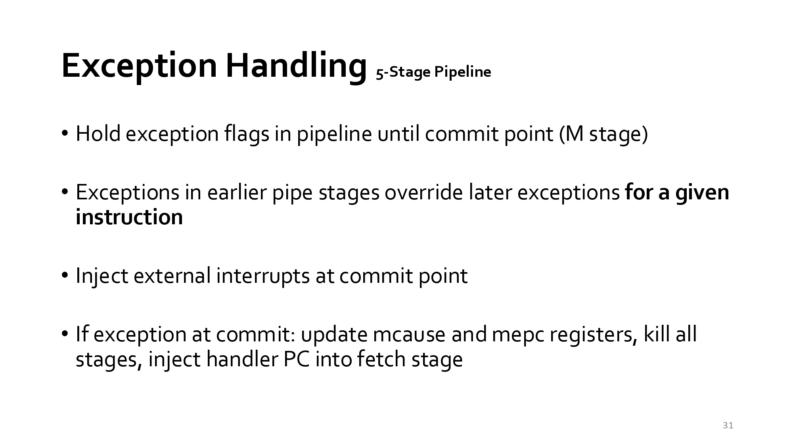

這張投影片主題為 「Exception Handling in a 5-Stage Pipeline（5 階流水線中例外處理的四核心原則）」，總結了在古典 5 階流水線中實現 精確例外（Precise Exception） 的微架構控制規則。
- 本教學重點內容：
  - 例外旗標保留至提交點（Hold Exception Flags Until Commit Point）：
    - 當某條指令在管線前端（如 IF, ID, EX）引發 Exception 時，硬體不會立即切換控制流，而是將 Exception 狀態旗標（Flags）暫存起來，隨著指令一路向後傳遞，直到該指令到達 Commit Point（即 M/MEM 階段）。
  - 前端例外覆蓋機制（Earlier Pipe Stage Exceptions Override Later Ones）：
    - 對於同一條指令而言，如果在流水線較早階段（如 IF 階段的 Instruction Page Fault）與較晚階段（如 MEM 階段的 Data Access Exception）皆偵測到 Exception，較早階段（IF）的例外優先權較高，會覆蓋較晚階段的例外。
  - 異步中斷的注入點（Inject External Interrupts at Commit Point）：
    - 來自外部硬體（如 I/O 裝置、Timer）的 Asynchronous Interrupt，統一選擇在 Commit Point 進行捕捉與注入。
  - 提交點例外的原子處置（Actions at Commit Point）：
    - 當到達 Commit Point 的指令確定引發例外時，硬體會同步完成以下處置：
      - 更新暫存器：將原因寫入 mcause，並將該指令的 PC 寫入 mepc。
      - 清空管線（Kill All Stages）：發送清空訊號（Flush），取消所有在管線中未完成的指令（IF, ID, EX, WB）。
      - 載入 Handler PC：將 Trap Handler 的起始位址注入到 IF (Fetch) 階段，開始執行 OS 的例外處理程式。
- 個人看法：
   這張投影片把複雜的精確例外控制邏輯高度精煉成 4 條金科玉律，對於理解 Processor Core 的 Exception HW 邏輯非常有幫助：
  - 單一指令的多重例外衝突解決（Single-Instruction Multi-Exception Conflict）：
    - 第二點提到「同一條指令較早階段的例外會覆蓋較晚階段」。舉例來說：如果一條 Load 指令在 Fetch 階段就被發現 PC 位址非法（IF Exception），但隨後管線暫存器帶入無效資料導致 MEM 階段也跳出 Data Access Fault。
    - 邏輯上，這條指令根本不應該被成功 Fetch 並執行到 MEM 階段，因此 IF 階段的例外才是根本原因。硬體透過階段覆蓋機制，確保寫入 mcause 的永遠是第一個觸發的錯誤類型。
  - Commit Point 扮演管線的「安檢閘門」：
    - 將異步中斷與同步例外的生效點統一集中在 M 階段（Commit Point），極大地簡化了流水線的控制邏輯。
    - 只要指令過得了 Commit Point，就能順利進入 WB 階段寫回暫存器；一旦在 Commit Point 被攔截，前方所有指令一律 Kill，徹底避免了「部分狀態已寫回、部分狀態被中斷」的混沌狀態。
- 總結：
   本投影片提煉了 5 階流水線處理例外的四大核心法則：將例外旗標傳遞至 M 階段 Commit Point 生效、以指令執行順序中的較早階段例外優先、於 Commit Point 注入外部中斷，並在確定觸發時原子性地更新 mepc/mcause 並 Flush 管線，確保完全符合 Precise Exception 的要求。

## slide：32

  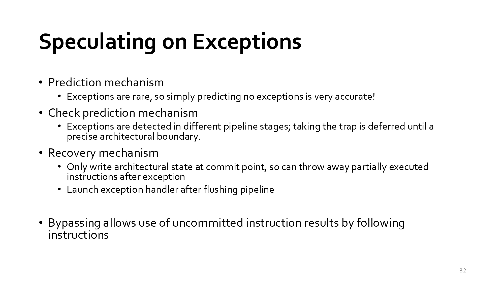

這張投影片主題為 「Speculating on Exceptions（例外處理中的推測執行機制）」，說明在現代管線（Pipeline）處理器中，如何將「推測執行（Speculation）」的概念套用至 Exception 的處理上，以同時兼顧效能與精確例外（Precise Exception）。
- 本教學重點內容：
  - 預測機制（Prediction Mechanism）：
    - 預測策略：在絕大多數程式執行過程中，Exception 發生的機率極低（Exceptions are rare）。
    - 簡單極致：因此處理器採用簡單且極為準確的預測策略——**預測完全不會發生 Exception**（Simply predicting no exceptions is very accurate）。
  - 檢查預測機制（Check Prediction Mechanism）：
    - Exception 會在流水線的不同階段（如 IF, ID, EX, MEM）被偵測到。
    - 延遲觸發（Deferred Trap）：偵測到 Exception 時，硬體**不會立刻中斷**，而是將 Trap 的觸發延遲到指令到達「精確的架構邊界（Precise Architectural Boundary）」（即 Commit Point / M stage）才進行檢查與確認。
  - 恢復機制（Recovery Mechanism）：
    - 僅在 Commit Point 寫入狀態：只有當指令順利抵達 Commit Point 且未發生例外時，才會正式修改架構暫存器狀態（Architectural State）。
    - 拋棄未完成指令：若在 Commit Point 確定發生 Exception，預測失敗，硬體可以直接丟棄（Throw away / Flush）該 Exception 之後所有已部分執行的指令。
    - 啟動 Handler：清空流水線後，將控制權轉移至 OS 的 Exception Handler。
  - 前瞻旁路/前饋（Bypassing / Forwarding 的安全運作）：
    - 允許後續指令直接使用「尚未提交（Uncommitted）」的指令執行結果（透過 Bypassing / Data Forwarding）。
    - 如果前方指令最終被證實發生 Exception 並遭到 Flush，這些使用了未提交結果的後續指令也會一併被清空（Killed），因此不會破壞系統狀態。
- 個人看法：
   這張投影片展現了微架構設計中極為精妙的哲學——「將 Exception 處理納入一般 Branch Prediction / Speculation 的統一框架中」：
  - 「例外也是一種分支預測失誤（Misprediction）」：
    - 在 CPU 眼裡，執行指令時「預測不會出錯」就跟「預測分支會跳轉」是一樣的推測執行（Speculative Execution）。
    - 當 Exception 真的發生時，微架構只需將其視為一次「預測失誤（Misprediction）」，觸發相同的 Flush 與 Recovery 邏輯即可。這種設計極大地簡化了控制邏輯的複雜度。
  - 效能與正確性的平衡（Performance via Bypassing）：
    - 最後一點提到 Bypassing。如果為了等待 Exception 檢查而禁止 Data Bypassing，流水線將充斥著 Data Hazard 導致的 Stall（停頓）。
    - 允許推測性的資料前饋（Bypassing uncommitted results），同時將寫回暫存器（Architectural State Write）嚴格限制在 Commit Point，既保證了管線的高吞吐量（Throughput），又捍衛了 Precise Exception 的底線。
- 總結：
   本投影片總結了例外處理的推測架構： CPU 預設「不會發生例外」以維持最高執行效率，並透過將 Exception 檢查延遲至 Commit Point 生效；一旦推測失敗，則藉由清空管線（Flush）來復原架構狀態，達到效能與精確性的完美平衡。

## slide：33

  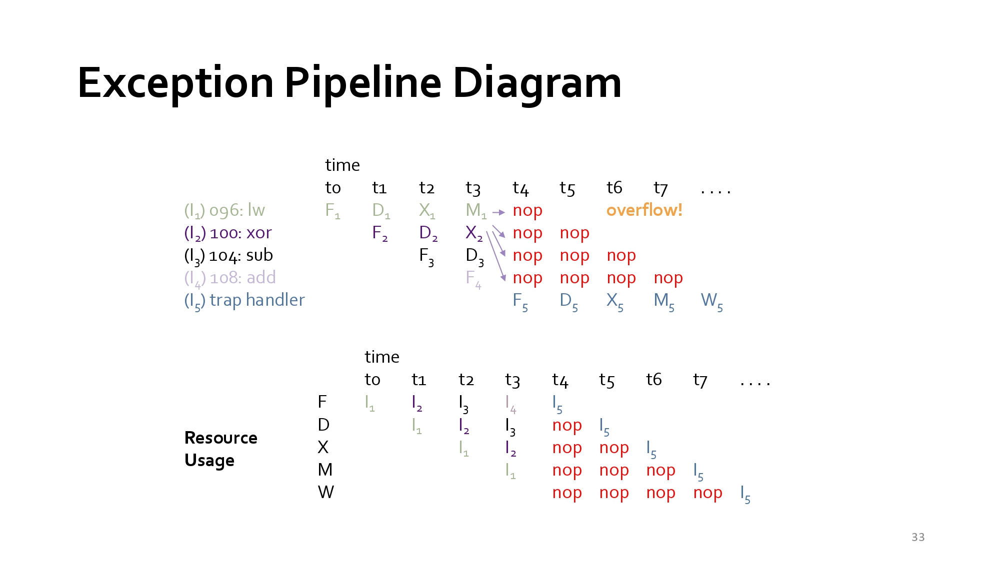

這張投影片主題為 「Exception Pipeline Diagram（例外處理的流水線時序圖）」，透過兩張時序圖（Pipeline Diagrams）展示當指令在流水線中發生 Exception 時，硬體如何進行清空（Flush / Kill）並切換至 Trap Handler。
- 本教學重點內容：
  - 指令執行與 Exception 觸發過程（上圖：Time View）：
    - 指令序列：
      - $I_1$ (096: lw)：在 $t_3$（M 階段）發生 overflow!（或數據存取例外）。
      - $I_2$ (100: xor)、 $I_3$ (104: sub)、 $I_4$ (108: add)：為跟在 $I_1$ 後面已經發射進入管線的指令。
      - $I_5$：Trap Handler 的第一條指令。
    - 時序變化（Time $t_0 \rightarrow t_7$）：
      - $t_0 \sim t_3$： $I_1 \sim I_4$ 正常推推進管線。
      - $t_3$ 關鍵點： $I_1$ 在 M 階段（Commit Point）確定觸發 Overflow Exception。
      - $t_4$ 管線清空（Flush/Kill）： $I_1$ 的 Exception 觸發，硬體將 $I_1$ 在 WB 階段以及後續所有指令（ $I_2, I_3, I_4$ ）全部轉化為 nop（No-Operation）。同時，硬體將 Trap Handler 的起始位址（ $I_5$ ）注入 Fetch 階段（ $F_5$ ）。
      - $t_5 \sim t_7$： $I_5$ (Trap Handler) 開始順利在管線中執行（ $F_5 \rightarrow D_5 \rightarrow X_5 \rightarrow M_5 \rightarrow W_5$ ）。
  - 硬體資源使用情況（下圖：Resource Usage View）：
    - 呈現每個時間點（ $t_0 \sim t_7$ ）各管線階段（F, D, X, M, W）所佔用的指令。
    - 清楚看到在 $t_4$ 週期，D、X、M、W 四個階段同時變成 nop，展現了 Atomic Flush（原子性清空） 的過程。
- 個人看法：
   這張時序圖是將前面講述的「Commit Point 檢查」與「Pipeline Flush」理論圖像化的最經典範例：
  - 精確例外（Precise Exception）的具體落實：
    - 注意觀察  $I_1$ 發生 Overflow 時， $I_1$ 本身有沒有寫入暫存器？沒有（在 $t_4$ 被轉為 nop，取消了 Writeback）。
    - 晚於 $I_1$ 的指令（ $I_2, I_3, I_4$ ）有沒有修改架構狀態？完全沒有，它們在 $t_4$ 一舉被抹成 nop。
    - 這保證了當 $I_5$ (Trap Handler) 開始執行時，CPU 的暫存器狀態完全停留在 $I_1$ 執行前的精確狀態！
  - Penalty（效能代價）的視覺化：
    - 圖中可以清晰看到，從 $t_3$ 發現例外到 $t_5$ 第一條 Handler 指令進到 Decode 階段，中間形成了連續的 nop 泡泡（Pipeline Bubbles）。這正是 Exception 帶來的心智與效能開銷（Flush Overhead）。
- 總結：
   本投影片透過 Pipeline Diagram 完整示範了精確例外發生的過程：當 $I_1$ 在 M 階段（ $t_3$ ）確定觸發 Exception 時，管線於下一週期（ $t_4$ ）立即發送清空訊號將 $I_1 \sim I_4$ 抹為 nop，並於 $t_4$ 將控制權無縫切換至 Trap Handler 的第一條指令 $I_5$（ $F_5$ ）開始執行。

## slide：34

  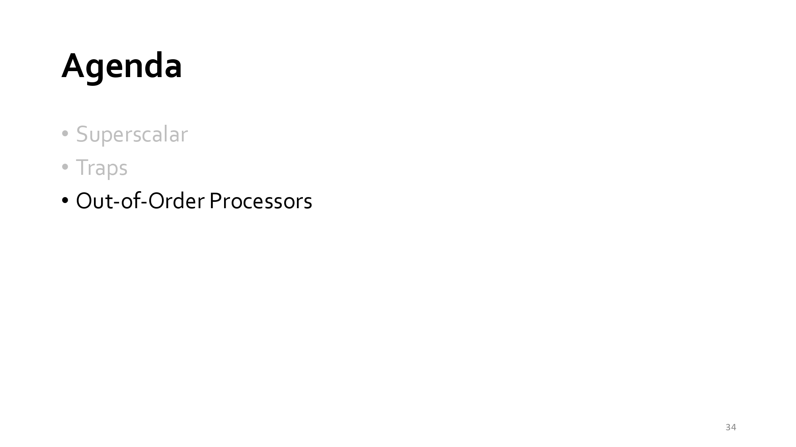

這張投影片為課程章節的 Agenda（課程大綱 / 內容目錄），標示了本單元的三大核心主題：
- 本教學重點內容：
  - Superscalar（超純量架構）：
     探討如何在單一時鐘週期內同時發射（Issue）與執行多條指令（如 2-way 或 4-way Superscalar），以突破 $CPI < 1$ 的限制。
  - Traps（陷阱與例外處理機制）：
     介紹同步例外（Synchronous Exceptions）與異步中斷（Asynchronous Interrupts）的分類、中斷處理程式（Handler）的運作，以及如何在流水線中實現精確例外（Precise Exceptions）。
  - Out-of-Order Processors（亂序執行處理器）：
     本章節即將進入的新主題，探討如何透過動態排程（Dynamic Scheduling）、保留站（Reservation Stations）、重排序緩衝區（Reorder Buffer, ROB）與暫存器重命名（Register Renaming）技術，允許指令不按程式順序（Out-of-Order）執行以解開 Data Hazards，同時依然維持按序提交（In-Order Commit）來保證 Precise Exception。
- 個人看法：
   這張 Agenda 展現了現代高效能 CPU 設計演進的三部曲：
  - 從 Superscalar 到 Out-of-Order 的必然性：
    - 單純的 In-Order Superscalar 雖然能同時發射多條指令，但只要遇到一次 Data Hazard 或 Cache Miss，整條管線就會陷入 Stalling（停頓）。
    - 為了真正發揮 Superscalar 的多發射能力，微架構必須轉向 Out-of-Order Execution（OoO），讓不互相依賴的後續指令「繞過」被阻塞的指令先執行。
  - Traps 是 OoO 架構的最大挑戰：
    - 將 Traps 放在 Superscalar 與 Out-of-Order 之間講授非常合理。在 OoO 處理器中，指令執行的順序已經完全打亂，要如何在發生 Trap 時恢復到「邏輯上精確」的程式狀態（Precise Exception），是 OoO 設計中最核心也最複雜的課題（例如依靠 ROB 來實現 In-Order Commit）。
- 總結：
   本投影片標誌著課程即將從「Traps 與精確例外處理」邁入下一個重頭戲——Out-of-Order Processors（亂序執行處理器）。接下來將深入學習現代高效能 CPU 如何在亂序執行的極致效能與精確例外的正確性之間取得平衡。

## slide：35

  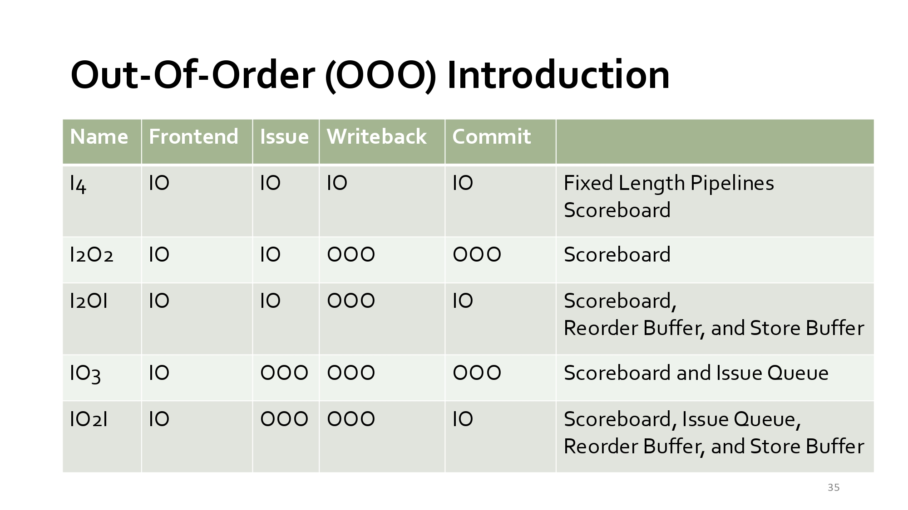

這張投影片為 「Out-Of-Order (OOO) Introduction（亂序執行處理器導論）」，透過一張分類表格整理了微架構在指令發射與執行的不同發展階段，以及各階段所需的硬體控制元件。
- 表格欄位說明：
  - Name（名稱代號）：以 $I$ (In-Order) 與 $O$ (Out-of-Order) 的組合命名各管線階段。
  - Frontend（前段 / 取指與解碼）：皆為 IO (In-Order)，即按程式順序取指與解碼。
  - Issue（發射）：分為按序發射 (IO) 與亂序發射 (OOO)。
  - Writeback（寫回暫存器）：分為按序寫回 (IO) 與亂序寫回 (OOO)。
  - Commit（提交 / 架構狀態更新）：分為按序提交 (IO) 與亂序提交 (OOO)。
- 本教學重點內容：
  - $I_4$ 架構 (In-Order Everything)：
    - 機制：Frontend, Issue, Writeback, Commit 全為 In-Order。
    - 硬體需求：固定長度流水線（Fixed Length Pipelines）與 Scoreboard（計分板機制）。
    - 特性：最基礎的古典流水線，簡單但容易因為 Data Hazard 造成停頓。
  - $I_2 O_2$ 架構 (In-Order Issue / Out-of-Order WB & Commit)：
    - 機制：按序發射，但允許不同執行時間的指令亂序完成（OOO Writeback & Commit）。
    - 硬體需求：Scoreboard。
    - 缺點：無法支援精確例外（Imprecise Exceptions）。
  - $I_2 OI$ 架構 (In-Order Issue & Commit / Out-of-Order WB)：
    - 機制：按序發射（IO Issue），允許執行過程中亂序寫回（OOO Writeback），但最終按序提交（IO Commit）。
    - 硬體需求：Scoreboard、Reorder Buffer (ROB)、Store Buffer。
    - 特性：導入 ROB 解決了 $I_2 O_2$ 的缺陷，成功實現 Precise Exceptions（精確例外）。
  - $IO_3$ 架構 (In-Order Frontend / Out-of-Order Execution & Commit)：
    - 機制：Frontend 按序，但進入 Issue Queue 後允許亂序發射（OOO Issue）與亂序執行/提交。
    - 硬體需求：Scoreboard 與 Issue Queue（發射佇列 / 保留站 Reservation Station）。
  - $IO_2 I$ 架構 (Full Out-of-Order Core with In-Order Commit)：
    - 機制：前端按序，進入 Issue Queue 後亂序發射與執行（OOO Issue & WB），最後在 Commit 階段強制按序提交（IO Commit）。
    - 硬體需求：Scoreboard、Issue Queue、Reorder Buffer (ROB) 與 Store Buffer。
    - 地位：現代所有高效能 CPU（Intel, AMD, Apple, ARM Cortex-A/X）的核心標準架構！
- 個人看法：
   這張表格是計算機結構中極度經典且清楚的架構演進分類表：
  - ROB（Reorder Buffer）的關鍵價值：
    - 觀察表格可以發現，只要 Commit 欄位是 IO（In-Order）（如 $I_2 OI$ 和 $IO_2 I$），硬體需求就必定出現 Reorder Buffer (ROB)。
    - 這印證了前幾張投影片所學：要在亂序發射/執行的極致效能下維護 Precise Exceptions，ROB 就是將「亂序結果」重新拉回「按序提交」的核心安檢閘門。
  - Store Buffer 的必要性：
    - 當 Commit 被要求必須按序（IO）時，記憶體寫入（Store 指令）絕對不能在 OOO 階段就直接寫進 L1 Data Cache，否則無法撤銷。因此必須先暫存在 Store Buffer，等到 Commit Point 確定沒有 Exception 後才正式寫入 Cache。
- 總結：
   本投影片總結了處理器從純按序（ $I_4$ ）邁向現代高效能亂序執行（ $IO_2 I$ ）的演進圖譜：透過 Issue Queue 實現亂序發射以提升效能，並結合 Reorder Buffer (ROB) 與 Store Buffer 實現按序提交（In-Order Commit），完美達成高效能與精確例外的兼顧。

## slide：36

  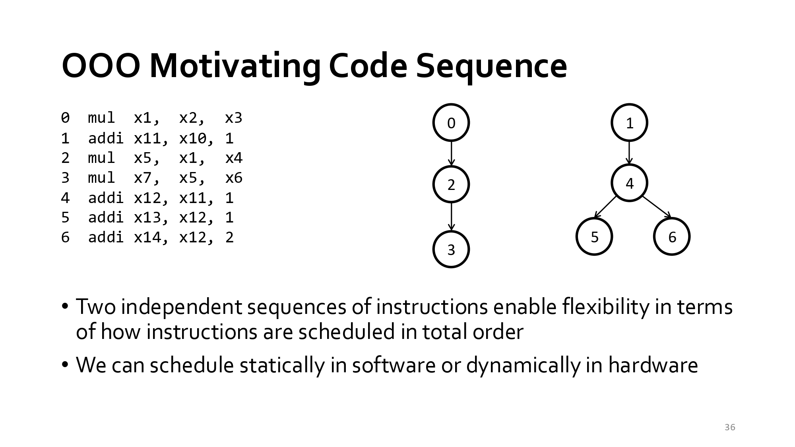

這張投影片主題為 「OOO Motivating Code Sequence（亂序執行的程式碼範例動機）」，透過一組簡單的指令序列與其資料相依圖（Data Dependency Graph），說明亂序執行（Out-of-Order Execution）在排程上的靈活性與優勢。
- 本教學重點內容：
  - 程式碼序列（Code Sequence）與資料相依性：
    - 指令 0：mul x1, x2, x3
    - 指令 1：addi x11, x10, 1
    - 指令 2：mul x5, x1, x4（相依於指令 0 的 x1）
    - 指令 3：mul x7, x5, x6（相依於指令 2 的 x5）
    - 指令 4：addi x12, x11, 1（相依於指令 1 的 x11）
    - 指令 5：addi x13, x12, 1（相依於指令 4 的 x12）
    - 指令 6：addi x14, x12, 2（相依於指令 4 的 x12）
  - 獨立的指令鏈（Two Independent Sequences）：
    - 右方圖表顯示這 7 條指令可拆解為兩條完全獨立、互不影響的相依鏈（Dependency Chains）：
      - 鏈一（乘法鏈）：$0 \rightarrow 2 \rightarrow 3$
      - 鏈二（加法鏈）：$1 \rightarrow 4 \rightarrow (5, 6)$
  - 全序排程的彈性（Flexibility in Total Order Scheduling）：
    - 由於兩條鏈彼此獨立，硬體或編譯器在安排指令執行順序（Total Order）時擁有極高的彈性。
    - 例如：若鏈一的乘法需要較多週期（Latency 長），處理器可以先執行鏈二的加法指令（如在指令 0 執行時同時執行指令 1 與 4），而不需停頓（Stall）等待乘法完成。
  - 靜態與動態排程（Static vs. Dynamic Scheduling）：
    - 靜態排程（Static Scheduling）：在編譯時期由軟體（Compiler）重新排列指令順序。
    - 動態排程（Dynamic Scheduling）：在執行時期由硬體（Hardware / Out-of-Order Core）根據運算單元與資料就緒狀態，動態調整執行順序。
- 個人看法：
   這張圖以極簡的方式揭示了 「指令級平行（Instruction-Level Parallelism, ILP）」 的本質：
  - 打破順序執行的魔咒：
    - 在傳統按序（In-Order）處理器中，如果指令 0 (mul) 因為等待資料或運算時間較長而阻塞，後續的指令 1、4、5 都必須無奈跟著停頓。
    - 但從資料相依圖可以清晰看到，指令 1, 4, 5, 6 跟指令 0, 2, 3 根本沒有半點關係！
  - 為什麼硬體需要動態排程（OOO）？
    - 編譯器靜態排程雖然有幫助，但無法應對「執行時期才確定的停頓」（例如 Cache Miss 或動態 Branch Misprediction）。
    - 透過 OOO 微架構，硬體能即時觀察這張 DAG（有向無環圖），只要運算資源空閒且資料已就緒（Ready），就能「亂序」發射並執行，大幅提升 Pipeline 的利用率！
- 總結：
   本投影片展示了動態亂序執行的核心動機：程式碼中常包含多條獨立的相依鏈，透過動態排程（Dynamic Scheduling），處理器能靈活交錯執行無關的指令，避免傳統按序流水線因單一長延遲指令而陷入停頓，進而極大化指令級平行度（ILP）。

## slide：37

  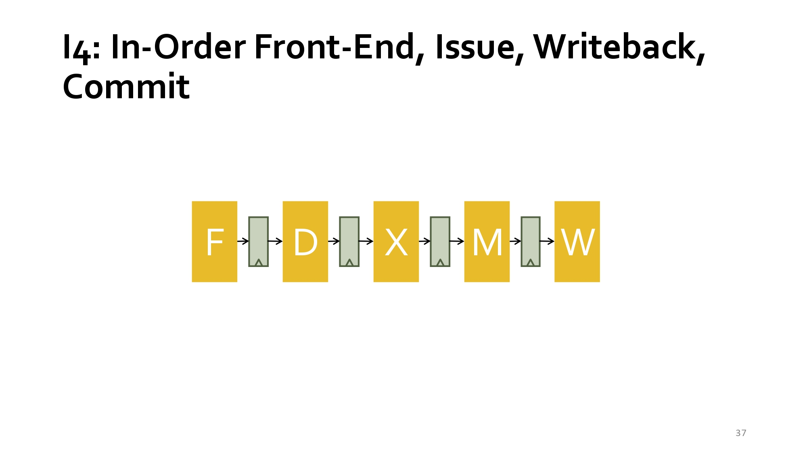

這張投影片主題為 「I4: In-Order Front-End, Issue, Writeback, Commit」，展示了一個經典的 5 階段順序處理管線（In-Order Pipeline）架構。
- 本教學重點內容：
  - 基本 5 階段管線架構（5-Stage Pipeline）：
    - F (Fetch，取指)：從指令記憶體讀取指令。
    - D (Decode / Issue，譯碼 / 發射)：解析指令並讀取暫存器，順序發射至執行階段。
    - X (Execute，執行)：由算術邏輯單元（ALU）進行運算或計算位址。
    - M (Memory，記憶體存取)：讀取或寫入資料記憶體。
    - W (Writeback / Commit，寫回 / 提交)：將結果寫回暫存器檔案，完成指令提交。
  - 「In-Order」（順序）核心特徵：
    - 從前端取指（Front-End）、發射（Issue）、寫回（Writeback）到最後的提交（Commit），指令全過程皆按照程式碼原始順序進行處理。
- 個人看法：
   這張投影片代表了微架構設計中最基礎、最標準的 CPU 基準模型（Baseline Architecture）。
  - 優點：架構簡單、控制邏輯直觀，且因為所有階段均為順序（In-Order），能天然地支援精確中斷（Precise Interrupts）與簡單的流水線暫存器設計。
  - 局限：當發生長延遲操作（如 Memory Miss）或指令間資料相依（Data Hazard）時，整個管線容易發生停頓（Stall）。這也是後續課程探討「亂序執行（Out-of-Order）」與「超純量（Superscalar）」架構的關鍵背景與理由。
- 總結： 本投影片展示經典 5 階段順序管線（F-D-X-M-W），強調指令在前端取指、發射、寫回與提交全程皆按原始順序執行。此架構設計簡單且易於維持精確中斷，但面對資料相依與記憶體延遲時易生停頓。它是學習亂序執行與超純量處理器等進階微架構的最佳基礎標竿。

## slide：38

  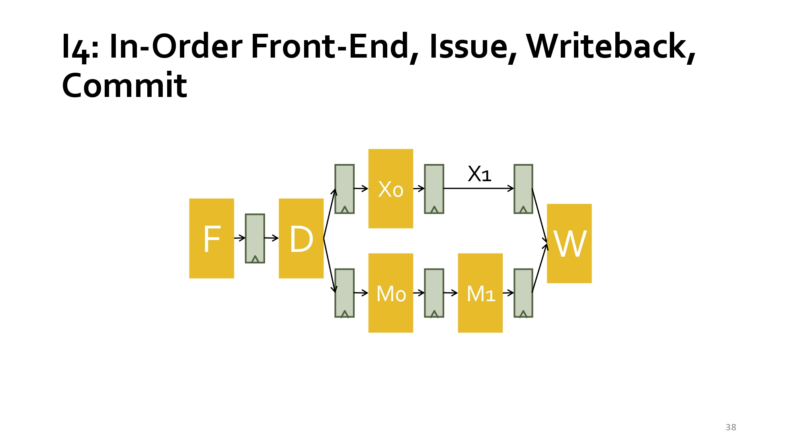

這張投影片展現了包含多條非對稱執行管線（Asymmetric Execution Pipelines）的進階 In-Order 架構。
- 本教學重點內容：
  - 多路/異構執行階段（Multiple Execution Paths）：
    - 前端（F, D）：指令順序進行取指（Fetch）與譯碼/發射（Decode/Issue）。
    - 分支執行管線：
      - ALU/算術路徑 ($X_0 \to X_1$)：處理一般的算術與邏輯運算
      - Memory/記憶體路徑 ($M_0 \to M_1$)：處理 Load/Store 等記憶體存取操作。
    - 後端（W）：兩條平行路徑運算完成後，匯合至 Writeback（寫回）階段進行結果提交。
  - 核心挑戰：結構衝突與結構冒險（Structural Hazards）：
   - 由於不同的執行路徑具備相同的流水線長度（皆為 2 階段），若不同類型的指令同時進入各自路徑，可能面臨同時抵達 W 階段搶奪 Write Port（寫回埠）的衝突。
- 個人看法： 這張圖是從單一流水線走向異構多執行單元（Asymmetric/Multi-pipeline Structure）的核心過渡模型。
  - 優點：允許不同類型的指令（如算術運算與記憶體存取）進行重疊與平行處理，提升了硬體資源利用率。
  - 隱憂與挑戰：雖然執行階段分流，但寫回埠（W Stage）成為集中的瓶頸點。若沒有設計適當的 Arbitration（仲裁）或 Stall（停頓）邏輯，極易產生寫回衝突；此外，不同執行時間也可能引發 WAW 或 RAW 等資料相依（Data Hazards）問題。
- 總結：
   本投影片展示包含算術與記憶體分流的雙路順序管線架構（F-D-$X_0$/$M_0$-$X_1$/$M_1$-W）。重點在於說明指令譯碼後可依類型分派至不同執行路徑以提升平行度。然而，異構路徑最終匯合於同一 Writeback 階段，會衍生寫回埠競爭與資料相依問題，是設計管線仲裁與控制邏輯的關注焦點。

## slide：39

  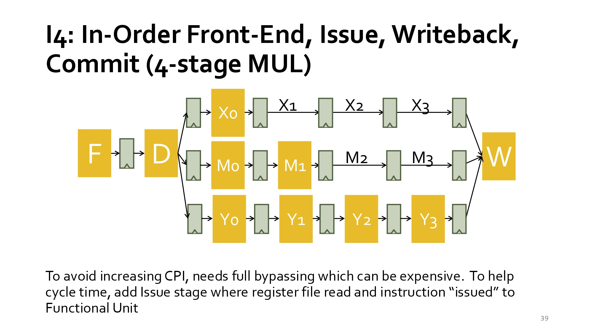

這張投影片介紹的是具備長延遲執行路徑（4-stage MUL）的順序管線架構。
- 本教學重點內容：
  - 非對稱的多階段執行路徑（Asymmetric Multi-Stage Execution）：
    - 取指與發射（F, D）：前級仍維持順序處理。
    - 多路平行執行單元：
      - 一般算術路徑 ($X_0 \to X_1$)：耗時較短（2 階段）。
      - 記憶體路徑 ($M_0 \to M_1 \to M_2 \to M_3$)：4 階段設計。
      - 乘法/複雜運算路徑 ($Y_0 \to Y_1 \to Y_2 \to Y_3$)：4 階段設計（4-stage MUL）。
    - 寫回階段（W）：所有執行單元算完後皆匯入 W 階段寫回暫存器。
  - 效能與硬體開銷的權衡（Trade-off）：
    - 全旁路（Full Bypassing）：為了避免長延遲運算拉高 CPI（降低效能），硬體需要極為複雜且昂貴的全旁路 forwarding 電路。
    - 新增 Issue 階段：為了維持與優化時脈週期時間（Cycle time），將暫存器讀取與指令發射（Issue）至功能單元（Functional Unit）的步驟獨立或優化處理。
- 個人看法： 此架構反映出真實 CPU 處理器在面對「不同運算需要不同週期」時的折衷設計。
  - 優點：允許乘法或長記憶體存取等慢速運算管線化（Pipelined），不至於讓簡單的 ALU 運算被卡住，有助於維持高 throughput。
  - 瓶頸與複雜度：由於執行路徑長度不一（2 階段 vs. 4 階段），若較晚發射的短指令比較早發射的長指令先算完，會產生 WAW 衝突 或 亂序寫回（Out-of-Order Completion） 的問題；且跨長度的 Bypassing 電路會讓晶片面積與功耗大增。
- 總結：
   本投影片展示包含 4 階段乘法器與記憶體路徑的多管道順序 CPU 架構。重點說明長延遲運算單元雖能提高平行度，但需要極昂貴的全旁路電路以避免 CPI 增加，同時需獨立發射階段來確保時脈週期效能，並進一步衍生了結構衝突與寫回順序控制的挑戰。

## slide：40

  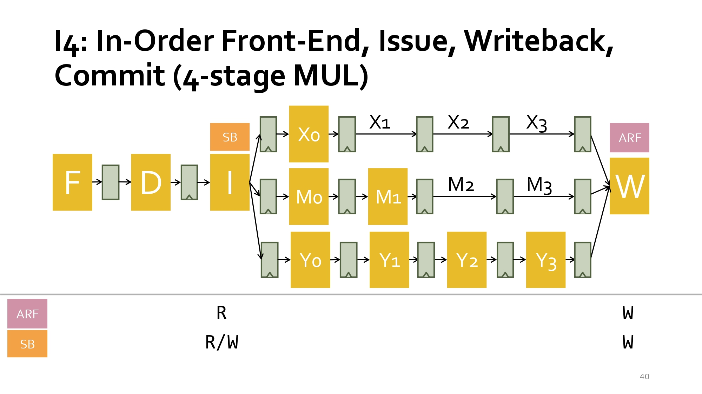

這張投影片主題為 「I4: In-Order Front-End, Issue, Writeback, Commit (4-stage MUL)」，進一步展示了引入Scoreboard（記分板）與ARF（架構暫存器檔案）機制後的完整順序管線結構。
- 本教學重點內容：
  - 結構組件與階段分工：
    - 前端階段（F, D, I）：除了取指（Fetch）與譯碼（Decode）外，獨立出 I (Issue，發射) 階段，並在此階段結合 SB (Scoreboard) 進行相依性檢查與暫存器讀取。
    - 多路執行單元：包含 2 階段算術路徑 ($X_0 \to X_1$)、4 階段記憶體路徑 ($M_0 \to \dots \to M_3$) 與 4 階段乘法路徑 ($Y_0 \to \dots \to Y_3$)。
    - 寫回階段（W）：將結果寫回 ARF (Architectural Register File)。
  - 硬體狀態維護機制（ARF vs. SB）：
    - ARF（架構暫存器檔案）：在 I 階段進行讀取（R），並在 W 階段進行寫入（W），儲存程式當前的實際架構狀態。
    - SB（記分板）：在 I 階段進行讀取與更新（R/W） 以檢查 hazard，並在 W 階段釋放狀態（W）。
- 個人看法： 這張投影片展現了硬體如何透過輕量化控制模組（Scoreboard）來管理具備非對稱延遲的多管線架構。
  - 優點：Scoreboard 能在 I 階段精確追蹤哪些暫存器正被長延遲運算（如 4-stage MUL）佔用，有效防範 RAW/WAW 等 Data Hazards 與 Writeback 競爭。
  - 局限：因為 Front-End 與 Issue 仍嚴格保持順序（In-Order），只要前方的指令被 SB 擋住（Stall），後方無相依性的指令也無法超越執行，硬體平行度的發揮仍受限於順序發射的本質。
- 總結：
   本投影片介紹結合 Scoreboard (SB) 與 ARF 的 4 階段乘法順序管線架構。重點說明在 Issue 階段利用 SB 進行動態相依性檢查與暫存器讀取，並於 Writeback 階段更新 ARF。此機制能精確管控多路執行路徑的 Hazards 與資源競爭，是向亂序執行（Out-of-Order）邁進的關鍵過渡設計。

## slide：41

  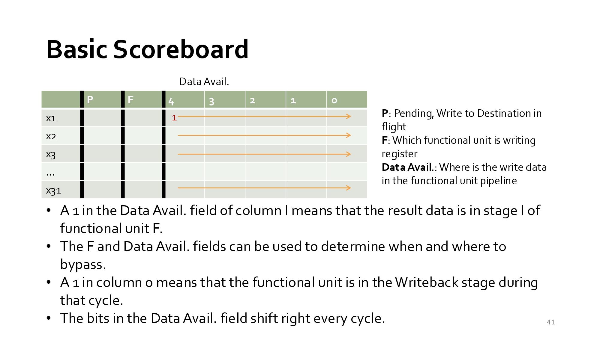

這張投影片主題為 「Basic Scoreboard（基礎記分板）」，詳細展示了 Scoreboard 控制邏輯的硬體結構與運作原理。
- 本教學重點內容：
  - 記分板表格欄位結構（Table Fields）：
    - P (Pending)：標示是否有指令正在執行中，且準備寫入該目標暫存器（In-flight）。
    - F (Functional Unit)：紀錄當前是由哪一個功能單元（Functional Unit）負責寫入該暫存器。
    - Data Avail. (Data Availability)：以 Bit-vector（如欄位 $4, 3, 2, 1, 0$）追蹤運算結果資料位於功能單元流水線的哪一階段。
  - 動態追蹤與旁路（Bypassing）機制：
    - 位置標示：Data Avail. 欄位中的 $1$ 代表結果資料當前處於該 Functional Unit 的第 $l$ 階段；若 $1$ 推進至 column 0，則表示該指令已進入 Writeback（寫回）階段。
    - 資料旁路仲裁：結合 F 與 Data Avail. 欄位資訊，系統能精確判定結果資料何時、何處可用，以控制旁路（Bypassing/Forwarding）線路的開啟 timing。
    - 時脈位移：每經過一個時脈週期（Cycle），Data Avail. 欄位中的 Bit 會向右位移（Shift right）一個位置，反映資料在管線中的推進。
- 個人看法： Scoreboard 是動態排程（Dynamic Scheduling）極為經典的控制心臟。
  - 優點：相較於完全靜態的編譯器排程，Scoreboard 透過簡單的狀態表（Bit-shifting）即可在硬體端動態追蹤多路流水線的資料進度，有效解決 Data Hazards 並控制 Bypassing 時機。
  - 局限：傳統 Scoreboard 通常僅追蹤 RAW hazard 與結構衝突；若沒有搭配暫存器重命名（Register Renaming）技術，在面對 WAW 或 WAR 衝突時仍需要 Stall 管線，這也是後續發展出 Tomasulo 演算法的重要動機。
- 總結：
   本投影片說明 Basic Scoreboard 的硬體結構與運算機制，利用 Pending (P)、Functional Unit (F) 及 Data Availability 欄位動態監控暫存器寫回狀態。透過狀態 Bit 每週期右移的特性，系統能精確仲裁資料旁路（Bypassing）時機並解除相依性停頓，是硬體動態排程與 hazard 控制的關鍵核心。

## slide：42

  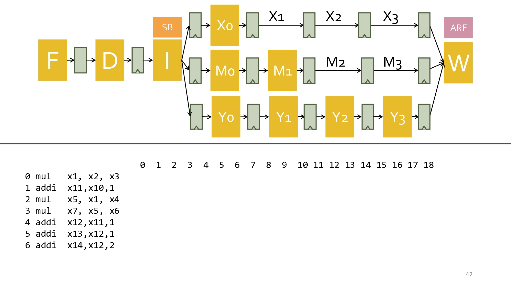

這張投影片主題為 Scoreboard 在包含長延遲單元（如 4-stage MUL）管線中的具體指令執行追蹤與模擬。
- 本教學重點內容：
  - 指令序列與相依性關係（Instruction Sequence & Hazards）：
    - 範例程式碼包含 7 條指令（0: mul, 1: addi, 2: mul, 3: mul, 4: addi, 5: addi, 6: addi）。
    - RAW 相依性（Data Hazard）：例如指令 2 (mul x5, x1, x4) 依賴指令 0 (mul x1, x2, x3) 的寫入結果 x1；指令 3 依賴指令 2 的 x5。
    - WAW / 資源衝突：不同長度的執行路徑（2-stage ALU vs 4-stage MUL）會導致後發射的短指令試圖與先發射的長指令在同一週期寫回，需要透過 Scoreboard 控制。
  - 時間軸模擬（Cycle-by-Cycle Execution Timeline）：
    - 投影片下方標示的數字 $0 \sim 18$ 代表時間軸（Clock Cycles）。
    - 透過這個架構，學生需要逐步推算每條指令進入 F（Fetch）、D（Decode）、I（Issue/Scoreboard Read）、EX/MEM/MUL 執行階段 與 W（Writeback） 的精確時脈週期。
- 個人看法：
   這是計算機架構課程中極為經典且重要的「手動管線追蹤（Pipeline Trace）」題目。
  - 教學目的：光看理論抽象概念（如 Scoreboard 結構）不足以理解細節，透過這種精確到 Clock Cycle 的模擬，能讓學生深刻體會到當發生 RAW/WAW hazard 時，Scoreboard 是如何動態發出 Stall（停頓）訊號，以及全旁路（Full Bypassing）硬體是如何省去等待週期。
  - 實務效益：理解這種非對稱管線的停頓與寫回衝突，是進一步邁向 Superscalar（超純量）與 Out-of-Order（亂序執行，如 Tomasulo 演算法）設計的核心基礎。   
- 總結：
   本投影片提供具備 4 階段乘法器與 Scoreboard 管線的時間軸模擬範例。透過包含資料相依性（如 x1, x5 的 RAW hazard）的 7 條指令序列，展示指令在時脈週期 $0 \sim 18$ 間的推移過程。重點在於驗證 Scoreboard 如何動態偵測 Hazards 並仲裁暫存器寫回與旁路時機。 

## slide：43

  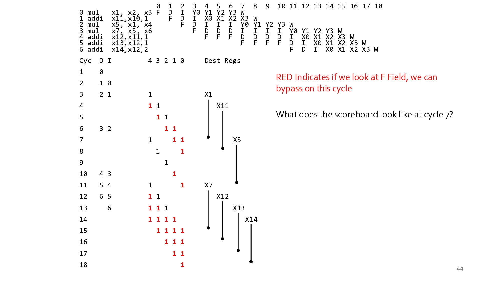

這張投影片展現了 Scoreboard（記分板）動態排程在具備多路非對稱執行管線（含 4 階段 MUL）中的實際運算日誌（Execution Trace）與狀態轉移。
- 本教學重點內容：
  - 具體指令序列的管線推移（Pipeline Flow）：
    - RAW Hazard（資料相依性）處理：例如指令 0 (mul x1, x2, x3) 產生的結果 x1 被指令 2 (mul x5, x1, x4) 依賴。投影片顯示指令 2 在 Issue (I) 階段停頓（Stall）多個週期（Cyc 4~6），直到指令 0 完成並進行旁路（Bypassing）才解鎖發射。
    - 多路發射與阻塞：後方無相依或有相依的指令（如 addi）受到前面指令停頓的影響，在 Decode (D) 或 Issue (I) 階段形成佇列等待。
  - 記分板內部狀態變化與旁路判定（Scoreboard State & Bypassing）：
    - 下方表格展示了每一週期（Cyc 1~18）Data Avail. 欄位位元陣列（Bit-vector）右移與目標暫存器（Dest Regs, 如 x1, x11, x5 等）標記的演變。
    - 紅色數字標示：代表透過檢查 F 欄位與 Data Avail. 狀態，硬體可以在該週期觸發資料旁路（Bypass），將運算結果直接 Forwarding 至需要該資料的功能單元，避免額外的寫回等待週期。
    - 提出的隨堂問題：「What does the scoreboard look like at cycle 7?」，要求分析在第 7 個週期時 SB 各欄位的數值狀態。
- 個人看法： **這張圖是整章微架構動態排程教學的最精髓精華**。
  - 實務價值：它透過文字化的流水線時間軸與表格狀態圖解，把「抽象的控制邏輯」轉化為「可驗證的演算法狀態演進」。讀者能清晰看到 Scoreboard 如何精確計算 Data Avail. 的位移（Shift）來抓準 Bypassing 時間點。
  - 瓶頸體會：從時間軸可以看出，即使引進了 Scoreboard 與 Bypassing，指令 2 仍因為前面長延遲的乘法運算而在 I 階段被卡住很久。這極大地凸顯了「In-Order Issue」的效能天花板，自然而然為後續引出「Out-of-Order Issue（如 Tomasulo 演算法與 Reservations Stations）」打下了最堅實的理論基礎。
- 總結：
   本投影片透過 7 條指令序列的 Cycle-by-Cycle 執行日誌，展示 Scoreboard 如何動態處理 RAW 資料相依與管線停頓。重點在於說明記分板利用位元位移追蹤 Data Avail.，並精確控制 Bypassing 觸發時機。此追蹤過程驗證了 Scoreboard 的動態排程能力，同時揭示了順序發射（In-Order Issue）面對長延遲運算時的瓶頸。

## slide：44

  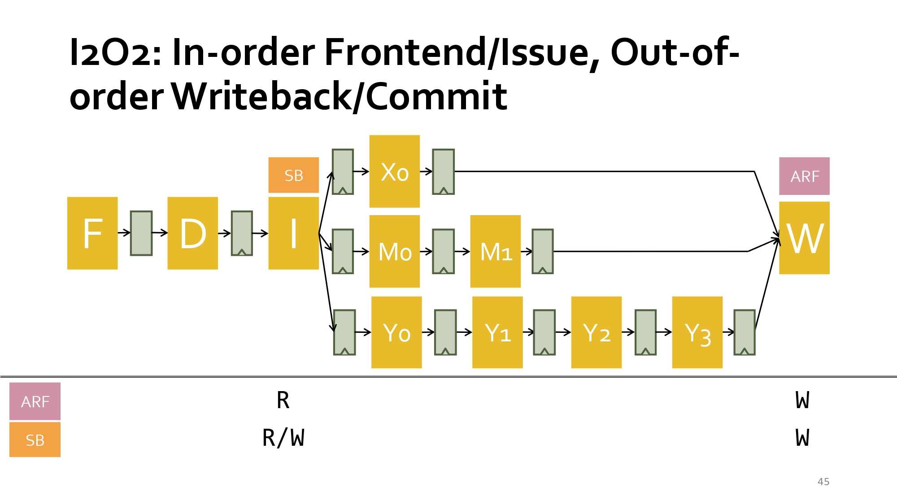

這張投影片主題為 「I2O2: In-order Frontend/Issue, Out-of-order Writeback/Commit」，展現了結合順序發射與亂序寫回（Commit）特性的微架構。
- 本教學重點內容：
  - 混合式管線架構模式（I2O2）：
    - In-order Frontend / Issue ($I_2$)：指令從 Fetch (F)、Decode (D) 到 Issue (I) 階段皆嚴格按照程式碼原始順序進行處理。
    - Out-of-order Writeback / Commit ($O_2$)：由於不同執行單元長度不一（例如 2 階段算術單元 $X_0 \to X_1$ vs. 4 階段乘法單元 $Y_0 \to \dots \to Y_3$），執行速度較快的短指令會超越先發射但執行慢的長指令，先一步算完並亂序寫回（Out-of-Order Writeback）暫存器。
  - 硬體狀態控制（Scoreboard + ARF）：
    - I 階段：讀取 ARF（架構暫存器檔案），同時對 Scoreboard (SB) 進行讀寫以實施相依性檢查。
    - W 階段：結果完成時，動態更新 ARF 並釋放 SB 狀態。
- 個人看法：
   I2O2 展現了處理器從純順序（In-Order）邁向完全亂序（Out-of-Order）的過渡設計。
  - 優點：前端設計簡單，且允許短指令不必死等前方慢速指令完成即可先寫回，提高了 execution pipeline 的運算效能。
  - 致命缺陷（精確中斷喪失）：由於寫回與提交是亂序的（Out-of-Order Commit），若後發射的短指令已經寫回更新了 ARF，而先發射的長指令此時突然觸發硬體異常（Exception），CPU 將無法還原至發生異常當下的精確狀態。這也是為什麼現代高效能處理器必須導入 ROB（Reorder Buffer） 來達成「亂序執行、順序提交（In-Order Commit）」。
- 總結：
   本投影片介紹 I2O2 架構，重點在於前端順序發射（In-Order Issue），但因多路執行管道長短不一，導致指令亂序寫回與提交（Out-of-Order Writeback/Commit）。此設計雖能提升多功能單元的吞吐量，但亂序更新 ARF 會破壞系統的「精確中斷（Precise Interrupt）」機制，凸顯了後續微架構需要 Reorder Buffer 來強制順序提交的必要性。

## slide：45

  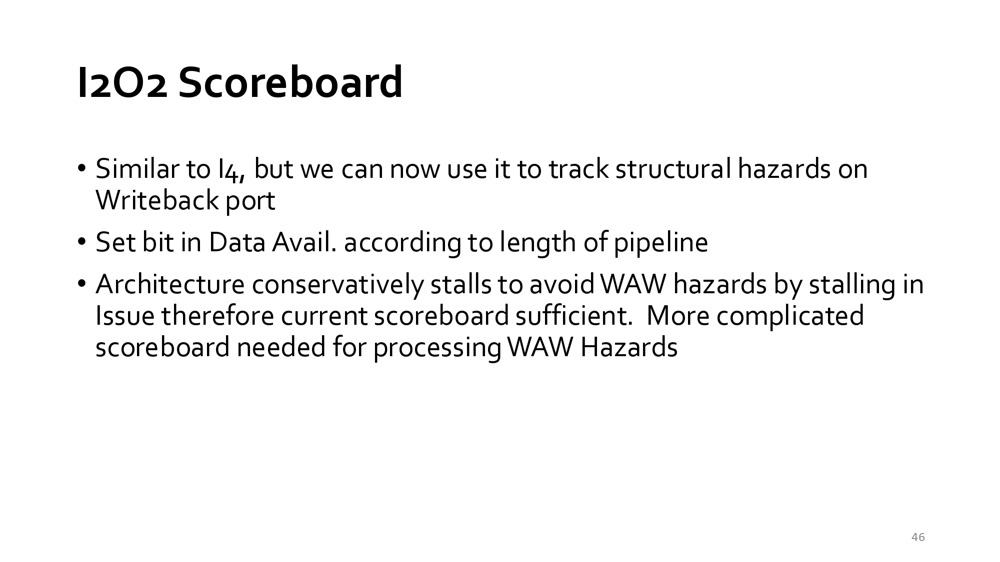

這張投影片說明 I2O2 架構下 Scoreboard（記分板）運作機制與控制限制。
- 本教學重點內容：
  - 功能與結構承襲：
    - 基本運作與 I4 架構類似，但可用於追蹤寫回埠（Writeback Port）上的結構衝突（Structural Hazards）。
    - 根據各功能單元管線的長度（Length of Pipeline），動態設定 Data Avail. 欄位中的位元。
  - WAW Hazards（寫後寫衝突）的處理機制：
    - 保守停頓策略：此架構透過在 Issue（發射）階段保守地暫停（Stall）指令來避免 WAW 衝突，因此當前的 Basic Scoreboard 結構已足夠使用。
    - 複雜度開銷：若要在允許發射後再動態處理解決 WAW 衝突，則需要更複雜的 Scoreboard 設計。
- 個人看法：
   這反映了微架構設計在「硬體複雜度」與「執行效能」之間的權衡（Trade-off）。
  - 優點：藉由在 Issue 階段直接 Blocking 掉可能產生 WAW 的指令，硬體可以用非常輕量、精簡的 Scoreboard 控制邏輯（Basic Scoreboard）維護寫回正確性，省去複雜的重命名或佇列機制。
  - 瓶頸：保守的 Stall 會產生不必要的流水線停頓，降低指令平行度（ILP）；這說明了為什麼更進階的 CPU 會採用暫存器重命名（Register Renaming）技術（如 Tomasulo 演算法）來徹底消除 WAW/WAR 假性相依，進而解放性能上限。
- 總結：
   本投影片說明 I2O2 架構下的 Scoreboard 機制，其透過設定 Data Avail. 位元追蹤 Writeback 埠的結構衝突。為確保正確性，系統選擇在 Issue 階段保守停頓指令以防範 WAW 衝突，使 Basic Scoreboard 足以應付需求。此折衷設計降低了硬體複雜度，但也暴露了順序發射限制 ILP 的效能瓶頸。

## slide：46

  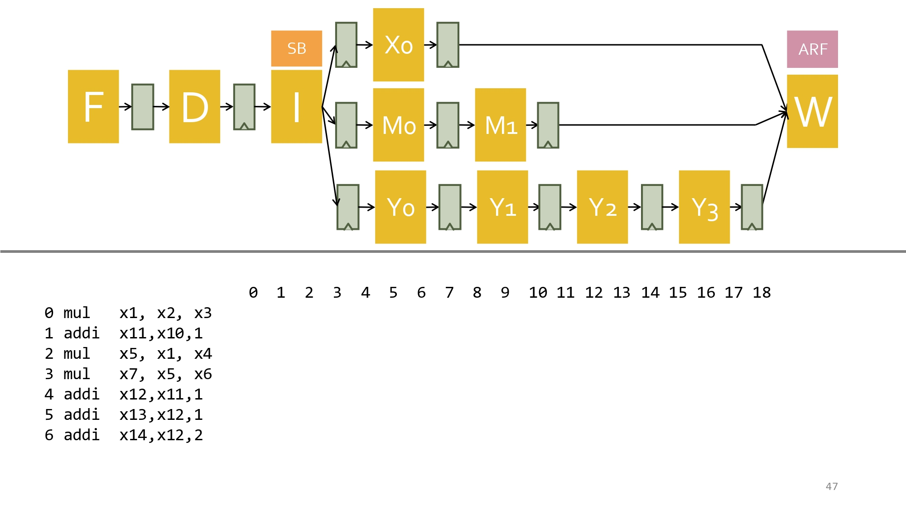

這張投影片展現了與上一頁相同結構的 I2O2（順序發射 / 亂序寫回） 架構，並著重於範例指令序列的執行追蹤。
- 本教學重點內容：
  - I2O2 範例追蹤架構模型：
    - 前端保持順序（In-Order Fetch/Decode/Issue），並由 Scoreboard (SB) 進行動態檢查。
    - 多路平行執行路徑包含 2 階段 ALU ($X_0 \to X_1$)、4 階段 Memory ($M_0 \to \dots \to M_3$) 與 4 階段 Multiplier ($Y_0 \to \dots \to Y_3$)。
    - 各單元算完後可亂序寫回（Out-of-Order Writeback）至 ARF。
  - 追蹤目標（Cycle-by-Cycle Trace）：
    - 提供相同的 7 條指令序列（包含 mul 與 addi），供學生比對在 I2O2 亂序寫回 模式下，指令於時脈週期 $0 \sim 18$ 的推移情況與 I4 順序寫回架構有何差異。
- 個人看法：
   對比上一節課的 I4（順序寫回），I2O2 讓短指令（如 addi）能提早於慢速指令（如 mul）前完成寫回（Out-of-Order Commit）。
  - 效能提升：減少了短指令在寫回階段被慢速指令卡住的 stall 時間，提高 pipe 吞吐量。
  - 設計隱憂：亂序寫回破壞了「精確中斷（Precise Interrupt）」。當較晚發射的短指令已寫回暫存器，而較早發射的慢指令突然發生硬體 Exception 時，CPU 狀態將無法完美復原，這促成了後續 Reorder Buffer (ROB) 架構的誕生。
- 總結：
   本投影片提供 I2O2（順序發射、亂序寫回）管線的指令追蹤範例。重點在於展示多路執行單元如何讓短指令超越長延遲指令先一步完成寫回，以提升運算效率。然而此設計破壞了精確中斷機制，亦引出了現代 CPU 導入 ROB 實現順序提交的必要性。

## slide：47

  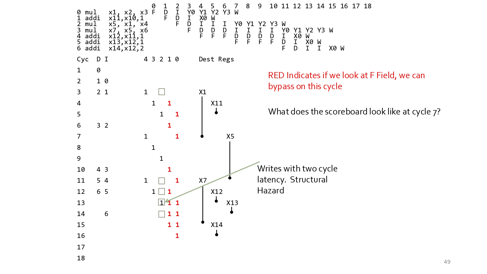

- 本教學重點內容：
- 個人看法：
- 總結：

## slide：48

  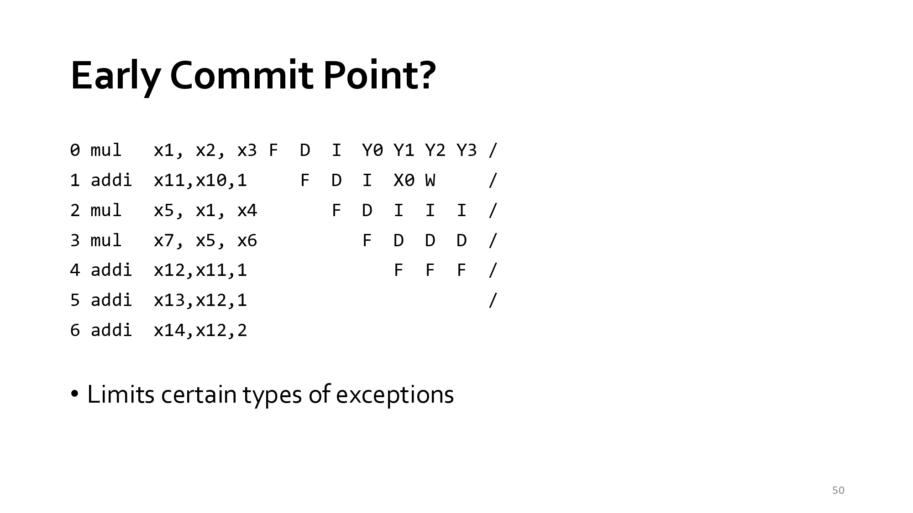

- 本教學重點內容：
- 個人看法：
- 總結：

## slide：49

  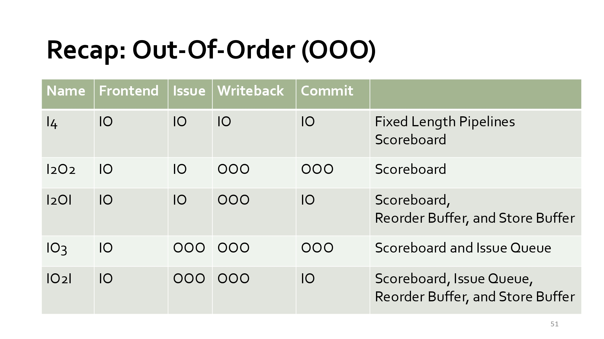

- 本教學重點內容：
- 個人看法：
- 總結：

## slide：50

  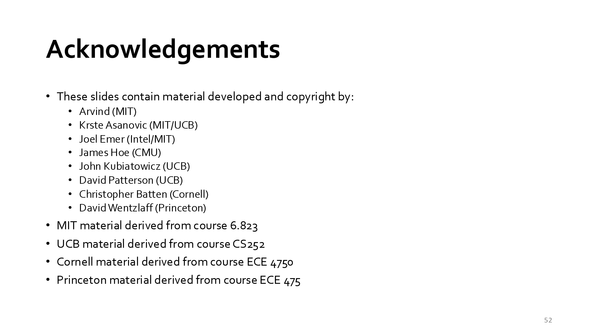

- 本教學重點內容：
- 個人看法：
- 總結：

