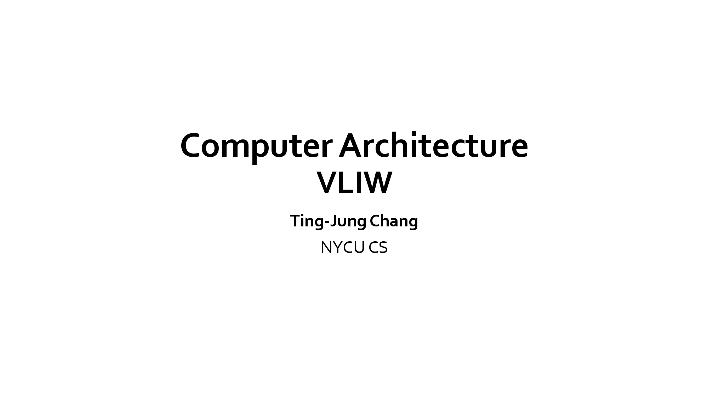
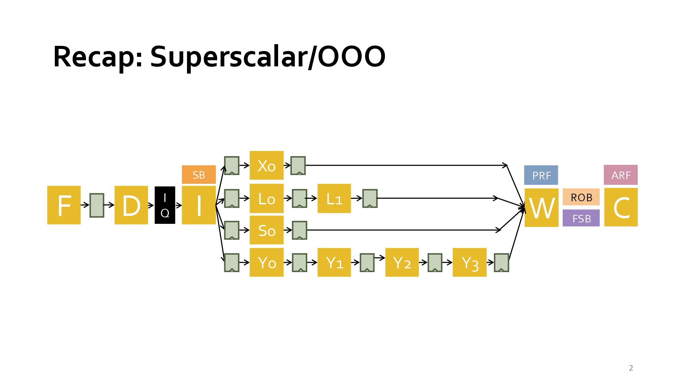

### Week 5 (2026-10-06)課堂逐字稿
#### 教學資源：
- [SD5.pdf](./Lecture/SD5.pdf)
- Lecture Recording:
  - Password for the video: 2026CompArch!
  - Superscalar complexity [video](https://nycu1-my.sharepoint.com/:v:/g/personal/tingjung_m365_nycu_edu_tw/IQCVuX_3NbKNQLbl4tEx19evAU0dgQovPnVaEb7VCiG_-us)
  - Classic VLIW [video](https://nycu1-my.sharepoint.com/:v:/g/personal/tingjung_m365_nycu_edu_tw/IQCpEPt6mBWJTq-_gttxWfyEAdn6B_fzmIdQ7bfAa2jU9YI?nav=eyJyZWZlcnJhbEluZm8iOnsicmVmZXJyYWxBcHAiOiJTdHJlYW1XZWJBcHAiLCJyZWZlcnJhbFZpZXciOiJTaGFyZURpYWxvZy1MaW5rIiwicmVmZXJyYWxBcHBQbGF0Zm9ybSI6IldlYiIsInJlZmVycmFsTW9kZSI6InZpZXcifX0%3D&e=8I7Yrw)
  - Itanium: Intel’s Great Successor [video](https://youtu.be/-K-IfiDmp_w?si=opXOIb5hF0O0xO-6)
- Prompt：
  - 請將本教學內容英/中翻譯比對
  - 請說明本教學重點內容及你的看法，最後以250字內總結

## 知識點：
### VLIW（Very Long Instruction Word，超長指令字）
- Computer Architecture | 電腦架構
- VLIW（Very Long Instruction Word，超長指令字） 是一種利用**指令級平行化（Instruction-Level Parallelism, ILP）**的處理器架構。
<br>其核心思想是：由編譯器負責找出可同時執行的指令，並將多個操作封裝成一個超長指令，讓 CPU 在同一個 Clock Cycle 同時執行。
- 傳統處理器：
  ```
  一般 RISC-V 指令：
    add x1,x2,x3
    sub x4,x5,x6
    mul x7,x8,x9
  CPU 一次取出一條指令：
    Cycle 1 → add
    Cycle 2 → sub
    Cycle 3 → mul
    ``
  ```
- VLIW 處理器：
  ```
  編譯器將可平行執行的指令組合：形成一個超長指令字（Instruction Word）。
    | add | sub | mul |
  執行時：三個功能單元同時工作。
    Cycle 1
    ├─ add
    ├─ sub
    └─ mul
  ```
- VLIW 的特色
  - 平行化由編譯器決定：
    - 傳統 Superscalar CPU：硬體找平行性
    - VLIW：編譯器找平行性，因此硬體較簡單。
  - 指令字較長：
    - 例如：128-bit、256-bit、512-bit
    - 一個指令字可能包含：ALU指令、Load指令、Store指令、Branch指令，同時發射（Issue）。
  - 多功能單元
    - ALU1、ALU2、Multiplier、Load/Store Unit 可同時運作。

- VLIW（Very Long Instruction Word）是一種利用指令級平行化的處理器架構，其特色是由編譯器在編譯期間分析指令相依性，並將多條可同時執行的指令打包成單一超長指令字，使多個執行單元能在同一個時脈週期內平行運作。與 Superscalar 處理器由硬體動態發掘平行性不同，VLIW 將複雜度轉移至編譯器，因此硬體設計較簡單、功耗較低。然而其效能高度依賴編譯器最佳化能力，且程式相容性較差。VLIW 是研究指令級平行化（ILP）與平行處理器設計的重要代表架構。


## slide：1 -2
<div align="left" >
  
</div>

- 教學重點內容：
  - 主題與定位：本章節為國立陽明交通大學資工系（NYCU CS）「電腦架構（Computer Architecture）」課程中的專題章節，主題聚焦於 VLIW（Very Long Instruction Word，超長指令字） 架構。
  - 核心核心概念 (VLIW)：VLIW 是一種指令層級平行（Instruction-Level Parallelism, ILP）的處理器架構設計。其核心機制是將多個獨立運算的指令（例如算術、記憶體存取、分支等）在編譯時期（Compiler Time）打包封裝成一個極長的指令字組（Long Instruction Word），使處理器能在單一時脈週期內同時執行多個運算單元（Execution Units）。
- 看法與補充：
  - 編譯器與硬體的權衡（Trade-off）：傳統 Superscalar（超純量）架構依賴複雜的硬體邏輯（如動態排程、亂序執行）在執行期找出平行度，耗電且電路龐大；而 VLIW 將排程與相依性檢查的負擔完全移轉給編譯器，顯著簡化了硬體邏輯與功耗。
  - 應用場景與限制：VLIW 的優勢在於平行度高且規則的計算任務（如 DSP 數位訊號處理、圖像/影音編解碼及特定 AI 加速器）；然而，其弱點在於對編譯器優化能力極度依賴、程式碼膨脹（Code Size Expansion）以及通用軟體相容性較差。
- 內容總結：
  <br>這份資料探討了電腦架構中指令級平行處理（ILP）的實現方式，特別深入對比了超純量處理器與超長指令字（VLIW）架構的設計哲學。文中指出，傳統的超純量架構將負擔交由硬體來動態偵測相依性並排程，這會導致控制邏輯隨著處理器寬度急劇膨脹。相較之下，VLIW 架構則是把複雜度轉移給編譯器進行靜態排程，透過將多個獨立運作打包成單一指令來提升執行效率。此外，資料也透過歷史案例分析了Intel Itanium 的興衰與 VLIW 的侷限性，說明在面對難以預測的分支和記憶體延遲時，靜態排程在通用運算領域遭遇了重大挑戰。
  <br>本教學為陽明交大資工系張婷詠老師的電腦架構課程投影片，主題為超長指令字（VLIW）架構。VLIW 的核心思想是透過編譯器在編譯時期將多個平行指令組合為單一超長指令包，直接交由硬體多個執行單元同步執行。這種「靜態排程」設計大幅簡化了晶片內部的動態排程邏輯與功耗，非常適合高平行度的專用運算（如 DSP 與 AI 加速器）。總結來說，VLIW 展示了將處理器複雜度從硬體轉移至軟體編譯器的經典架構思維，是理解現代平行處理與特定領域架構（DSA）不可或缺的基石。


## slide：2
<div align="left" >
  
</div>

- 教學內容英/中翻譯比對：
  - Recap: Superscalar/OOO | 複習：超純量與亂序執行架構
  - F → D → IQ → I
    > 取指 (Fetch) → 解碼 (Decode) → 發射佇列 (Issue Queue) → 發射 (Issue)
  - SB
    > 記分板 (Scoreboard)
  - Xo, Lo, So, Yo
    > 各式執行單元的第一階段/發射門（如 ALU、Load、Store、多週期/向量單元等）
  - L1, Y1, Y2, Y3
    > 多階段管線單元（如多週期延遲之記憶體或乘法/向量運算管線）
  - W
    > 寫回/完成階段 (Writeback / Complete)
  - ROB / PRF / FSB
    > 重排序緩衝區 (Reorder Buffer) / 實體暫存器檔案 (Physical Register File) / 填滿/儲存緩衝區 (Fill/Store Buffer)
  - C
    > 提交/退休階段 (Commit / Retire)
  - ARF
    > 架構暫存器檔案 (Architectural Register File)
- 教學重點內容：
  - 超純量與亂序執行（Superscalar / Out-Of-Order, OOO）微架構全貌：本頁展示了典型的 $IO_2I$（In-Order Fetch/Decode, Out-of-Order Execute/Writeback, In-Order Commit）亂序處理器管線結構圖。
  - 前端（In-Order）：指令依序進行取指（F）與解碼（D），隨後進入發射佇列（IQ）。
  - 執行與寫回（Out-of-Order）：透過 Scoreboard（SB）與 Issue Queue（IQ）動態排程，資料就緒的指令可亂序發射（I）至不同延遲的執行管道（如 $X_0, L_0 \rightarrow L_1, Y_0 \rightarrow Y_3$ 等），並亂序寫回（W）結果。
  - 後端與提交（In-Order）：利用重排序緩衝區（ROB）、實體暫存器（PRF）與儲存緩衝區（FSB），確保所有指令最後能依原始程式順序（In-Order）提交（C）並更新架構暫存器（ARF），以維護精確例外（Precise Exceptions）與程式語意正確性。
- 看法與補充：
  - 承上啟下的核心頁面：本頁複習了 Superscalar/OOO 為了挖掘最大指令級平行度（ILP），需要在晶片中建置極其複雜的動態硬體（如 IQ, ROB, PRF, SB 等）。
  - 引出 VLIW 的動機：OOO 硬體雖然能對舊有程式碼自動發掘平行度，但硬體面積與功耗極大；這直接凸顯了本章主題 VLIW 的優勢——將這些複雜的動態排程與相依性檢查完全交給編譯器在靜態期完成，從而大幅簡化硬體設計。
- 內容總結：
  <br>本頁複習了超純量與亂序執行（Superscalar/OOO）處理器的整體微架構。系統採用 $IO_2I$ 模式：前端依序取指解碼後進入發射佇列，當資料就緒即亂序發射至各式執行單元並亂序寫回；最後透過重排序緩衝區（ROB）與實體暫存器（PRF）確保指令按原順序提交。此動態排程機制能極大化指令級平行度（ILP），但需要極複雜的硬體邏輯與高功耗。這頁作為背景介紹，精準帶出了後續 VLIW 架構如何利用編譯器靜態排程來取代這些昂貴硬體的核心動機。


