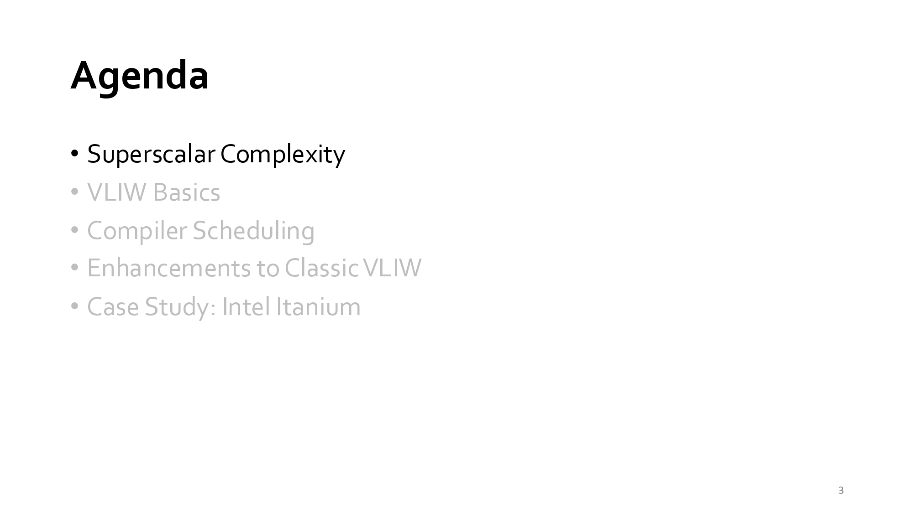
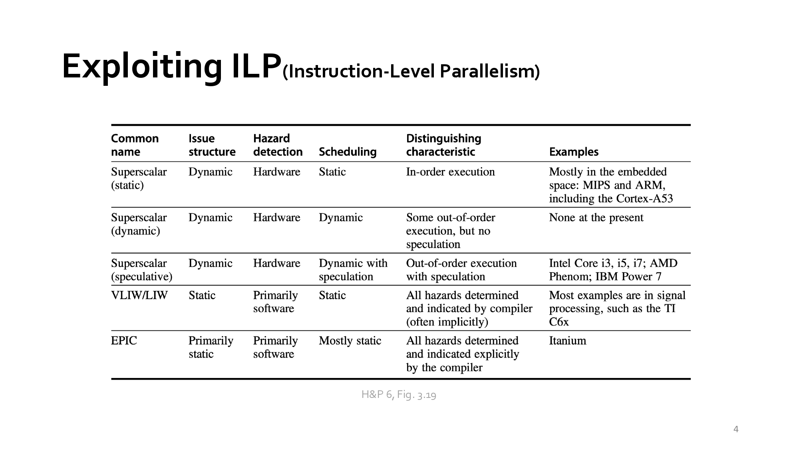
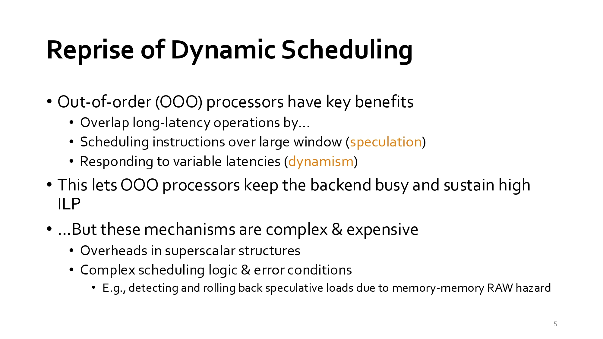
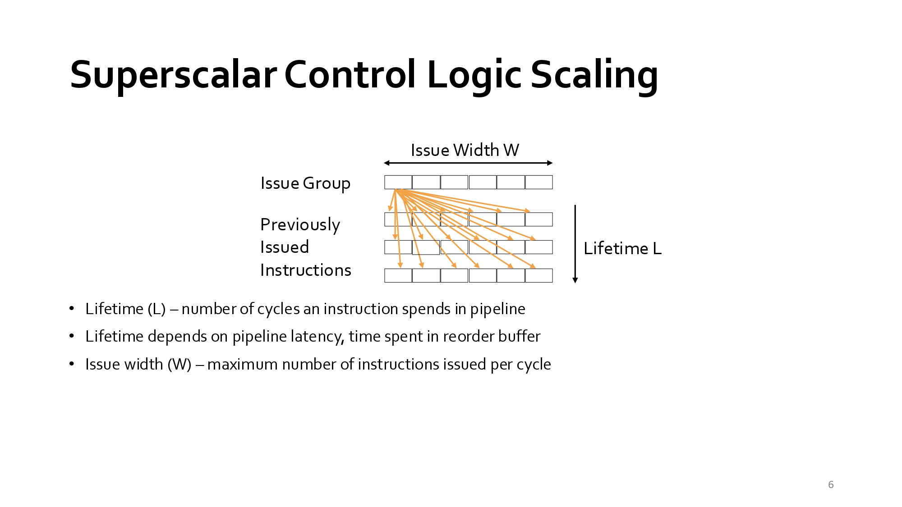
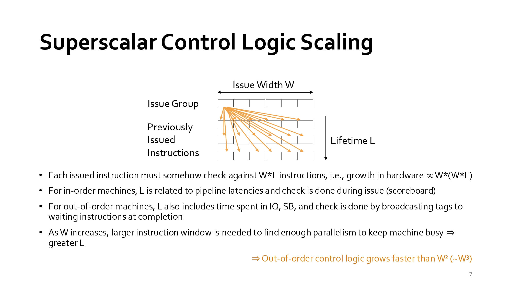
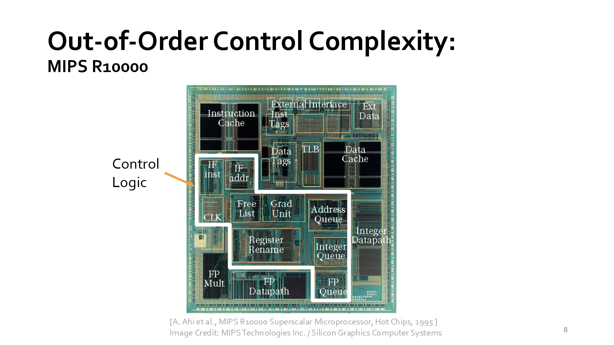

### Week 5 (2026-10-06)課堂逐字稿
#### 教學資源：
- [SD5.pdf](./Lecture/SD5.pdf)
- Lecture Recording:
  - Password for the video: 2026CompArch!
  - Superscalar complexity [video](https://nycu1-my.sharepoint.com/:v:/g/personal/tingjung_m365_nycu_edu_tw/IQCVuX_3NbKNQLbl4tEx19evAU0dgQovPnVaEb7VCiG_-us)
  - Classic VLIW [video](https://nycu1-my.sharepoint.com/:v:/g/personal/tingjung_m365_nycu_edu_tw/IQCpEPt6mBWJTq-_gttxWfyEAdn6B_fzmIdQ7bfAa2jU9YI?nav=eyJyZWZlcnJhbEluZm8iOnsicmVmZXJyYWxBcHAiOiJTdHJlYW1XZWJBcHAiLCJyZWZlcnJhbFZpZXciOiJTaGFyZURpYWxvZy1MaW5rIiwicmVmZXJyYWxBcHBQbGF0Zm9ybSI6IldlYiIsInJlZmVycmFsTW9kZSI6InZpZXcifX0%3D&e=8I7Yrw)
  - Itanium: Intel’s Great Successor [video](https://youtu.be/-K-IfiDmp_w?si=opXOIb5hF0O0xO-6)
  - Reference: 
    - H&P6 218 - 222
    - H&P6 Appendix H
- Prompt：
  - 請將本教學內容英/中翻譯比對
  - 請說明本教學重點內容及你的看法，最後以250字內總結

## 知識點：
- [VLIW（Very Long Instruction Word，超長指令字）](#vliwvery-long-instruction-word超長指令字)
- 
### VLIW（Very Long Instruction Word，超長指令字）
- Computer Architecture | 電腦架構
- VLIW（Very Long Instruction Word，超長指令字） 是一種利用**指令級平行化（Instruction-Level Parallelism, ILP）**的處理器架構。
<br>其核心思想是：由編譯器負責找出可同時執行的指令，並將多個操作封裝成一個超長指令，讓 CPU 在同一個 Clock Cycle 同時執行。
- 傳統處理器：
  ```
  一般 RISC-V 指令：
    add x1,x2,x3
    sub x4,x5,x6
    mul x7,x8,x9
  CPU 一次取出一條指令：
    Cycle 1 → add
    Cycle 2 → sub
    Cycle 3 → mul
    ``
  ```
- VLIW 處理器：
  ```
  編譯器將可平行執行的指令組合：形成一個超長指令字（Instruction Word）。
    | add | sub | mul |
  執行時：三個功能單元同時工作。
    Cycle 1
    ├─ add
    ├─ sub
    └─ mul
  ```
- VLIW 的特色
  - 平行化由編譯器決定：
    - 傳統 Superscalar CPU：硬體找平行性
    - VLIW：編譯器找平行性，因此硬體較簡單。
  - 指令字較長：
    - 例如：128-bit、256-bit、512-bit
    - 一個指令字可能包含：ALU指令、Load指令、Store指令、Branch指令，同時發射（Issue）。
  - 多功能單元
    - ALU1、ALU2、Multiplier、Load/Store Unit 可同時運作。

- VLIW（Very Long Instruction Word）是一種利用指令級平行化的處理器架構，其特色是由編譯器在編譯期間分析指令相依性，並將多條可同時執行的指令打包成單一超長指令字，使多個執行單元能在同一個時脈週期內平行運作。與 Superscalar 處理器由硬體動態發掘平行性不同，VLIW 將複雜度轉移至編譯器，因此硬體設計較簡單、功耗較低。然而其效能高度依賴編譯器最佳化能力，且程式相容性較差。VLIW 是研究指令級平行化（ILP）與平行處理器設計的重要代表架構。


## slide：1 -2
<div align="left" >
  
</div>

- 教學重點內容：
  - 主題與定位：本章節為國立陽明交通大學資工系（NYCU CS）「電腦架構（Computer Architecture）」課程中的專題章節，主題聚焦於 VLIW（Very Long Instruction Word，超長指令字） 架構。
  - 核心核心概念 (VLIW)：VLIW 是一種指令層級平行（Instruction-Level Parallelism, ILP）的處理器架構設計。其核心機制是將多個獨立運算的指令（例如算術、記憶體存取、分支等）在編譯時期（Compiler Time）打包封裝成一個極長的指令字組（Long Instruction Word），使處理器能在單一時脈週期內同時執行多個運算單元（Execution Units）。
- 看法與補充：
  - 編譯器與硬體的權衡（Trade-off）：傳統 Superscalar（超純量）架構依賴複雜的硬體邏輯（如動態排程、亂序執行）在執行期找出平行度，耗電且電路龐大；而 VLIW 將排程與相依性檢查的負擔完全移轉給編譯器，顯著簡化了硬體邏輯與功耗。
  - 應用場景與限制：VLIW 的優勢在於平行度高且規則的計算任務（如 DSP 數位訊號處理、圖像/影音編解碼及特定 AI 加速器）；然而，其弱點在於對編譯器優化能力極度依賴、程式碼膨脹（Code Size Expansion）以及通用軟體相容性較差。
- 內容總結：
  <br>這份資料探討了電腦架構中指令級平行處理（ILP）的實現方式，特別深入對比了超純量處理器與超長指令字（VLIW）架構的設計哲學。文中指出，傳統的超純量架構將負擔交由硬體來動態偵測相依性並排程，這會導致控制邏輯隨著處理器寬度急劇膨脹。相較之下，VLIW 架構則是把複雜度轉移給編譯器進行靜態排程，透過將多個獨立運作打包成單一指令來提升執行效率。此外，資料也透過歷史案例分析了Intel Itanium 的興衰與 VLIW 的侷限性，說明在面對難以預測的分支和記憶體延遲時，靜態排程在通用運算領域遭遇了重大挑戰。
  <br>本教學為陽明交大資工系張婷詠老師的電腦架構課程投影片，主題為超長指令字（VLIW）架構。VLIW 的核心思想是透過編譯器在編譯時期將多個平行指令組合為單一超長指令包，直接交由硬體多個執行單元同步執行。這種「靜態排程」設計大幅簡化了晶片內部的動態排程邏輯與功耗，非常適合高平行度的專用運算（如 DSP 與 AI 加速器）。總結來說，VLIW 展示了將處理器複雜度從硬體轉移至軟體編譯器的經典架構思維，是理解現代平行處理與特定領域架構（DSA）不可或缺的基石。


## slide：2
<div align="left" >
  
</div>

- 教學內容英/中翻譯比對：
  - Recap: Superscalar/OOO | 複習：超純量與亂序執行架構
  - F → D → IQ → I
    > 取指 (Fetch) → 解碼 (Decode) → 發射佇列 (Issue Queue) → 發射 (Issue)
  - SB
    > 記分板 (Scoreboard)
  - Xo, Lo, So, Yo
    > 各式執行單元的第一階段/發射門（如 ALU、Load、Store、多週期/向量單元等）
  - L1, Y1, Y2, Y3
    > 多階段管線單元（如多週期延遲之記憶體或乘法/向量運算管線）
  - W
    > 寫回/完成階段 (Writeback / Complete)
  - ROB / PRF / FSB
    > 重排序緩衝區 (Reorder Buffer) / 實體暫存器檔案 (Physical Register File) / 填滿/儲存緩衝區 (Fill/Store Buffer)
  - C
    > 提交/退休階段 (Commit / Retire)
  - ARF
    > 架構暫存器檔案 (Architectural Register File)
- 教學重點內容：
  - 超純量與亂序執行（Superscalar / Out-Of-Order, OOO）微架構全貌：本頁展示了典型的 $IO_2I$（In-Order Fetch/Decode, Out-of-Order Execute/Writeback, In-Order Commit）亂序處理器管線結構圖。
  - 前端（In-Order）：指令依序進行取指（F）與解碼（D），隨後進入發射佇列（IQ）。
  - 執行與寫回（Out-of-Order）：透過 Scoreboard（SB）與 Issue Queue（IQ）動態排程，資料就緒的指令可亂序發射（I）至不同延遲的執行管道（如 $X_0, L_0 \rightarrow L_1, Y_0 \rightarrow Y_3$ 等），並亂序寫回（W）結果。
  - 後端與提交（In-Order）：利用重排序緩衝區（ROB）、實體暫存器（PRF）與儲存緩衝區（FSB），確保所有指令最後能依原始程式順序（In-Order）提交（C）並更新架構暫存器（ARF），以維護精確例外（Precise Exceptions）與程式語意正確性。
- 看法與補充：
  - 承上啟下的核心頁面：本頁複習了 Superscalar/OOO 為了挖掘最大指令級平行度（ILP），需要在晶片中建置極其複雜的動態硬體（如 IQ, ROB, PRF, SB 等）。
  - 引出 VLIW 的動機：OOO 硬體雖然能對舊有程式碼自動發掘平行度，但硬體面積與功耗極大；這直接凸顯了本章主題 VLIW 的優勢——將這些複雜的動態排程與相依性檢查完全交給編譯器在靜態期完成，從而大幅簡化硬體設計。
- 內容總結：
  <br>本頁複習了超純量與亂序執行（Superscalar/OOO）處理器的整體微架構。系統採用 $IO_2I$ 模式：前端依序取指解碼後進入發射佇列，當資料就緒即亂序發射至各式執行單元並亂序寫回；最後透過重排序緩衝區（ROB）與實體暫存器（PRF）確保指令按原順序提交。此動態排程機制能極大化指令級平行度（ILP），但需要極複雜的硬體邏輯與高功耗。這頁作為背景介紹，精準帶出了後續 VLIW 架構如何利用編譯器靜態排程來取代這些昂貴硬體的核心動機。

## slide：3
<div align="left" >
  
</div>

- 教學內容英/中翻譯比對：
  - Agenda | 課程大綱 / 議程
    - Superscalar Complexity | 超純量架構的複雜度
      <br>問題起源（Superscalar Complexity）：探討超純量與亂序執行（OOO）處理器因硬體動態排程所帶來的電路複雜度、面積與高功耗瓶頸。
    - VLIW Basics | 超長指令字（VLIW）基本概念
      <br>核心概念（VLIW Basics）：介紹 Very Long Instruction Word 的基本運作機制，即將多個指令打包並交由靜態排程。
    - Compiler Scheduling | 編譯器排程技術
      <br>軟體核心（Compiler Scheduling）：講解編譯器如何扮演關鍵角色，負責指令排程、相依性檢查與平行度挖掘。
    - Enhancements to Classic VLIW | 傳統 VLIW 架構之強化與改進
      <br>架構演進（Enhancements to Classic VLIW）：說明為克服傳統 VLIW 缺點（如程式碼膨脹、相容性問題）所引入的改進技術（如 Predication 謂詞執行、Speculation 投機執行等）。
    - Case Study: Intel Itanium | 案例研究：Intel Itanium 處理器
      <br>實務案例（Case Study: Intel Itanium）：以 Intel 與 HP 合作開發的 Itanium（EPIC 架構）作為實際經典案例進行深度剖析。
- 本教學重點內容與看法：
- 我的看法與補充：
- 內容總結：
  <br>本頁為本章節的課程大綱。課程首先分析超純量處理器因硬體動態排程導致的電路複雜度與高功耗瓶頸；接著引入 VLIW 架構的核心概念，說明如何將排程與相依性檢查轉移至編譯器靜態處理。隨後將深入探討編譯器排程演算法及傳統 VLIW 的強化機制，最後以 Intel Itanium（EPIC 架構）作為經典實務案例進行討論。整體大綱完整銜接了「發現硬體痛點 → 提出軟體解決方案 → 系統化強化 → 實務應用剖析」的電腦架構核心思考邏輯。

## slide：4
<div align="left" >
  
</div>

- 教學內容英/中翻譯比對：
  - Exploiting ILP (Instruction-Level Parallelism) | 挖掘指令級平行度（ILP）

    |Common name（常見分類名稱）|發射結構（Issue Structure）|危害/相依性偵測（Hazard Detection）|指令排程方式（Scheduling）|Distinguishing characteristic核心顯著特徵|Examples代表性架構/處理器實例|
    |--|--|--|--|--|--|
    |Superscalar (static)靜態排程超純量架構|--|--|--|--|--|
    |Superscalar (dynamic)動態排程超純量架構|--|--|--|--|--|
    |Superscalar (speculative)具投機執行的超純量架構|--|--|--|--|--|
    |VLIW/LIW超長指令字 / 長指令字架構|--|--|--|--|--|
    |EPIC顯式平行指令計算（Explicitly Parallel Instruction Computer）|--|--|--|--|--|
- 教學重點內容：
  <br>本頁引用自經典教科書 Hennessy & Patterson（H&P 6th Ed, Fig 3.19），將各種挖掘指令級平行度（ILP）的處理器設計分類進行綜合對比：
  - Superscalar (Static)：動態發射、硬體偵測 Hazard，但採取靜態/按序排程（如 Cortex-A53）。
  - Superscalar (Dynamic)：動態發射與排程，具備部分亂序執行但不支援投機執行（目前極少見）。
  - Superscalar (Speculative)：現代主流高效能 CPU（如 Intel Core i3/i5/i7, AMD Phenom），具備動態發射、硬體 Hazard 偵測、亂序排程與分支投機執行（Speculation）。
  - VLIW/LIW：靜態發射與靜態排程，Hazard 主要交由軟體/編譯器隱式（implicitly）處理與標示，代表如 TI C6x DSP。
  - EPIC：以靜態發射與排程為主，Hazard 由編譯器顯式（explicitly）標示與決策，代表如 Intel Itanium。
- 我的看法與補充：
  - 關鍵轉折點：這張表格清楚揭示了「硬體導向（Superscalar）」與「軟體導向（VLIW/EPIC）」在挖掘 ILP 上的哲學差異。
  - 責任移轉（Shift of Responsibility）：Speculative Superscalar 將所有負擔交給硬體（Issue Queue, ROB, PRF），代價是邏輯極度複雜與功耗龐大；而 VLIW/EPIC 則將相依性檢查與排程全權交給編譯器（Software），藉此換取極簡且高能效的硬體結構。
- 內容總結：
  <br>本頁引用 H&P 教科書表格，比較各種挖掘指令級平行度（ILP）的處理器分類。主流的投機型超純量（Speculative Superscalar）依賴硬體進行動態發射、Hazards 偵測與亂序排程，雖能最大化 ILP 但晶片邏輯與功耗極高。相對地，VLIW 與 EPIC 架構採取靜態發射與靜態排程，將 Hazards 偵測與指令平行度的編排責任轉移至編譯器（軟體）端。這種將動態排程複雜度由硬體轉移至軟體的哲學，是 VLIW 實現高能效比的核心所在。

## slide：5
<div align="left" >
  
</div>

- 教學內容英/中翻譯比對：
  - Reprise of Dynamic Scheduling | 重溫動態排程（Dynamic Scheduling）
    - Out-of-order (OOO) processors have key benefits | 亂序執行（OOO）處理器具備核心優勢：
    - Overlap long-latency operations by... | 透過以下方式重疊長延遲運算：
    - Scheduling instructions over large window (speculation) | 在大型指令視窗中進行排程（投機執行）
    - Responding to variable latencies (dynamism) | 動態回應可變的運算延遲（動態特性）
  - This lets OOO processors keep the backend busy and sustain high ILP | 這讓 OOO 處理器能保持後端繁忙並維持高的指令級平行度（ILP）
  - ...But these mechanisms are complex & expensive | ……但這些機制非常複雜且昂貴
    - Overheads in superscalar structures | 超純量結構中的額外負擔（Overheads）
    - Complex scheduling logic & error conditions | 複雜的排程邏輯與錯誤狀況處理
      - E.g., detecting and rolling back speculative loads due to memory-memory RAW hazard
        > 例如：偵測並復原（Roll back）因記憶體對記憶體 RAW 相依（Read-After-Write）引起的投機載入（Speculative Loads）
- 教學重點內容：
  <br>本頁重點探討了動態排程（Dynamic Scheduling）與亂序執行（OOO）的兩面性：
  - 優勢（Benefits）：能在較大的指令視窗（Instruction Window）內進行排程與投機執行（Speculation），並即時動態回應（如快取未命中造成的）可變延遲，使後端執行單元保持滿載，維持高 ILP。
  - 代價與瓶頸（Cost & Complexity）：
    - 硬體結構膨脹與邏輯複雜度大幅上升。
    - 處理邊界與錯誤條件（Error Conditions）極度困難，例如記憶體之間的寫後讀（RAW）危害偵測，若投機載入錯誤必須執行昂貴的狀態復原（Rollback）。
- 我的看法與補充：
  - VLIW 登場的最關鍵痛點：本頁切中了現代 OOO CPU 的致命傷——「功耗與電路複雜度的邊際效益遞減」。硬體為了幫軟體「猜測」與「動態解相依」，使用了極大量的比對邏輯（如 Load/Store Queue, ROB, Issue Queue）。
  - 軟體替換硬體的核心動機：既然硬體動態排程代價如此高昂，VLIW 的概念就是「將這些龐大的動態排程邏輯與 Hazard 檢查完全抽離硬體，改由靜態編譯器在編譯時期搞定」，從而省下大量的電路面積與功耗。
- 內容總結：
  <br>本頁重溫了亂序執行（OOO）處理器的優缺點。OOO 透過大型指令視窗動態排程與投機執行，能有效填補高延遲時間，讓後端保持高 ILP 運作。然而，這帶來極高昂的硬體代價，包含複雜的排程邏輯與邊界錯誤處理（如記憶體 RAW 相依導致的投機復原）。這些硬體複雜度與功耗負擔，正是驅使電腦架構師轉向研究 VLIW 架構的核心動機——試圖利用編譯器靜態排程來取代昂貴的硬體動態排程。

## slide：6
<div align="left" >
  
  
</div>

- 教學內容英/中翻譯比對：
  <br>Superscalar Control Logic Scaling | 超純量控制邏輯的擴充性/規模化問題（Scaling）
  - Issue Width W | 發射寬度 $W$（單一週期最多可發射之指令數）
  - Issue Group | 發射指令群組
  - Previously Issued Instructions | 先前已發射且仍在管線中執行的指令
  - Lifetime L | 生命週期 $L$（指令在管線中停留的時脈週期數）
  - Lifetime (L) – number of cycles an instruction spends in pipeline
    > 生命週期 ( $L$)：一個指令在管線中所停留/經歷的時脈週期總數
  - Lifetime depends on pipeline latency, time spent in reorder buffer
    >生命週期長短取決於管線延遲以及在重排序緩衝區（ROB）中停留的時間
  - Issue width (W) – maximum number of instructions issued per cycle
    > 發射寬度 ( $W$)：每個時脈週期最多能發射執行的指令數量
  
  
- 教學重點內容：
  <br>本頁透過圖解深入分析超純量（Superscalar）處理器動態控制邏輯的幾何級數成長問題：
  - 核心參數：
    - 發射寬度 ( $W$)：每個週期新發射的指令數。
    - 生命週期 ( $L$)：指令從發射到完成提交前在管線與 ROB 中存留的時間（週期數）。 
  - 相依性檢查交叉數量：當前週期欲發射的 $W$ 個指令，必須與先前週期已發射且尚未結束的 $W \times L$ 個指令進行完整的資料危害/相依性檢查（Data Hazard Checking）。
  - 複雜度幾何爆炸：每次發射新指令時，需要進行的比對電路（Bypass / Dependency Check Hardware）數量將會高達 $O(W \times (W \times L)) = O(W^2 \cdot L)$。
- 我的看法與補充：
  - 超純量的「硬體牆（Hardware Wall）」：這張圖精準展示了為什麼我們無法無限制地擴大 Superscalar 的發射寬度（例如從 4-issue 擴展到 8-issue 或 16-issue）。當 $W$ 翻倍時，動態比對與 Bypass 邏輯的電路面積與功耗會以二次方（$W^2$）甚至更快的速度飆升，導致關鍵路徑（Critical Path）變長，進而拉低處理器時脈頻率。
  - VLIW 的破局之道：本頁是 VLIW 理念最為堅實的定量依據。VLIW 直接在編譯期打包好無相依性的指令，硬體完全省去了這龐大的 $O(W^2 \cdot L)$ 動態交叉檢查比對器，讓晶片能以極低的面積與功耗實現極寬（High Width）的平行執行。
- 內容總結：
  <br>本頁分析了超純量處理器控制邏輯的擴充性瓶頸。在超純量架構中，單週期發射的 $W$ 個指令必須與管線中存留的 $W \times L$ 個先前指令進行動態相依性檢查，導致 Hazard 偵測電路複雜度呈二次方（$O(W^2 \cdot L)$）爆炸性成長。當發射寬度 $W$ 擴大時，動態排程硬體的面積與功耗負擔將難以承受。這項硬體 scaling 限制，正是 VLIW 架構的核心考量——透過編譯器靜態消除指令相依性，進而省去這龐大的動態檢查邏輯，以極高能效實現寬發射平行運算。

## slide：7
<div align="left" >
  
</div>

- 教學內容英/中翻譯比對：
  <br>Superscalar Control Logic Scaling | 超純量控制邏輯的擴充性/規模化問題（Scaling）
  - Each issued instruction must somehow check against W*L instructions, i.e., growth in hardware $\propto W \times (W \times L)$
    >每個發射的指令必須與 $W \times L$ 個指令進行檢查，意即硬體成長量與 $W \times (W \times L)$ 成正比
  - For in-order machines, L is related to pipeline latencies and check is done during issue (scoreboard)
    > 對於順序執行機器，生命週期 $L$ 與管線延Latency相關，相依性檢查於發射階段完成（如記分板）
  - For out-of-order machines, L also includes time spent in IQ, SB, and check is done by broadcasting tags to waiting instructions at completion
    >對於亂序執行機器，生命週期 $L$ 還包含在發射佇列（IQ）與儲存緩衝區（SB）停留的時間，且檢查是在運算完成時透過廣播標籤（Tags）給等待中的指令
  - As W increases, larger instruction window is needed to find enough parallelism to keep machine busy $\Rightarrow$ greater L
    >當發射寬度 $W$ 增加時，需要更大的指令視窗以尋找足夠的平行度來維持機器滿載 $\Rightarrow$ 導致更大的生命週期 $L$
  - Out-of-order control logic grows faster than $W^2$ ( $\sim W^3$)
    >$\Rightarrow$ 亂序執行的控制邏輯成長速度超越 $W^2$（約達 $O(W^3)$）
- 教學重點內容：
  <br>本頁進一步數學化地論證了超純量（Superscalar）控制邏輯的非線性爆炸問題：
  - 順序（In-order）與亂序（Out-of-order）的機制差異：順序機器在發射時使用記分板（Scoreboard）進行檢查；而亂序機器除了管線延遲外，指令還需在發射佇列（IQ）中等待，並在完成時廣播 Tag 給其他等待指令，導致生命週期 $L$ 被大幅拉長。
  - 連鎖反應（W 與 L 的正相關）：為了讓發射寬度 $W$ 更寬的處理器不致飢餓，必須擴大指令視窗（Instruction Window）以搜尋更多平行度，這又進一步增大了 $L$。
  - 複雜度極限（$O(W^3)$）：由於 $L$ 隨 $W$ 成長，控制邏輯硬體開銷 $W \times (W \times L)$ 的最終成長速度將超越二次方，達到約 $O(W^3)$ 的幾何級數爆炸。
- 看法與補充：
  - 量化超純量架構的物理牆：本頁給出了非常關鍵且嚴謹的推導結論，解釋了為何單純擴充 Superscalar 的 Issue Width 會迅速撞上「功率牆」與「面積牆」
  - 確立 VLIW 架構的優勢：當超純量的動態控制邏輯開銷呈現 $O(W^3)$ 的立方成長時，VLIW 透過編譯器在靜態編譯期解除這些相依性，將動態比對硬體降至接近 $O(1)$，在追求高指令級平行度（ILP）時具備壓倒性的能效比。
- 內容總結：
  <br>本頁深入剖析亂序執行（OOO）超純量處理器的硬體擴充瓶頸。在 OOO 架構中，指令除了管線延遲外，還需在發射佇列中等待並透過廣播 Tag 進行相依性檢查。當發射寬度 $W$ 擴大時，必須隨之擴大指令視窗以尋找平行度，進而拉長指令生命週期 $L$。這使得控制邏輯的硬體開銷成長速度超越 $W^2$，達到約 $O(W^3)$ 的幾何級數爆炸。此物理瓶頸清晰地揭示了超純量架構的極限，亦凸顯了 VLIW 透過編譯器靜態排程以解開硬體複雜度鎖鏈的核心價值。

## slide：8
<div align="left" >
  
</div>

- 教學內容英/中翻譯比對：
  <br>Out-of-Order Control Complexity: MIPS R10000 | 亂序執行的控制複雜度實例：MIPS R10000 處理器
  - Control Logic
    >控制邏輯區域（白色邊框標示處）
  - Instruction Cache / Data Cache
    >指令快取 / 資料快取
  - Inst Tags / Data Tags / TLB
    > 指令標籤 / 資料標籤 / 轉譯後備緩衝區 (TLB)
  - External Interface / Ext Data
    > 外部介面 / 外部資料
  - IF inst / IF addr / CLK
    > 取指指令 / 取指位址 / 時脈邏輯
  - Free List / Grad Unit / Address Queue
    > 空閒暫存器清單 / 遞交單元 (Graduation Unit) / 位址佇列
  - Register Rename / Integer Queue / Integer Datapath
    > 暫存器重命名 / 整數佇列 / 整數資料通道
  - FP Mult / FP Datapath / FP Queue
    >浮點數乘法器 / 浮點數資料通道 / 浮點數佇列
  - [A. Ahi et al., MIPS R10000 Superscalar Microprocessor, Hot Chips, 1995]
    >[引用自 A. Ahi 等人，MIPS R10000 超純量微處理器，Hot Chips, 1995]
- 教學重點內容：
  - 亂序執行的實體晶片剖析（Die Photo）：本頁展示了 1995 年經典的早期亂序執行超純量晶片—MIPS R10000 的實際晶片佈局（Die Layout）。
  - 控制邏輯佔據龐大面積：圖中白框圍住的部分（包含 Register Rename、Free List、Graduation Unit/ROB、Integer Queue、FP Queue、Address Queue 等）全都是為了實現動態排程與亂序執行所必需的控制邏輯與佇列結構。
  - 實體佐證：這張晶片圖具體佐證了前面 Slide 5~7 所推導的理論——為了尋找 ILP 並實現亂序執行，控制邏輯佔據了晶片極大的比例，擠壓了原本可用於運算單元（Datapath）或快取（Cache）的硬體空間。
- 內容總結：
  <br>本頁以 1995 年 MIPS R10000 處理器的晶片顯微圖（Die Photo），實體展示了亂序執行（OOO）控制邏輯的極高複雜度。圖中白框標示的動態排程組件（如暫存器重命名、發射佇列、遞交單元與位址佇列）佔據了絕大部分的晶片面積，遠超實際進行算術運算的資料通道（Datapath）。這張圖具體印證了超純量架構在硬體控制邏輯上的龐大負擔與開銷。此實體例證有力地揭示了 OOO 的物理極限，並直接帶出 VLIW 欲以軟體編譯器取代這些昂貴硬體控制電路的核心動機。


